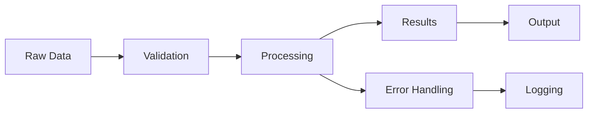

# Documentation Features

The Pythonic Template provides a comprehensive documentation system using MkDocs Material that automatically generates beautiful, professional documentation from your code.

## Documentation Philosophy 📚

Great documentation is essential for professional Python projects. The template follows these principles:

- **📝 Write documentation first** - Document your API before implementing
- **🔄 Keep it synchronized** - Documentation lives with the code
- **🎯 Make it discoverable** - Easy navigation and search
- **📱 Mobile-friendly** - Responsive design for all devices
- **⚡ Fast and accessible** - Static sites with excellent performance

## MkDocs Material Setup 🎨

The template uses **MkDocs Material**, the most popular documentation theme for Python projects.

### Why MkDocs Material?

- **🎨 Beautiful Design**: Modern, professional appearance
- **📱 Responsive**: Works perfectly on mobile devices
- **⚡ Fast**: Static site generation for excellent performance
- **🔍 Smart Search**: Built-in search with highlighting
- **🎯 Python-focused**: Excellent integration with Python tools
- **🌍 Accessible**: Follows accessibility guidelines

### Configuration

```yaml
# mkdocs.yml
site_name: My Project
site_url: https://username.github.io/my-project/
site_description: A modern Python project with comprehensive documentation

# Repository info
repo_name: username/my-project
repo_url: https://github.com/username/my-project

# Navigation structure
nav:
  - Home: index.md
  - Getting Started:
    - Installation: getting-started/quick-start.md
    - Quick Start: getting-started/quick-start.md
    - Configuration: getting-started/configuration.md
  - User Guide:
    - Basic Usage: user-guide/basic-usage.md
    - Advanced Features: user-guide/advanced.md
    - Examples: user-guide/examples.md
  - API Reference: api.md
  - Development:
    - Contributing: development/contributing.md
    - Testing: development/testing.md
    - Release Process: development/release.md
  - Changelog: changelog.md

# Theme configuration
theme:
  name: material
  palette:
    # Light mode
    - scheme: default
      primary: blue
      accent: blue
      toggle:
        icon: material/brightness-7
        name: Switch to dark mode
    # Dark mode
    - scheme: slate
      primary: blue
      accent: blue
      toggle:
        icon: material/brightness-4
        name: Switch to light mode
  
  features:
    - navigation.sections      # Collapsible navigation sections
    - navigation.tabs         # Top-level navigation tabs
    - navigation.top          # Back to top button
    - navigation.tracking     # URL tracking for navigation
    - search.highlight        # Highlight search terms
    - search.share           # Share search results
    - search.suggest         # Search suggestions
    - content.code.copy      # Copy code button
    - content.code.annotate  # Code annotations
    - content.tabs.link      # Linked content tabs

# Plugins
plugins:
  - search:
      separator: '[\s\-,:!=\[\]()"`/]+|\.(?!\d)|&[lg]t;|(?!\b)(?=[A-Z][a-z])'
  - mkdocstrings:
      handlers:
        python:
          options:
            docstring_style: numpy
            show_source: true
            show_root_heading: true
            show_if_no_docstring: true
            inherited_members: true
            members_order: alphabetical
            separate_signature: true
            unwrap_annotated: true
            filters:
              - "!^_"          # Hide private members
            merge_init_into_class: true

# Markdown extensions
markdown_extensions:
  # Python Markdown
  - abbr
  - admonition
  - attr_list
  - def_list
  - footnotes
  - md_in_html
  - toc:
      permalink: true

  # Python Markdown Extensions
  - pymdownx.arithmatex:
      generic: true
  - pymdownx.betterem:
      smart_enable: all
  - pymdownx.caret
  - pymdownx.details
  - pymdownx.emoji:
      emoji_index: !!python/name:material.extensions.emoji.twemoji
      emoji_generator: !!python/name:material.extensions.emoji.to_svg
  - pymdownx.highlight:
      anchor_linenums: true
      line_spans: __span
      pygments_lang_class: true
  - pymdownx.inlinehilite
  - pymdownx.keys
  - pymdownx.mark
  - pymdownx.smartsymbols
  - pymdownx.snippets
  - pymdownx.superfences:
      custom_fences:
        - name: mermaid
          class: mermaid
          format: !!python/name:pymdownx.superfences.fence_code_format
  - pymdownx.tabbed:
      alternate_style: true
  - pymdownx.tasklist:
      custom_checkbox: true
  - pymdownx.tilde

# Extra configuration
extra:
  social:
    - icon: fontawesome/brands/github
      link: https://github.com/username
    - icon: fontawesome/brands/python
      link: https://pypi.org/user/username/
    - icon: fontawesome/brands/twitter
      link: https://twitter.com/username
  
  version:
    provider: mike

# Custom CSS and JavaScript
extra_css:
  - stylesheets/extra.css

extra_javascript:
  - javascripts/mathjax.js
  - https://polyfill.io/v3/polyfill.min.js?features=es6
  - https://cdn.jsdelivr.net/npm/mathjax@3/es5/tex-mml-chtml.js

copyright: Copyright &copy; 2025 Your Name
```

## Automatic API Documentation 🤖

The template automatically generates API documentation from your docstrings using **mkdocstrings**.

### API Reference Page

```markdown
<!-- docs/api.md -->
# API Reference

This page contains the complete API documentation for the project, automatically generated from docstrings.

## Core Module

::: my_package.core
    options:
      show_source: true
      show_root_heading: true
      heading_level: 3

## Utilities

::: my_package.utils
    options:
      show_source: false
      members_order: alphabetical
      
## Data Processing

::: my_package.data
    options:
      filters:
        - "!^_"              # Hide private members
        - "!^__"             # Hide dunder methods
      show_signature_annotations: true
```

### Example Generated Documentation

From this docstring:

```python
def process_data(
    data: List[Dict[str, Any]],
    config: Optional[ProcessingConfig] = None
) -> ProcessedData:
    """Process raw data according to configuration.
    
    This function takes raw input data and processes it according to the
    provided configuration. If no configuration is provided, default
    settings are used.
    
    Parameters
    ----------
    data : List[Dict[str, Any]]
        Raw input data to process. Each dictionary should contain
        at least a 'value' key.
    config : Optional[ProcessingConfig], default=None
        Processing configuration. If None, uses default configuration.
        
    Returns
    -------
    ProcessedData
        Processed data with metadata about the processing operation.
        
    Raises
    ------
    ValueError
        If input data is empty or malformed.
    ProcessingError
        If processing fails due to configuration issues.
        
    Examples
    --------
    Basic usage:
    
    >>> data = [{"value": 1}, {"value": 2}]
    >>> result = process_data(data)
    >>> result.total_processed
    2
    
    With custom configuration:
    
    >>> config = ProcessingConfig(normalize=True, scale=2.0)
    >>> result = process_data(data, config)
    >>> result.values
    [2.0, 4.0]
    
    See Also
    --------
    ProcessingConfig : Configuration class for data processing
    validate_data : Validate input data before processing
    """
```

MkDocs Material generates beautiful documentation with:

- **Type annotations** displayed clearly
- **Parameter descriptions** with proper formatting
- **Return value documentation**
- **Exception information**
- **Runnable examples** with syntax highlighting
- **Cross-references** to related functions
- **Source code links** (when enabled)

## Documentation Structure 📁

The template creates a comprehensive documentation structure:

```
docs/
├── index.md                    # Homepage
├── getting-started/            # Getting started guides
│   ├── installation.md
│   ├── quick-start.md
│   └── configuration.md
├── user-guide/                 # User documentation
│   ├── basic-usage.md
│   ├── advanced.md
│   └── examples.md
├── api.md                      # API reference
├── development/                # Developer docs
│   ├── contributing.md
│   ├── testing.md
│   └── release.md
├── changelog.md                # Change log
├── stylesheets/                # Custom CSS
│   └── extra.css
└── javascripts/                # Custom JS
    └── mathjax.js
```

### Homepage (index.md)

The template generates a comprehensive homepage:

```markdown
# Project Name

Brief, compelling description of your project.

## Quick Start

```bash
pip install my-project
```

## Features

- ✨ **Feature 1**: Description
- 🚀 **Feature 2**: Description  
- 📚 **Feature 3**: Description

## Example Usage

```python
from my_package import process_data

data = [{"value": 1}, {"value": 2}]
result = process_data(data)
print(result.total_processed)  # 2
```

## Installation

See the [Installation Guide](../getting-started/quick-start.md) for detailed instructions.
```

## Content Features 🎯

The template supports rich content features for comprehensive documentation.

### Code Blocks with Syntax Highlighting

````markdown
```python title="example.py" linenums="1"
def fibonacci(n: int) -> int:
    """Calculate the nth Fibonacci number."""
    if n <= 1:
        return n
    return fibonacci(n - 1) + fibonacci(n - 2)

# Usage
result = fibonacci(10)
print(f"The 10th Fibonacci number is {result}")
```
````

### Admonitions for Important Information

```markdown
!!! note "Performance Tip"
    For large datasets, consider using the batch processing feature
    to improve memory efficiency.

!!! warning "Breaking Change"
    Version 2.0 introduces breaking changes to the API. See the
    [migration guide](migration.md) for details.

!!! example "Real-world Example"
    Here's how a machine learning team uses this library:
    
    ```python
    from my_package import MLProcessor
    
    processor = MLProcessor(model="transformer")
    predictions = processor.predict(data)
    ```

!!! tip "Pro Tip"
    Use environment variables for configuration to make your
    application more flexible.
```

### Tabbed Content

```markdown
=== "Python"

    ```python
    import my_package
    result = my_package.process(data)
    ```

=== "CLI"

    ```bash
    my-tool process --input data.json --output result.json
    ```

=== "Configuration"

    ```yaml
    processing:
      enabled: true
      batch_size: 1000
    ```
```

### Mathematical Expressions

```markdown
The algorithm complexity is $O(n \log n)$ where $n$ is the input size.

For the detailed mathematical formulation:

$$
f(x) = \int_{-\infty}^{\infty} \hat{f}(\xi) e^{2 \pi i \xi x} d\xi
$$
```

### Diagrams with Mermaid

````markdown

````

### Interactive Code Examples

```markdown
```python exec="true" source="material-block"
import datetime

print(f"Documentation built on: {datetime.datetime.now()}")
```
```

## Search Features 🔍

MkDocs Material provides powerful search capabilities:

### Search Configuration

```yaml
plugins:
  - search:
      separator: '[\s\-,:!=\[\]()"`/]+|\.(?!\d)|&[lg]t;|(?!\b)(?=[A-Z][a-z])'
      min_search_length: 2
      lang: en
      prebuild_index: python
```

### Search Features

- **🔍 Real-time search** - Results appear as you type
- **📝 Content preview** - See snippets of matching content
- **🎯 Keyboard navigation** - Navigate results with arrow keys
- **💾 Search history** - Remember recent searches
- **🔗 Deep linking** - Share search results with URLs

## Deployment 🚀

The template includes automated documentation deployment.

### GitHub Pages Deployment

```yaml
# .github/workflows/docs.yml
name: Documentation
on:
  push:
    branches: [main]
  pull_request:
    branches: [main]

jobs:
  deploy:
    runs-on: ubuntu-latest
    if: github.ref == 'refs/heads/main'
    steps:
      - uses: actions/checkout@v4
        with:
          fetch-depth: 0

      - name: Setup Python
        uses: actions/setup-python@v4
        with:
          python-version: "3.13"

      - name: Install dependencies
        run: |
          pip install uv
          uv pip install -e ".[dev]" --system

      - name: Build documentation
        run: mkdocs build

      - name: Deploy to GitHub Pages
        uses: peaceiris/actions-gh-pages@v3
        with:
          github_token: ${{ secrets.GITHUB_TOKEN }}
          publish_dir: ./site
          cname: my-project.example.com  # Optional custom domain
```

### Versioned Documentation

For projects with multiple versions:

```bash
# Install mike for version management
uv add mike

# Deploy version
mike deploy 1.0 latest --update-aliases

# Set default version
mike set-default latest

# List versions
mike list
```

## Documentation Best Practices 📖

The template encourages documentation best practices:

### 1. Write Documentation First

```python
def new_feature(data: List[str]) -> Dict[str, int]:
    """Process strings and count occurrences.
    
    This is a placeholder for a new feature. The function will:
    1. Validate input data
    2. Process each string  
    3. Count character occurrences
    4. Return frequency dictionary
    
    Parameters
    ----------
    data : List[str]
        Input strings to process
        
    Returns
    -------
    Dict[str, int]
        Character frequency counts
        
    Examples
    --------
    >>> count_chars(["hello", "world"])
    {'h': 1, 'e': 1, 'l': 3, 'o': 2, 'w': 1, 'r': 1, 'd': 1}
    """
    # TODO: Implement this function
    raise NotImplementedError("Feature coming in next release")
```

### 2. Include Comprehensive Examples

```python
def advanced_processing(
    data: DataFrame,
    config: ProcessingConfig
) -> ProcessingResult:
    """Advanced data processing with comprehensive examples.
    
    Examples
    --------
    Basic usage:
    
    >>> import pandas as pd
    >>> from my_package import ProcessingConfig, advanced_processing
    >>> 
    >>> # Create sample data
    >>> data = pd.DataFrame({
    ...     'values': [1, 2, 3, 4, 5],
    ...     'categories': ['A', 'B', 'A', 'C', 'B']
    ... })
    >>> 
    >>> # Configure processing
    >>> config = ProcessingConfig(
    ...     normalize=True,
    ...     group_by='categories',
    ...     aggregation='mean'
    ... )
    >>> 
    >>> # Process data
    >>> result = advanced_processing(data, config)
    >>> result.summary
    {'A': 2.0, 'B': 3.5, 'C': 4.0}
    
    Advanced configuration:
    
    >>> # Custom processing pipeline
    >>> config = ProcessingConfig(
    ...     pipeline=[
    ...         {'operation': 'normalize', 'method': 'z-score'},
    ...         {'operation': 'filter', 'threshold': 0.5},
    ...         {'operation': 'aggregate', 'function': 'median'}
    ...     ]
    ... )
    >>> result = advanced_processing(data, config)
    
    Error handling:
    
    >>> # Invalid configuration
    >>> bad_config = ProcessingConfig(normalize=True, invalid_param=True)
    >>> try:
    ...     result = advanced_processing(data, bad_config)
    ... except ValueError as e:
    ...     print(f"Configuration error: {e}")
    Configuration error: Unknown parameter 'invalid_param'
    """
```

### 3. Document Configuration

```markdown
# Configuration

The library supports extensive configuration through environment variables and configuration files.

## Environment Variables

| Variable | Description | Default | Example |
|----------|-------------|---------|---------|
| `MY_PACKAGE_DEBUG` | Enable debug logging | `false` | `true` |
| `MY_PACKAGE_CACHE_DIR` | Cache directory | `~/.cache/my-package` | `/tmp/cache` |
| `MY_PACKAGE_MAX_WORKERS` | Maximum worker threads | `4` | `8` |

## Configuration File

```yaml
# config.yml
processing:
  batch_size: 1000
  timeout: 30
  retry_count: 3

logging:
  level: INFO
  format: "%(asctime)s - %(name)s - %(levelname)s - %(message)s"
  
cache:
  enabled: true
  ttl: 3600  # seconds
```
```

## Maintenance and Updates 🔄

The template includes tools for keeping documentation up-to-date:

### Automated Documentation Checks

```yaml
# .pre-commit-config.yaml
repos:
  - repo: local
    hooks:
      - id: docs-build
        name: Build documentation
        entry: mkdocs build --strict
        language: system
        pass_filenames: false
        
      - id: check-api-docs
        name: Check API documentation coverage
        entry: python scripts/check_api_coverage.py
        language: python
```

### Documentation Linting

```bash
# Check for common documentation issues
markdownlint docs/
vale docs/  # Prose linting
```

### Link Checking

```bash
# Check for broken links
mkdocs build
linkchecker site/
```

## Next Steps

Now that you understand the documentation system:

1. **[Learn about DevOps integration](devops.md)**
2. **[Explore template variables](../reference/template-variables.md)**
3. **[Follow best practices](../reference/best-practices.md)**
