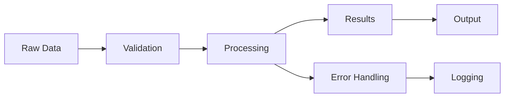

# Repository Snapshot

**Snapshot taken on:** 2025-08-17 14:25:55

---

## File: `.markdownlint.json`

```json
{
    "MD013": false,
    "MD046": false,
    "no-duplicate-heading": {
        "siblings_only": true
    },
    "first-line-h1": false
}
```

## File: `main.py`

```python
def main():
    print("Hello from pythonic-template!")


if __name__ == "__main__":
    main()

```

## File: `README.md`

```markdown
# Pythonic Template 🐍

A modern, comprehensive Cookiecutter template for Python projects that follows best practices and includes everything you need for professional Python development - now with **advanced devcontainer support**, **AI agent integration**, and **academic paper workflows**.

## Features

### ✨ **Key Features**

- **Modern Python tooling**: uv, Ruff, pytest, MkDocs Material, beartype
- **AI-powered development**: Claude Code CLI, OpenAI Codex, Roo Code integration
- **Advanced containerization**: Multi-stage Docker, VS Code devcontainers, service orchestration
- **Academic paper support**: Quarto integration, automatic rendering, citation management
- **Quality assurance**: Pre-commit hooks, GitHub Actions CI/CD, automated dependency updates
- **Developer experience**: Makefile-driven workflow, template synchronization with Cruft

## Quick Start

1. **Install Cookiecutter** (if not already installed):

   ```bash
   # Using uv (recommended)
   uv tool install cookiecutter

   # Or using pip
   pip install cookiecutter
   ```

2. **Generate your project**:

   ```bash
   cookiecutter https://github.com/adamamer20/pythonic-template
   ```

3. **Follow the prompts** to configure your project:
   - Project name: "My Amazing Library"
   - Package name: (auto-generated from project name)
   - Author information
   - Python version (3.12-3.13, defaults to 3.12)
   - License choice (MIT, Apache-2.0, BSD-3-Clause)
   - **Project type**: "standard" or "paper" (for academic research)
   - **AI agents**: Choose from Claude Code, OpenAI Codex, Roo Code, or combinations

4. **Navigate to your new project**:

   ```bash
   cd your-new-project
   ```

5. **Initialize your development environment**:

   ```bash
   make setup  # Complete environment setup with dependencies and pre-commit
   ```

6. **Start developing**! 🎉

   ```bash
   # Show all available commands (ALWAYS start here!)
   make help

   # Run tests
   make test

   # For paper projects - render your paper
   make paper-render  # (only available for paper type projects)

   # Start coding in src/your_package/
   # Tests go in tests/
   # Papers go in paper/ (if using paper type)
   ```

## Template Configuration

The template prompts for these variables:

| Variable | Description | Default | Options |
|----------|-------------|---------|---------|
| `project_name` | Human-readable project name | "My Amazing Library" | Any string |
| `package_name` | Python package name (auto-generated) | (derived from project_name) | Auto-generated |
| `repo_name` | Repository name (auto-generated) | (derived from project_name) | Auto-generated |
| `author_name` | Your name | "Adam Amer" | Any string |
| `author_email` | Your email | "adam@example.com" | Any email |
| `github_username` | Your GitHub username | "adamamer20" | Any username |
| `python_version` | Minimum Python version | "3.12" | "3.12" to "3.13" |
| `initial_version` | Starting version | "0.1.0" | Any version string |
| `license` | License type | "MIT" | MIT, Apache-2.0, BSD-3-Clause |
| **`project_type`** | **Project type** | **"standard"** | **"standard", "paper"** |
| **`ai_agents`** | **AI agents to include** | **"all"** | **"all", "claude_code", "openai_codex", "roo_code", combinations, "none"** |
| `project_short_description` | Brief description | "A modern Python package" | Any string |

## Generated Project Structure

```text
your-project/
├── .devcontainer/              # 🐳 Advanced development containers
│   ├── Dockerfile              # Multi-stage container with conditional installs
│   ├── docker-compose.yml      # Service orchestration (Qdrant, Ollama)
│   ├── devcontainer.json       # VS Code devcontainer configuration
│   └── ai-agents-config.json   # AI agent setup configuration
├── .github/
│   ├── workflows/              # CI/CD pipelines
│   │   ├── ci.yml              # Standard CI
│   │   ├── render-paper.yml    # 📄 Paper rendering (paper projects only)
│   │   └── ...
│   └── dependabot.yml          # Dependency updates
├── .roo/                       # 🤖 Roo Code AI configuration (if selected)
│   └── rules-code/
│       └── rules.md            # Roo-specific development rules
├── .vscode/                    # VS Code configuration
├── docs/                       # Documentation source
├── paper/                      # 📄 Academic paper (paper projects only)
│   ├── paper.qmd               # Main paper in Quarto format
│   └── references.bib          # Bibliography
├── src/your_package/           # Your Python package
├── tests/                      # Test suite
├── .env.example               # Environment variables template
├── .gitignore                 # Comprehensive gitignore
├── .pre-commit-config.yaml    # Code quality hooks
├── .cruft.json                # Template synchronization config
├── AGENTS.md                  # 🤖 AI agent instructions
├── Makefile                   # 🔧 CENTRAL command hub (USE THIS!)
├── mkdocs.yml                 # Documentation configuration
├── pyproject.toml             # Project configuration
└── README.md                  # Project documentation
```

## Development Workflow

**CRITICAL: Always use `make` commands for development tasks!**

After generating your project:

### 1. **Quick Start**

```bash
# ALWAYS start here - see all available commands
make help

# Complete environment setup (replaces multiple manual steps)
make setup

# Start development
make dev
```

### 2. **Essential Make Commands**

The Makefile is the **CENTRAL HUB** for all development operations:

```bash
# Core workflow
make setup         # Complete development environment setup
make test          # Run tests with type checking
make quick-test    # Fast tests for development
make check         # Run all quality checks (lint + format + test)

# Development tasks
make lint          # Run linting and fix issues
make format        # Format code with ruff
make quality       # Run all quality checks

# Utilities
make clean         # Clean build artifacts
make sync          # Sync dependencies
make upgrade       # Upgrade all dependencies
make ai-setup      # Set up AI agents (Claude Code CLI, etc.)
```

### 3. **Paper Projects (if project_type="paper")**

```bash
make paper-render   # Render paper to HTML and PDF
make paper-preview  # Preview paper in browser
make paper-check    # Check paper for issues
```

### 4. **AI Agent Integration**

If you selected AI agents during setup:

- **Claude Code CLI**: Available via `claude-code` command
- **OpenAI Codex**: Uses AGENTS.md for instructions
- **Roo Code**: Uses `.roo/rules-code/rules.md` + Qdrant + Ollama

The devcontainer automatically configures your selected agents!

## Additional Information

For detailed information about features, configuration options, and best practices, see the [full documentation](https://github.com/adamamer20/pythonic-template/tree/main/docs).

## GitHub Actions Workflows

The template includes CI/CD workflows for testing, building, publishing to PyPI, documentation deployment, and paper rendering (for academic projects).

## Template Synchronization

Projects generated from this template can stay synchronized with template updates using [Cruft](https://cruft.github.io/cruft/):

### Setup (included automatically)

Cruft is included in the generated project's development dependencies and configured with a `.cruft.json` file.

### Checking for Updates

```bash
make sync           # First sync your current dependencies
uv run cruft check  # Check for template updates
```

### Applying Updates

```bash
uv run cruft update  # Apply template updates
make setup          # Re-setup environment with new changes
```

This will apply template changes while preserving your customizations. The updated `.cruft.json` tracks your configuration for seamless updates.


## License

This template is licensed under the MIT License. Generated projects can use any license you choose.

## Contributing

Contributions are welcome! Please feel free to submit issues and pull requests.

---

**Happy coding!** 🚀

```

## File: `repository_20250817142555.md`

```markdown
# Repository Snapshot

**Snapshot taken on:** 2025-08-17 14:25:55

---

## File: `.markdownlint.json`

```json
{
    "MD013": false,
    "MD046": false,
    "no-duplicate-heading": {
        "siblings_only": true
    },
    "first-line-h1": false
}
```

## File: `main.py`

```python
def main():
    print("Hello from pythonic-template!")


if __name__ == "__main__":
    main()

```

## File: `README.md`

```markdown
# Pythonic Template 🐍

A modern, comprehensive Cookiecutter template for Python projects that follows best practices and includes everything you need for professional Python development - now with **advanced devcontainer support**, **AI agent integration**, and **academic paper workflows**.

## Features

### ✨ **Key Features**

- **Modern Python tooling**: uv, Ruff, pytest, MkDocs Material, beartype
- **AI-powered development**: Claude Code CLI, OpenAI Codex, Roo Code integration
- **Advanced containerization**: Multi-stage Docker, VS Code devcontainers, service orchestration
- **Academic paper support**: Quarto integration, automatic rendering, citation management
- **Quality assurance**: Pre-commit hooks, GitHub Actions CI/CD, automated dependency updates
- **Developer experience**: Makefile-driven workflow, template synchronization with Cruft

## Quick Start

1. **Install Cookiecutter** (if not already installed):

   ```bash
   # Using uv (recommended)
   uv tool install cookiecutter

   # Or using pip
   pip install cookiecutter
   ```

2. **Generate your project**:

   ```bash
   cookiecutter https://github.com/adamamer20/pythonic-template
   ```

3. **Follow the prompts** to configure your project:
   - Project name: "My Amazing Library"
   - Package name: (auto-generated from project name)
   - Author information
   - Python version (3.12-3.13, defaults to 3.12)
   - License choice (MIT, Apache-2.0, BSD-3-Clause)
   - **Project type**: "standard" or "paper" (for academic research)
   - **AI agents**: Choose from Claude Code, OpenAI Codex, Roo Code, or combinations

4. **Navigate to your new project**:

   ```bash
   cd your-new-project
   ```

5. **Initialize your development environment**:

   ```bash
   make setup  # Complete environment setup with dependencies and pre-commit
   ```

6. **Start developing**! 🎉

   ```bash
   # Show all available commands (ALWAYS start here!)
   make help

   # Run tests
   make test

   # For paper projects - render your paper
   make paper-render  # (only available for paper type projects)

   # Start coding in src/your_package/
   # Tests go in tests/
   # Papers go in paper/ (if using paper type)
   ```

## Template Configuration

The template prompts for these variables:

| Variable | Description | Default | Options |
|----------|-------------|---------|---------|
| `project_name` | Human-readable project name | "My Amazing Library" | Any string |
| `package_name` | Python package name (auto-generated) | (derived from project_name) | Auto-generated |
| `repo_name` | Repository name (auto-generated) | (derived from project_name) | Auto-generated |
| `author_name` | Your name | "Adam Amer" | Any string |
| `author_email` | Your email | "adam@example.com" | Any email |
| `github_username` | Your GitHub username | "adamamer20" | Any username |
| `python_version` | Minimum Python version | "3.12" | "3.12" to "3.13" |
| `initial_version` | Starting version | "0.1.0" | Any version string |
| `license` | License type | "MIT" | MIT, Apache-2.0, BSD-3-Clause |
| **`project_type`** | **Project type** | **"standard"** | **"standard", "paper"** |
| **`ai_agents`** | **AI agents to include** | **"all"** | **"all", "claude_code", "openai_codex", "roo_code", combinations, "none"** |
| `project_short_description` | Brief description | "A modern Python package" | Any string |

## Generated Project Structure

```text
your-project/
├── .devcontainer/              # 🐳 Advanced development containers
│   ├── Dockerfile              # Multi-stage container with conditional installs
│   ├── docker-compose.yml      # Service orchestration (Qdrant, Ollama)
│   ├── devcontainer.json       # VS Code devcontainer configuration
│   └── ai-agents-config.json   # AI agent setup configuration
├── .github/
│   ├── workflows/              # CI/CD pipelines
│   │   ├── ci.yml              # Standard CI
│   │   ├── render-paper.yml    # 📄 Paper rendering (paper projects only)
│   │   └── ...
│   └── dependabot.yml          # Dependency updates
├── .roo/                       # 🤖 Roo Code AI configuration (if selected)
│   └── rules-code/
│       └── rules.md            # Roo-specific development rules
├── .vscode/                    # VS Code configuration
├── docs/                       # Documentation source
├── paper/                      # 📄 Academic paper (paper projects only)
│   ├── paper.qmd               # Main paper in Quarto format
│   └── references.bib          # Bibliography
├── src/your_package/           # Your Python package
├── tests/                      # Test suite
├── .env.example               # Environment variables template
├── .gitignore                 # Comprehensive gitignore
├── .pre-commit-config.yaml    # Code quality hooks
├── .cruft.json                # Template synchronization config
├── AGENTS.md                  # 🤖 AI agent instructions
├── Makefile                   # 🔧 CENTRAL command hub (USE THIS!)
├── mkdocs.yml                 # Documentation configuration
├── pyproject.toml             # Project configuration
└── README.md                  # Project documentation
```

## Development Workflow

**CRITICAL: Always use `make` commands for development tasks!**

After generating your project:

### 1. **Quick Start**

```bash
# ALWAYS start here - see all available commands
make help

# Complete environment setup (replaces multiple manual steps)
make setup

# Start development
make dev
```

### 2. **Essential Make Commands**

The Makefile is the **CENTRAL HUB** for all development operations:

```bash
# Core workflow
make setup         # Complete development environment setup
make test          # Run tests with type checking
make quick-test    # Fast tests for development
make check         # Run all quality checks (lint + format + test)

# Development tasks
make lint          # Run linting and fix issues
make format        # Format code with ruff
make quality       # Run all quality checks

# Utilities
make clean         # Clean build artifacts
make sync          # Sync dependencies
make upgrade       # Upgrade all dependencies
make ai-setup      # Set up AI agents (Claude Code CLI, etc.)
```

### 3. **Paper Projects (if project_type="paper")**

```bash
make paper-render   # Render paper to HTML and PDF
make paper-preview  # Preview paper in browser
make paper-check    # Check paper for issues
```

### 4. **AI Agent Integration**

If you selected AI agents during setup:

- **Claude Code CLI**: Available via `claude-code` command
- **OpenAI Codex**: Uses AGENTS.md for instructions
- **Roo Code**: Uses `.roo/rules-code/rules.md` + Qdrant + Ollama

The devcontainer automatically configures your selected agents!

## Additional Information

For detailed information about features, configuration options, and best practices, see the [full documentation](https://github.com/adamamer20/pythonic-template/tree/main/docs).

## GitHub Actions Workflows

The template includes CI/CD workflows for testing, building, publishing to PyPI, documentation deployment, and paper rendering (for academic projects).

## Template Synchronization

Projects generated from this template can stay synchronized with template updates using [Cruft](https://cruft.github.io/cruft/):

### Setup (included automatically)

Cruft is included in the generated project's development dependencies and configured with a `.cruft.json` file.

### Checking for Updates

```bash
make sync           # First sync your current dependencies
uv run cruft check  # Check for template updates
```

### Applying Updates

```bash
uv run cruft update  # Apply template updates
make setup          # Re-setup environment with new changes
```

This will apply template changes while preserving your customizations. The updated `.cruft.json` tracks your configuration for seamless updates.


## License

This template is licensed under the MIT License. Generated projects can use any license you choose.

## Contributing

Contributions are welcome! Please feel free to submit issues and pull requests.

---

**Happy coding!** 🚀

```


```

## File: `.pre-commit-config.yaml`

```yaml
ci:
    autoupdate_schedule: 'monthly'

repos:
- repo: https://github.com/astral-sh/ruff-pre-commit  # Ruff version.
  rev: "v0.12.9"
  hooks:
    # Run the linter.
    - id: ruff
      types_or: [ python, pyi, jupyter ]
      args: [ --fix ]
    # Run the formatter.
    - id: ruff-format
      types_or: [ python, pyi, jupyter ]
-   repo: https://github.com/asottile/pyupgrade
    rev: v3.19.1
    hooks:
    -   id: pyupgrade
        args: [--py312-plus]
-   repo: https://github.com/pre-commit/pre-commit-hooks
    rev: v5.0.0
    hooks:
    -   id: trailing-whitespace
    -   id: check-toml
    -   id: check-yaml
- repo: https://github.com/codespell-project/codespell
  rev: v2.4.1
  hooks:
    - id: codespell
      args: [
        "--ignore-words",
        ".codespellignore",
      ]
- repo: https://github.com/DavidAnson/markdownlint-cli2  # For formatting markdown for documentation
  rev: v0.17.2
  hooks:
    - id: markdownlint-cli2
      args: [
        "--fix",
        "--config",
        ".markdownlint.json",
      ]
- repo: https://github.com/jsh9/pydoclint  # For checking docstrings
  rev: 0.6.6
  hooks:
    - id: pydoclint
      args: [--style=numpy, --skip-checking-raises=True, --allow-init-docstring=True]

```

## File: `mkdocs.yml`

```yaml
site_name: Pythonic Template
site_url: https://adamamer20.github.io/pythonic-template/
site_author: Adam Amer
site_description: A modern, comprehensive Cookiecutter template for Python projects following best practices

repo_name: adamamer20/pythonic-template
repo_url: https://github.com/adamamer20/pythonic-template

nav:
  - Home: index.md
  - Getting Started:
      - Quick Start: getting-started/quick-start.md
      - Configuration: getting-started/configuration.md
      - Generated Project: getting-started/generated-project.md
  - Features:
      - Modern Stack: features/modern-stack.md
      - Quality Assurance: features/quality-assurance.md
      - Documentation: features/documentation.md
      - DevOps: features/devops.md
  - Development:
      - Contributing: development/contributing.md
      - Testing: development/testing.md
      - Release Process: development/release-process.md
  - Reference:
      - Template Variables: reference/template-variables.md
      - Project Structure: reference/project-structure.md
      - Best Practices: reference/best-practices.md
  - Troubleshooting: troubleshooting.md
  - Changelog: changelog.md

theme:
  name: material
  palette:
    - scheme: default
      primary: blue
      accent: blue
      toggle:
        icon: material/brightness-7
        name: Switch to dark mode
    - scheme: slate
      primary: blue
      accent: blue
      toggle:
        icon: material/brightness-4
        name: Switch to light mode
  features:
    - navigation.sections
    - navigation.tabs
    - navigation.top
    - search.highlight
    - search.share
    - content.code.copy
    - content.code.annotate

plugins:
  - search
  - mkdocstrings:
      handlers:
        python:
          options:
            docstring_style: numpy
            show_source: true
            show_root_heading: true

markdown_extensions:
  - pymdownx.highlight:
      anchor_linenums: true
  - pymdownx.inlinehilite
  - pymdownx.snippets
  - pymdownx.superfences:
      custom_fences:
        - name: mermaid
          class: mermaid
          format: !!python/name:pymdownx.superfences.fence_code_format
  - pymdownx.tabbed:
      alternate_style: true
  - admonition
  - pymdownx.details
  - attr_list
  - md_in_html
  - pymdownx.emoji:
      emoji_index: !!python/name:material.extensions.emoji.twemoji
      emoji_generator: !!python/name:material.extensions.emoji.to_svg

extra:
  social:
    - icon: fontawesome/brands/github
      link: https://github.com/adamamer20
    - icon: fontawesome/brands/python
      link: https://pypi.org/user/adamamer20/

copyright: Copyright &copy; 2025 Adam Amer

```

## File: `CONTRIBUTING.md`

```markdown
# Contributing to Pythonic Template

Thank you for your interest in contributing to Pythonic Template! This document provides guidelines and information for contributors.

## 🌟 **Our Mission**

Generate crystal‑clear, Pythonic, fully‑typed, test‑first code that is easy to swap, automate, and scale — never monolithic, always DRY.

## 🚀 Getting Started

### Prerequisites

- Python 3.13+
- [uv](https://github.com/astral-sh/uv) for package management
- Git

### Development Setup

1. **Fork and clone the repository**:
   ```bash
   git clone https://github.com/your-username/pythonic-template.git
   cd pythonic-template
   ```

2. **Install development dependencies**:
   ```bash
   uv pip install -e .[dev]
   ```

3. **Install pre-commit hooks**:
   ```bash
   pre-commit install
   ```

4. **Test the template**:
   ```bash
   # Test generating a project
   cookiecutter . --no-input
   
   # Test with different configurations
   cookiecutter . --no-input license=Apache-2.0 use_docker=y
   ```

## 📝 Development Guidelines

### Code Quality Standards

- ✨ **Clarity > cleverness** - Code should read like English
- 📚 **Full type hints** everywhere (PEP 484/695)
- 🔄 **DRY, atomic, modular** - Each component does one thing well
- 🌐 **Environment agnostic** - No hard-coded paths or configurations
- 📝 **Meaningful comments** ≤ 80 chars explaining **why**, not **what**

### Tools and Standards

- **Package Management**: uv only, no manual requirements.txt
- **Code Quality**: Ruff for linting and formatting
- **Testing**: pytest with comprehensive coverage
- **Type Checking**: beartype for runtime type checking
- **Documentation**: NumPy-style docstrings, MkDocs Material
- **Git Hooks**: pre-commit for automated quality checks

### Testing Philosophy

- 🧪 **Test-Driven Development**: Write failing tests first
- ✅ **Comprehensive Coverage**: Aim for high test coverage
- 🔄 **Template Testing**: Test generated projects work correctly
- 🎯 **Edge Cases**: Test different configuration combinations

## 🛠️ Development Workflow

### 1. Making Changes

1. **Create a feature branch**:
   ```bash
   git checkout -b feature/your-feature-name
   ```

2. **Make your changes** following our guidelines

3. **Test your changes**:
   ```bash
   # Run tests
   pytest -v
   
   # Test template generation
   make test-template
   
   # Run all quality checks
   pre-commit run --all-files
   ```

4. **Update documentation** if needed

### 2. Template Testing

Test different configurations:

```bash
# Basic template
cookiecutter . --no-input

# With Docker
cookiecutter . --no-input use_docker=y

# Different license
cookiecutter . --no-input license=Apache-2.0

# Test the generated project
cd my-amazing-library
uv pip install -e .[dev]
pre-commit run --all-files
pytest
```

### 3. Documentation

- Update README.md for user-facing changes
- Update CHANGELOG.md following [Keep a Changelog](https://keepachangelog.com/)
- Add docstrings for any Python code (NumPy style)
- Update cookiecutter.json documentation if adding new variables

## 📋 Pull Request Process

1. **Ensure all tests pass**:
   ```bash
   pytest
   pre-commit run --all-files
   ```

2. **Update documentation** as needed

3. **Add changelog entry** in the "Unreleased" section

4. **Create descriptive PR**:
   - Clear title describing the change
   - Detailed description of what and why
   - Reference any related issues
   - Include testing instructions

5. **Wait for review** - maintainers will review and provide feedback

## 🐛 Bug Reports

When reporting bugs, please include:

- **Clear description** of the issue
- **Steps to reproduce** the problem
- **Expected vs actual behavior**
- **Environment details** (OS, Python version, uv version)
- **Generated project structure** if relevant
- **Error messages** and stack traces

## 💡 Feature Requests

For new features:

- **Describe the use case** - what problem does it solve?
- **Provide examples** of how it would be used
- **Consider alternatives** - why is this the best approach?
- **Check existing issues** to avoid duplicates

## 🏷️ Release Process

1. **Update version** in pyproject.toml
2. **Update CHANGELOG.md** with release date
3. **Create release PR** with all changes
4. **Merge to main** after approval
5. **Tag release** and push tags
6. **GitHub Actions** will handle PyPI publishing

## 📊 Quality Metrics

We maintain high standards:

- **Test Coverage**: Aim for >90%
- **Type Coverage**: 100% type hints
- **Ruff Score**: 10/10 (no warnings)
- **Documentation**: All public APIs documented
- **Template Quality**: Generated projects must pass all checks

## 🎯 Areas for Contribution

Looking for ways to help? Consider:

- 📝 **Documentation improvements**
- 🧪 **Additional test cases**
- 🔧 **New template features**
- 🐛 **Bug fixes and edge cases**
- 🚀 **Performance improvements**
- 📦 **Dependency updates**
- 🏗️ **CI/CD enhancements**

## 💬 Getting Help

- **Discussions**: Use GitHub Discussions for questions
- **Issues**: Create issues for bugs and feature requests
- **Documentation**: Check the docs at our GitHub Pages site

## 📜 Code of Conduct

- Be respectful and inclusive
- Focus on constructive feedback
- Help others learn and grow
- Follow Python community standards

## 🙏 Recognition

Contributors will be recognized in:
- README.md contributors section
- Release notes for significant contributions
- GitHub contributor insights

---

**Thank you for contributing to Pythonic Template!** 🚀

Together we're making Python development more efficient, enjoyable, and professional.

```

## File: `cookiecutter.json`

```json
{
    "_copy_without_render": [
        ".github/workflows/*"
    ],
    "project_name": "My Amazing Library",
    "repo_name": "{{ cookiecutter.project_name|lower|replace(' ', '-') }}",
    "package_name": "{{ cookiecutter.repo_name|lower|replace('-', '_') }}",
    "author_name": "Adam Amer",
    "author_email": "adam@example.com",
    "github_username": "adamamer20",
    "python_version": "3.12",
    "initial_version": "0.1.0",
    "license": [
        "MIT",
        "Apache-2.0",
        "BSD-3-Clause",
        "Proprietary"
    ],
    "project_type": [
        "standard",
        "paper"
    ],
    "ai_agents": [
        "all",
        "claude_code",
        "openai_codex", 
        "roo_code",
        "claude_code,openai_codex",
        "claude_code,roo_code",
        "openai_codex,roo_code",
        "none"
    ],
    "project_short_description": "A modern Python package",
    "_release_date": "{% now 'utc', '%Y-%m-%d' %}"
}
```

## File: `CHANGELOG.md`

```markdown
# Changelog

All notable changes to this project will be documented in this file.

The format is based on [Keep a Changelog](https://keepachangelog.com/en/1.0.0/),
and this project adheres to [Semantic Versioning](https://semver.org/spec/v2.0.0.html).

## [Unreleased]

### Added
- Nothing yet

### Changed
- Nothing yet

### Deprecated
- Nothing yet

### Removed
- Nothing yet

### Fixed
- Nothing yet

### Security
- Nothing yet

## [0.1.0] - 2025-05-25

### Added
- Initial release of pythonic-template
- Modern Python project template with Cookiecutter
- Support for Python 3.12+ with full type hints
- **uv** for ultra-fast package management
- **Ruff** for lightning-fast linting and formatting
- **pytest** with comprehensive test configuration and coverage
- **MkDocs Material** for beautiful documentation
- **typeguard** for runtime type checking in development
- Pre-commit hooks for automatic code quality
- GitHub Actions CI/CD pipelines
- Dependabot for automated dependency updates
- VS Code configuration with recommended extensions
- Docker support with development containers (optional)
- Professional project structure with src layout
- Automated PyPI publishing with trusted publishing
- Documentation deployment to GitHub Pages
- Comprehensive Makefile with development tasks
- Environment variable management with .env support
- Security-focused configuration with modern best practices

### Features
- 🚀 **Modern Python Stack**: uv, Ruff, pytest, MkDocs Material, typeguard
- 🛡️ **Quality Assurance**: Pre-commit, GitHub Actions, Dependabot, type checking
- 📚 **Documentation**: Material for MkDocs with automatic API docs
- 🔧 **DevOps Ready**: CI/CD, PyPI publishing, GitHub Pages deployment
- 🐳 **Docker Support**: Development containers and production builds
- 💻 **Developer Experience**: VS Code config, modern tooling, comprehensive setup

[Unreleased]: https://github.com/adamamer20/pythonic-template/compare/v0.1.0...HEAD
[0.1.0]: https://github.com/adamamer20/pythonic-template/releases/tag/v0.1.0

```

## File: `tests/test_template.py`

```python
"""
Test suite for the pythonic-template cookiecutter template.
Tests template generation and validates the resulting project structure.
"""

import os
import subprocess
import sys
import tempfile
from pathlib import Path
from typing import Any

import pytest

ROOT = Path(__file__).resolve().parent.parent
sys.path.insert(0, str(ROOT))

from hooks.post_gen_project import run_command  # noqa: E402


def run_subprocess(cmd: list[str], **kwargs: Any) -> subprocess.CompletedProcess:
    """Run subprocess without coverage environment variables."""
    env = os.environ.copy()
    env.pop("COVERAGE_FILE", None)
    env.pop("COVERAGE_PROCESS_START", None)
    kwargs.setdefault("env", env)
    check_flag = kwargs.pop("check", False)
    return subprocess.run(cmd, check=check_flag, **kwargs)


def test_run_command_basic():
    """Ensure run_command executes a simple command."""
    result = run_command("echo hello", check=False)
    assert result.returncode == 0


def test_template_generation_basic():
    """Test basic template generation with default parameters."""
    with tempfile.TemporaryDirectory() as temp_dir:
        # Generate project
        run_subprocess(
            [
                "cookiecutter",
                str(Path(__file__).parent.parent),
                "--no-input",
                f"--output-dir={temp_dir}",
            ],
            capture_output=True,
            text=True,
            check=True,
        )

        project_path = Path(temp_dir) / "my-amazing-library"
        assert project_path.exists()

        # Check essential files exist
        essential_files = [
            "pyproject.toml",
            "README.md",
            "LICENSE",
            "src/my_amazing_library/__init__.py",
            "tests/test_sample.py",
            ".gitignore",
            ".pre-commit-config.yaml",
            "Makefile",
        ]

        for file_path in essential_files:
            assert (project_path / file_path).exists(), f"Missing {file_path}"


def test_template_generation_with_devcontainer():
    """Test template generation includes devcontainer files."""
    with tempfile.TemporaryDirectory() as temp_dir:
        run_subprocess(
            [
                "cookiecutter",
                str(Path(__file__).parent.parent),
                "--no-input",
                f"--output-dir={temp_dir}",
            ],
            capture_output=True,
            text=True,
            check=True,
        )

        project_path = Path(temp_dir) / "my-amazing-library"

        # Check Docker files exist (Docker is always enabled now)
        assert (project_path / ".devcontainer/Dockerfile").exists()
        assert (project_path / ".devcontainer/devcontainer.json").exists()
        assert (project_path / ".devcontainer/docker-compose.yml").exists()

        # Verify Dockerfile has multi-stage build
        dockerfile_content = (project_path / ".devcontainer/Dockerfile").read_text()
        assert "AS builder" in dockerfile_content
        assert "AS runtime" in dockerfile_content
        assert "AS development" in dockerfile_content


def test_generated_project_structure():
    """Test that generated project has correct structure and can be built."""
    with tempfile.TemporaryDirectory() as temp_dir:
        # Generate project
        run_subprocess(
            [
                "cookiecutter",
                str(Path(__file__).parent.parent),
                "--no-input",
                f"--output-dir={temp_dir}",
            ],
            check=True,
        )

        project_path = Path(temp_dir) / "my-amazing-library"

        # Test that the project can be installed and tested
        result = run_subprocess(
            ["uv", "sync", "--all-extras"],
            cwd=project_path,
            capture_output=True,
            text=True,
            check=False,
        )

        if result.returncode != 0:
            pytest.skip("uv not available, skipping dependency installation test")

        # Run tests
        test_result = run_subprocess(
            ["uv", "run", "pytest", "-v"],
            cwd=project_path,
            capture_output=True,
            text=True,
            check=False,
        )

        assert test_result.returncode == 0, f"Tests failed: {test_result.stderr}"

        # Check linting passes
        lint_result = run_subprocess(
            ["uv", "run", "ruff", "check", "."],
            cwd=project_path,
            capture_output=True,
            text=True,
            check=False,
        )

        assert lint_result.returncode == 0, f"Linting failed: {lint_result.stderr}"


def test_pyproject_toml_validity():
    """Test that generated pyproject.toml is valid."""
    with tempfile.TemporaryDirectory() as temp_dir:
        run_subprocess(
            [
                "cookiecutter",
                str(Path(__file__).parent.parent),
                "--no-input",
                f"--output-dir={temp_dir}",
            ],
            check=True,
        )

        project_path = Path(temp_dir) / "my-amazing-library"
        pyproject_path = project_path / "pyproject.toml"

        # Test that pyproject.toml can be parsed
        import tomllib

        with open(pyproject_path, "rb") as f:
            pyproject = tomllib.load(f)

        # Check required sections exist
        assert "project" in pyproject
        assert "build-system" in pyproject
        assert "tool" in pyproject
        assert "ruff" in pyproject["tool"]
        assert "pytest" in pyproject["tool"]
        assert "hatch" in pyproject["tool"]

        # Check project metadata
        project = pyproject["project"]
        assert project["name"] == "my_amazing_library"  # Package name is normalized
        # Check that requires-python uses minimum version (default 3.12)
        assert project["requires-python"] == ">=3.12"
        assert "dependency-groups" in pyproject
        assert "dev" in pyproject["dependency-groups"]


def test_custom_parameters():
    """Test template generation with custom parameters."""
    with tempfile.TemporaryDirectory() as temp_dir:
        run_subprocess(
            [
                "cookiecutter",
                str(Path(__file__).parent.parent),
                "--no-input",
                "project_name=Custom Project",
                "author_name=Test Author",
                "author_email=test@example.com",
                "python_version=3.11",
                f"--output-dir={temp_dir}",
            ],
            check=True,
        )

        project_path = Path(temp_dir) / "custom-project"
        assert project_path.exists()

        # Check customizations are applied
        pyproject_path = project_path / "pyproject.toml"
        content = pyproject_path.read_text()

        assert "custom-project" in content
        assert "Test Author" in content
        assert "test@example.com" in content


def test_paper_project_type():
    """Test template generation with different project types."""
    # Test paper project type
    with tempfile.TemporaryDirectory() as temp_dir:
        run_subprocess(
            [
                "cookiecutter",
                str(Path(__file__).parent.parent),
                "--no-input",
                "project_type=paper",
                f"--output-dir={temp_dir}",
            ],
            capture_output=True,
            text=True,
            check=True,
        )

        project_path = Path(temp_dir) / "my-amazing-library"
        
        # Check paper-specific files exist
        assert (project_path / "paper/paper.qmd").exists()
        assert (project_path / "paper/references.bib").exists()
        assert (project_path / ".github/workflows/render-paper.yml").exists()
        
        # Check paper dependencies in pyproject.toml
        pyproject_content = (project_path / "pyproject.toml").read_text()
        assert "paper = [" in pyproject_content
        assert "marimo" in pyproject_content
        
        # Check Quarto in Dockerfile
        dockerfile_content = (project_path / ".devcontainer/Dockerfile").read_text()
        assert "quarto" in dockerfile_content.lower()
        
        # Check Makefile has paper commands
        makefile_content = (project_path / "Makefile").read_text()
        assert "paper-render" in makefile_content
        assert "paper-preview" in makefile_content
    
    # Test standard project type (should not have paper files)
    with tempfile.TemporaryDirectory() as temp_dir:
        run_subprocess(
            [
                "cookiecutter",
                str(Path(__file__).parent.parent),
                "--no-input",
                "project_type=standard",
                f"--output-dir={temp_dir}",
            ],
            capture_output=True,
            text=True,
            check=True,
        )

        project_path = Path(temp_dir) / "my-amazing-library"
        
        # Check paper-specific files do NOT exist
        assert not (project_path / "paper").exists()
        assert not (project_path / ".github/workflows/render-paper.yml").exists()
        
        # Check NO paper dependencies in pyproject.toml for standard projects
        pyproject_content = (project_path / "pyproject.toml").read_text()
        assert "paper = [" not in pyproject_content
        assert "marimo" not in pyproject_content


def test_ai_agents_configuration():
    """Test template generation with different AI agent configurations."""
    test_cases = [
        ("all", ["claude_code", "qdrant", "ollama"]),
        ("claude_code", ["claude_code"]),
        ("roo_code", ["qdrant", "ollama"]),
        ("none", []),
    ]
    
    for ai_agents, expected_services in test_cases:
        with tempfile.TemporaryDirectory() as temp_dir:
            run_subprocess(
                [
                    "cookiecutter",
                    str(Path(__file__).parent.parent),
                    "--no-input",
                    f"ai_agents={ai_agents}",
                    f"--output-dir={temp_dir}",
                ],
                capture_output=True,
                text=True,
                check=True,
            )

            project_path = Path(temp_dir) / "my-amazing-library"
            
            # AI agents config is handled through conditional filenames
            
            # Check Docker Compose has expected services
            docker_compose = project_path / ".devcontainer/docker-compose.yml"
            if ai_agents != "none":
                assert docker_compose.exists()
                compose_content = docker_compose.read_text()
                
                for service in expected_services:
                    if service in ["qdrant", "ollama"]:
                        if ai_agents in ["all", "roo_code"]:
                            assert service in compose_content
                        else:
                            assert service not in compose_content
            
            # Check Roo code rules exist when appropriate
            roo_rules = project_path / ".roo/rules-code/rules.md"
            if ai_agents in ["all", "roo_code"]:
                assert roo_rules.exists()
                roo_content = roo_rules.read_text()
                assert "# Project Instructions" in roo_content
            else:
                # File should not exist due to conditional filename
                assert not roo_rules.exists()


def test_devcontainer_configuration():
    """Test devcontainer configuration with different options."""
    with tempfile.TemporaryDirectory() as temp_dir:
        run_subprocess(
            [
                "cookiecutter",
                str(Path(__file__).parent.parent),
                "--no-input",
                "ai_agents=all",
                "project_type=paper",
                f"--output-dir={temp_dir}",
            ],
            capture_output=True,
            text=True,
            check=True,
        )

        project_path = Path(temp_dir) / "my-amazing-library"
        
        # Check devcontainer files exist
        devcontainer_files = [
            ".devcontainer/Dockerfile",
            ".devcontainer/devcontainer.json", 
            ".devcontainer/docker-compose.yml",
        ]
        
        for file_path in devcontainer_files:
            assert (project_path / file_path).exists(), f"Missing {file_path}"
        
        # Check devcontainer.json configuration
        devcontainer_content = (project_path / ".devcontainer/devcontainer.json").read_text()
        assert "dockerComposeFile" in devcontainer_content
        assert "6333" in devcontainer_content  # Qdrant port
        assert "11434" in devcontainer_content  # Ollama port
        assert "quarto.quarto" in devcontainer_content  # Quarto extension for paper projects
        
        # Check multi-stage Dockerfile
        dockerfile_content = (project_path / ".devcontainer/Dockerfile").read_text()
        stages = ["base-env", "deps", "builder", "runtime", "development"]
        for stage in stages:
            assert f"AS {stage}" in dockerfile_content


def test_makefile_commands():
    """Test that Makefile contains all expected commands."""
    with tempfile.TemporaryDirectory() as temp_dir:
        run_subprocess(
            [
                "cookiecutter",
                str(Path(__file__).parent.parent),
                "--no-input",
                "project_type=paper",
                f"--output-dir={temp_dir}",
            ],
            check=True,
        )

        project_path = Path(temp_dir) / "my-amazing-library"
        makefile_content = (project_path / "Makefile").read_text()
        
        # Check core commands exist
        core_commands = [
            "help", "setup", "test", "lint", "format", "clean",
            "ai-setup", "quick-test", "quality", "check"
        ]
        
        for cmd in core_commands:
            assert f"{cmd}:" in makefile_content, f"Missing command: {cmd}"
        
        # Check paper-specific commands for paper projects
        paper_commands = ["paper-render", "paper-preview", "paper-check"]
        for cmd in paper_commands:
            assert f"{cmd}:" in makefile_content, f"Missing paper command: {cmd}"


def test_beartype_replaces_typeguard():
    """Test that beartype is used instead of typeguard and mypy."""
    with tempfile.TemporaryDirectory() as temp_dir:
        run_subprocess(
            [
                "cookiecutter",
                str(Path(__file__).parent.parent),
                "--no-input",
                f"--output-dir={temp_dir}",
            ],
            check=True,
        )

        project_path = Path(temp_dir) / "my-amazing-library"
        pyproject_content = (project_path / "pyproject.toml").read_text()
        
        # Check beartype is included
        assert "beartype" in pyproject_content
        
        # Check typeguard and mypy are NOT included
        assert "typeguard" not in pyproject_content
        assert "mypy" not in pyproject_content
        
        # Check mypy configuration does NOT exist
        assert "[tool.mypy]" not in pyproject_content


def test_cruft_configuration():
    """Test that cruft is properly configured."""
    with tempfile.TemporaryDirectory() as temp_dir:
        run_subprocess(
            [
                "cookiecutter",
                str(Path(__file__).parent.parent),
                "--no-input",
                "project_type=paper",
                "ai_agents=claude_code",
                f"--output-dir={temp_dir}",
            ],
            check=True,
        )

        project_path = Path(temp_dir) / "my-amazing-library"
        
        # Check .cruft.json exists and has correct structure
        cruft_config = project_path / ".cruft.json"
        assert cruft_config.exists()
        
        import json
        with open(cruft_config) as f:
            cruft_data = json.load(f)
        
        assert "template" in cruft_data
        assert "context" in cruft_data
        assert "cookiecutter" in cruft_data["context"]
        
        # Check new fields are tracked
        context = cruft_data["context"]["cookiecutter"]
        assert "project_type" in context
        assert "ai_agents" in context
        # Check use_docker is NOT tracked (removed)
        assert "use_docker" not in context


def test_ai_agent_files_consistency():
    """Test that all AI agent instruction files have identical content."""
    def extract_content(content: str) -> str:
        """Extract content between conditions, removing emojis."""
        import re
        # Remove Jinja conditions
        content = re.sub(r'', '', content, flags=re.DOTALL).strip()
        # Remove emojis (any unicode emoji characters)
        content = re.sub(r'[\U0001F600-\U0001F64F\U0001F300-\U0001F5FF\U0001F680-\U0001F6FF\U0001F1E0-\U0001F1FF\U00002702-\U000027B0\U000024C2-\U0001F251]+', '', content)
        # Remove fire emoji and other specific emojis that might not be caught
        content = content.replace('🔥', '').replace('🚀', '').replace('🤖', '').replace('💡', '').replace('✅', '')
        return content.strip()

    # Test different AI agent combinations
    test_cases = [
        ("all", ["AGENTS.md", "CLAUDE.md", ".roo/rules-code/rules.md"]),
        ("claude_code", ["CLAUDE.md"]),
        ("openai_codex", ["AGENTS.md"]),
        ("roo_code", [".roo/rules-code/rules.md"]),
        ("claude_code,openai_codex", ["CLAUDE.md", "AGENTS.md"]),
    ]
    
    for ai_agents, expected_files in test_cases:
        with tempfile.TemporaryDirectory() as temp_dir:
            run_subprocess(
                [
                    "cookiecutter",
                    str(Path(__file__).parent.parent),
                    "--no-input",
                    f"ai_agents={ai_agents}",
                    "project_type=paper",  # Use paper to test all template features
                    f"--output-dir={temp_dir}",
                ],
                capture_output=True,
                text=True,
                check=True,
            )

            project_path = Path(temp_dir) / "my-amazing-library"
            file_contents = {}
            
            # Read all existing AI agent files
            for file_path in expected_files:
                full_path = project_path / file_path
                if full_path.exists():
                    content = full_path.read_text()
                    file_contents[file_path] = extract_content(content)
            
            # If multiple files exist, they should have identical content
            if len(file_contents) > 1:
                contents = list(file_contents.values())
                base_content = contents[0]
                
                for i, content in enumerate(contents[1:], 1):
                    assert content == base_content, (
                        f"AI agent files have different content in {ai_agents} configuration.\n"
                        f"File {expected_files[0]} vs {expected_files[i]} differ."
                    )

            # Check that no emojis exist in the AI agent files
            for file_path, content in file_contents.items():
                import re
                emoji_pattern = r'[\U0001F600-\U0001F64F\U0001F300-\U0001F5FF\U0001F680-\U0001F6FF\U0001F1E0-\U0001F1FF\U00002702-\U000027B0\U000024C2-\U0001F251🔥🚀🤖💡✅]'
                emojis_found = re.findall(emoji_pattern, content)
                assert not emojis_found, f"Found emojis in {file_path}: {emojis_found}"


def test_conditional_ai_agent_files():
    """Test that AI agent files are only created when the agent is selected."""
    # Test that files are not created when agent is not selected
    with tempfile.TemporaryDirectory() as temp_dir:
        run_subprocess(
            [
                "cookiecutter",
                str(Path(__file__).parent.parent),
                "--no-input",
                "ai_agents=none",
                f"--output-dir={temp_dir}",
            ],
            capture_output=True,
            text=True,
            check=True,
        )

        project_path = Path(temp_dir) / "my-amazing-library"
        
        # Check that no AI agent files exist
        assert not (project_path / "AGENTS.md").exists() or (project_path / "AGENTS.md").read_text().strip() == ""
        assert not (project_path / "CLAUDE.md").exists() or (project_path / "CLAUDE.md").read_text().strip() == ""
        assert not (project_path / ".roo/rules-code/rules.md").exists() or (project_path / ".roo/rules-code/rules.md").read_text().strip() == ""

    # Test that specific files are created for specific agents
    test_cases = [
        ("claude_code", "CLAUDE.md", ["AGENTS.md", ".roo/rules-code/rules.md"]),
        ("openai_codex", "AGENTS.md", ["CLAUDE.md", ".roo/rules-code/rules.md"]),
        ("roo_code", ".roo/rules-code/rules.md", ["AGENTS.md", "CLAUDE.md"]),
    ]
    
    for ai_agent, should_exist, should_not_exist in test_cases:
        with tempfile.TemporaryDirectory() as temp_dir:
            run_subprocess(
                [
                    "cookiecutter",
                    str(Path(__file__).parent.parent),
                    "--no-input",
                    f"ai_agents={ai_agent}",
                    f"--output-dir={temp_dir}",
                ],
                capture_output=True,
                text=True,
                check=True,
            )

            project_path = Path(temp_dir) / "my-amazing-library"
            
            # Check that the correct file exists and has content
            target_file = project_path / should_exist
            assert target_file.exists(), f"{should_exist} should exist for {ai_agent}"
            assert target_file.read_text().strip(), f"{should_exist} should have content for {ai_agent}"
            
            # Check that other files don't exist or are empty
            for file_path in should_not_exist:
                other_file = project_path / file_path
                if other_file.exists():
                    content = other_file.read_text().strip()
                    assert not content, f"{file_path} should be empty when {ai_agent} is selected, but contains: {content[:100]}..."


def test_dynamic_python_versions():
    """Test that Python versions are dynamically configured correctly."""
    test_cases = ["3.12", "3.13", "3.14"]
    
    for python_version in test_cases:
        with tempfile.TemporaryDirectory() as temp_dir:
            # Generate project with specific Python version
            run_subprocess(
                [
                    "cookiecutter",
                    str(Path(__file__).parent.parent),
                    "--no-input",
                    f"python_version={python_version}",
                    f"--output-dir={temp_dir}",
                ],
                capture_output=True,
                text=True,
                check=True,
            )

            project_path = Path(temp_dir) / "my-amazing-library"
            
            # Test CI workflow matrix
            ci_content = (project_path / ".github/workflows/ci.yml").read_text()
            assert "python-version: __PY_MATRIX__" not in ci_content, "Tokens should be replaced in CI"
            assert f"python-version: [" in ci_content, "Matrix should be populated"
            
            # Test Codecov condition uses max version
            assert 'if: matrix.python-version == \'__PY_MAX__\'' not in ci_content, "MAX token should be replaced"
            
            # Test README has resolved version
            readme_content = (project_path / "README.md").read_text()
            assert "__PY_MIN__" not in readme_content, "MIN token should be replaced in README"
            assert f"Python {python_version}+" in readme_content, "README should show minimum version"
            
            # Test pyproject.toml has resolved version
            pyproject_content = (project_path / "pyproject.toml").read_text()
            assert "__PY_MIN__" not in pyproject_content, "MIN token should be replaced in pyproject"
            assert f'requires-python = ">={python_version}"' in pyproject_content, "pyproject should have minimum version"
            assert "__PY_CLASSIFIERS__" not in pyproject_content, "Classifiers token should be replaced"
            
            # Test Python classifiers are present
            assert f'"Programming Language :: Python :: {python_version}"' in pyproject_content, "Should have classifier for min version"
            
            # Test changelog has real date
            changelog_content = (project_path / "docs/development/changelog.md").read_text()
            assert "__RELEASE_DATE__" not in changelog_content, "Release date token should be replaced"
            import re
            date_pattern = r"\d{4}-\d{2}-\d{2}"
            assert re.search(date_pattern, changelog_content), "Should have real date format"


def test_python_version_matrix_generation():
    """Test that Python version matrix includes correct versions."""
    with tempfile.TemporaryDirectory() as temp_dir:
        run_subprocess(
            [
                "cookiecutter",
                str(Path(__file__).parent.parent),
                "--no-input",
                "python_version=3.12",
                f"--output-dir={temp_dir}",
            ],
            capture_output=True,
            text=True,
            check=True,
        )

        project_path = Path(temp_dir) / "my-amazing-library"
        ci_content = (project_path / ".github/workflows/ci.yml").read_text()
        
        # Should include minimum version and higher
        assert '"3.12"' in ci_content, "Should include minimum version 3.12"
        
        # Should not include lower versions
        assert '"3.11"' not in ci_content, "Should not include versions below minimum"
        assert '"3.10"' not in ci_content, "Should not include versions below minimum"


def test_no_leftover_tokens():
    """Test that no placeholder tokens remain after generation."""
    tokens_to_check = [
        "__PY_MIN__",
        "__PY_MATRIX__", 
        "__PY_MAX__",
        "__PY_SHORT__",
        "__PY_CLASSIFIERS__",
        "__RELEASE_DATE__"
    ]
    
    with tempfile.TemporaryDirectory() as temp_dir:
        run_subprocess(
            [
                "cookiecutter",
                str(Path(__file__).parent.parent),
                "--no-input",
                f"--output-dir={temp_dir}",
            ],
            capture_output=True,
            text=True,
            check=True,
        )

        project_path = Path(temp_dir) / "my-amazing-library"
        
        # Files that should have token replacements
        files_to_check = [
            ".github/workflows/ci.yml",
            ".github/workflows/docs.yml",
            ".github/workflows/publish.yml",
            "README.md",
            "pyproject.toml", 
            "docs/development/changelog.md",
        ]
        
        for file_path in files_to_check:
            full_path = project_path / file_path
            if full_path.exists():
                content = full_path.read_text()
                for token in tokens_to_check:
                    assert token not in content, f"Found unreplaced token {token} in {file_path}"


def test_no_typeguard_references():
    """Test that no typeguard references remain in generated project."""
    with tempfile.TemporaryDirectory() as temp_dir:
        run_subprocess(
            [
                "cookiecutter", 
                str(Path(__file__).parent.parent),
                "--no-input",
                f"--output-dir={temp_dir}",
            ],
            capture_output=True,
            text=True,
            check=True,
        )

        project_path = Path(temp_dir) / "my-amazing-library"
        
        # Check that beartype is used instead of typeguard
        pyproject_content = (project_path / "pyproject.toml").read_text()
        assert "beartype" in pyproject_content, "Should use beartype"
        assert "typeguard" not in pyproject_content, "Should not reference typeguard"
        
        # Check contributing docs
        contributing_content = (project_path / "docs/development/contributing.md").read_text()
        assert "beartype" in contributing_content, "Should mention beartype in docs"
        assert "typeguard" not in contributing_content, "Should not mention typeguard in docs"


def test_ruff_version_consistency():
    """Test that Ruff version strategy is consistent."""
    with tempfile.TemporaryDirectory() as temp_dir:
        run_subprocess(
            [
                "cookiecutter",
                str(Path(__file__).parent.parent), 
                "--no-input",
                f"--output-dir={temp_dir}",
            ],
            capture_output=True,
            text=True,
            check=True,
        )

        project_path = Path(temp_dir) / "my-amazing-library"
        precommit_content = (project_path / ".pre-commit-config.yaml").read_text()
        
        # Should use floating version for consistency  
        assert 'rev: "v0.12.9"' in precommit_content, "Should use floating Ruff version"
        
        # Should not have pinned versions
        import re
        pinned_pattern = r'rev: "v0\.\d+\.\d+"'
        assert not re.search(pinned_pattern, precommit_content), "Should not use pinned Ruff version"


def test_makefile_targets_exist():
    """Test that all standard Makefile targets exist."""
    with tempfile.TemporaryDirectory() as temp_dir:
        run_subprocess(
            [
                "cookiecutter",
                str(Path(__file__).parent.parent),
                "--no-input", 
                f"--output-dir={temp_dir}",
            ],
            capture_output=True,
            text=True,
            check=True,
        )

        project_path = Path(temp_dir) / "my-amazing-library"
        makefile_content = (project_path / "Makefile").read_text()
        
        # Standard targets that should always exist
        required_targets = [
            "help:", "setup:", "fmt:", "format:", "lint:", "check:", 
            "test:", "docs:", "clean:", "build:", "publish:"
        ]
        
        for target in required_targets:
            assert target in makefile_content, f"Missing required Makefile target: {target}"


def test_github_actions_versions():
    """Test that GitHub Actions use the latest versions."""
    with tempfile.TemporaryDirectory() as temp_dir:
        run_subprocess(
            [
                "cookiecutter",
                str(Path(__file__).parent.parent),
                "--no-input",
                f"--output-dir={temp_dir}",
            ],
            capture_output=True,
            text=True,
            check=True,
        )

        project_path = Path(temp_dir) / "my-amazing-library"
        
        # Check CI workflow
        ci_content = (project_path / ".github/workflows/ci.yml").read_text()
        assert "setup-uv@v6" in ci_content, "Should use setup-uv@v6"
        assert "codecov-action@v5" in ci_content, "Should use codecov-action@v5"
        
        # Check docs workflow
        docs_content = (project_path / ".github/workflows/docs.yml").read_text()
        assert "setup-uv@v6" in docs_content, "Should use setup-uv@v6 in docs"
        assert "configure-pages@v5" in docs_content, "Should use configure-pages@v5"
        assert "deploy-pages@v5" in docs_content, "Should use deploy-pages@v5"


if __name__ == "__main__":
    pytest.main([__file__])

```

## File: `{{cookiecutter.repo_name}}/README.md`

```markdown
# {{ cookiecutter.project_name }}

[](https://github.com/{{ cookiecutter.github_username }}/{{ cookiecutter.repo_name }}/actions/workflows/ci.yml)
[](https://{{ cookiecutter.github_username }}.github.io/{{ cookiecutter.repo_name }}/)
[](https://badge.fury.io/py/{{ cookiecutter.package_name }})
[](https://pypi.org/project/{{ cookiecutter.package_name }}/)

[](https://opensource.org/licenses/MIT)

[](https://opensource.org/licenses/Apache-2.0)

[](https://opensource.org/licenses/BSD-3-Clause)


{{ cookiecutter.project_short_description }}

## Features

- ✨ **Modern Python**: Built with Python __PY_MIN__+ support
- 🚀 **Fast Development**: Powered by `uv` package manager
- 🛡️ **Type Safe**: Full type hints with runtime validation via `beartype`
- 🧪 **Well Tested**: Comprehensive test suite with pytest
- 📚 **Documentation**: Beautiful docs with Material for MkDocs
- 🔧 **Developer Experience**: Pre-commit hooks, automated formatting, and linting
- 🏗️ **CI/CD Ready**: GitHub Actions workflows for testing, building, and publishing

## Installation

Install from PyPI:

```bash
pip install {{ cookiecutter.package_name }}
```

Or with `uv`:

```bash
uv add {{ cookiecutter.package_name }}
```

## Quick Start

```python
import {{ cookiecutter.package_name }}

# Your code here
print(f"{{ cookiecutter.project_name }} version: {{ "{" }}{{ cookiecutter.package_name }}.__version__{{ "}" }}")
```

## Development

### Prerequisites

- Python __PY_MIN__+
- [uv](https://github.com/astral-sh/uv) package manager

### Setup

1. Clone the repository:
   ```bash
   git clone https://github.com/{{ cookiecutter.github_username }}/{{ cookiecutter.repo_name }}.git
   cd {{ cookiecutter.repo_name }}
   ```

2. Install dependencies:
   ```bash
   uv pip install -e .[dev]
   ```

3. Install pre-commit hooks:
   ```bash
   pre-commit install
   ```

### Development Commands

```bash
# Run tests
pytest

# Run tests with type checking
DEV_TYPECHECK=1 pytest

# Run linting and formatting
ruff check .
ruff format .

# Run pre-commit on all files
pre-commit run --all-files

# Serve documentation locally
mkdocs serve

# Build documentation
mkdocs build
```

### Environment Variables

Create a `.env` file based on `.env.example`:

- `DEV_TYPECHECK=1`: Enable enhanced type validation for beartype
- `LOG_LEVEL=INFO`: Set logging level

## Contributing

We welcome contributions! Please see our [Contributing Guide](https://{{ cookiecutter.github_username }}.github.io/{{ cookiecutter.repo_name }}/development/contributing/) for details.

## License

This project is licensed under the {{ cookiecutter.license }} License. See the [LICENSE](LICENSE) file for details.

## Links

- [Documentation](https://{{ cookiecutter.github_username }}.github.io/{{ cookiecutter.repo_name }}/)
- [PyPI Package](https://pypi.org/project/{{ cookiecutter.package_name }}/)
- [Source Code](https://github.com/{{ cookiecutter.github_username }}/{{ cookiecutter.repo_name }})
- [Issue Tracker](https://github.com/{{ cookiecutter.github_username }}/{{ cookiecutter.repo_name }}/issues)

```

## File: `{{cookiecutter.repo_name}}/.cruft.json`

```json
{
    "template": "https://github.com/{{ cookiecutter.github_username }}/pythonic-template",
    "commit": null,
    "checkout": null,
    "context": {
        "cookiecutter": {
            "project_name": "{{ cookiecutter.project_name }}",
            "package_name": "{{ cookiecutter.package_name }}",
            "repo_name": "{{ cookiecutter.repo_name }}",
            "author_name": "{{ cookiecutter.author_name }}",
            "author_email": "{{ cookiecutter.author_email }}",
            "github_username": "{{ cookiecutter.github_username }}",
            "python_version": "{{ cookiecutter.python_version }}",
            "initial_version": "{{ cookiecutter.initial_version }}",
            "license": "{{ cookiecutter.license }}",
            "project_type": "{{ cookiecutter.project_type }}",
            "ai_agents": "{{ cookiecutter.ai_agents }}",
            "project_short_description": "{{ cookiecutter.project_short_description }}"
        }
    },
    "directory": null
}
```

## File: `{{cookiecutter.repo_name}}/.pre-commit-config.yaml`

```yaml
ci:
  autoupdate_schedule: 'monthly'
  autofix_commit_msg: |
    [pre-commit.ci] auto fixes from pre-commit.com hooks

    for more information, see https://pre-commit.ci

repos:
  - repo: https://github.com/astral-sh/ruff-pre-commit
    rev: "v0.12.9"
    hooks:
      - id: ruff
        args: [--fix]
      - id: ruff-format

  - repo: https://github.com/astral-sh/uv-pre-commit
    rev: 0.5.18
    hooks:
      - id: uv-lock

  - repo: https://github.com/pre-commit/pre-commit-hooks
    rev: v5.0.0
    hooks:
      - id: trailing-whitespace
      - id: end-of-file-fixer
      - id: check-yaml
      - id: check-toml
      - id: check-added-large-files

  - repo: https://github.com/codespell-project/codespell
    rev: v2.4.1
    hooks:
      - id: codespell
        args: [
          "--skip=*.lock,*.css,*.js",
          "--ignore-words-list=nd,jupyter"
        ]


```

## File: `{{cookiecutter.repo_name}}/mkdocs.yml`

```yaml
site_name: "{{ cookiecutter.project_name }}"
site_description: "{{ cookiecutter.project_short_description }}"
site_author: "{{ cookiecutter.author_name }}"
site_url: "https://{{ cookiecutter.github_username }}.github.io/{{ cookiecutter.repo_name }}/"

repo_url: "https://github.com/{{ cookiecutter.github_username }}/{{ cookiecutter.repo_name }}"
repo_name: "{{ cookiecutter.github_username }}/{{ cookiecutter.repo_name }}"

theme:
  name: material
  palette:
    # Palette toggle for light mode
    - scheme: default
      primary: blue
      accent: blue
      toggle:
        icon: material/brightness-7
        name: Switch to dark mode
    # Palette toggle for dark mode
    - scheme: slate
      primary: blue
      accent: blue
      toggle:
        icon: material/brightness-4
        name: Switch to light mode

  font:
    text: Roboto
    code: Roboto Mono

  features:
    - navigation.instant
    - navigation.instant.prefetch
    - navigation.tracking
    - navigation.tabs
    - navigation.sections
    - navigation.expand
    - navigation.top
    - search.highlight
    - search.share
    - search.suggest
    - toc.follow
    - content.code.copy
    - content.code.annotate

plugins:
  - search:
      separator: '[\s\-,:!=\[\]()"`/]+|\.(?!\d)|&[lg]t;|(?!\b)(?=[A-Z][a-z])'
  - mkdocstrings:
      handlers:
        python:
          options:
            docstring_style: numpy
            docstring_section_style: table
            heading_level: 1
            inherited_members: true
            merge_init_into_class: true
            separate_signature: true
            show_root_heading: true
            show_root_full_path: false
            show_signature_annotations: true
            show_symbol_type_heading: true
            show_symbol_type_toc: true
            signature_crossrefs: true
            summary: true

markdown_extensions:
  - admonition
  - pymdownx.details
  - pymdownx.superfences:
      custom_fences:
        - name: mermaid
          class: mermaid
          format: 'pymdownx.superfences.fence_code_format'
  - pymdownx.highlight:
      anchor_linenums: true
      line_spans: __span
      pygments_lang_class: true
  - pymdownx.inlinehilite
  - pymdownx.snippets
  - pymdownx.tabbed:
      alternate_style: true
  - tables
  - footnotes
  - md_in_html
  - attr_list
  - def_list
  - pymdownx.tasklist:
      custom_checkbox: true
  - pymdownx.emoji
  - pymdownx.arithmatex:
      generic: true

extra_javascript:
  - javascripts/mathjax.js
  - https://unpkg.com/mathjax@3/es5/tex-mml-chtml.js

nav:
  - Home: index.md
  - API Reference: api.md
  - Development:
    - Contributing: development/contributing.md
    - Changelog: development/changelog.md

extra:
  social:
    - icon: fontawesome/brands/github
      link: "https://github.com/{{ cookiecutter.github_username }}"
    - icon: fontawesome/brands/python
      link: "https://pypi.org/project/{{ cookiecutter.package_name }}/"

```

## File: `{{cookiecutter.repo_name}}/src/{{cookiecutter.package_name}}/__init__.py`

```python
"""
{{ cookiecutter.project_name }}: {{ cookiecutter.project_short_description }}
"""

from importlib import metadata as _metadata

__all__ = ["__version__"]

try:
    __version__: str = _metadata.version(__name__)
except _metadata.PackageNotFoundError:
    # Package is not installed
    __version__ = "0.0.0+dev"

# -- Development-only runtime type-checking ------------------------------
import os

if os.getenv("DEV_TYPECHECK", "0") == "1":
    from beartype.claw import beartype_this_package
    beartype_this_package()  # Enforce type hints across entire package
# ------------------------------------------------------------------------

```

## File: `{{cookiecutter.repo_name}}/tests/test_sample.py`

```python
"""
Basic tests for {{ cookiecutter.package_name }}.
"""

import pytest

import {{ cookiecutter.package_name }}


def test_package_version():
    """Test that the package has a version."""
    assert hasattr({{ cookiecutter.package_name }}, "__version__")
    assert isinstance({{ cookiecutter.package_name }}.__version__, str)
    assert len({{ cookiecutter.package_name }}.__version__) > 0


def test_package_import():
    """Test that the package can be imported."""
    assert {{ cookiecutter.package_name }}.__name__ == "{{ cookiecutter.package_name }}"


@pytest.mark.unit
def test_example_function():
    """Example unit test - replace with your actual tests."""
    # This is a placeholder test - replace with your actual test logic
    assert True


@pytest.mark.integration
def test_example_integration():
    """Example integration test - replace with your actual tests."""
    # This is a placeholder test - replace with your actual test logic
    assert True


@pytest.mark.slow
def test_example_slow():
    """Example slow test - can be skipped with -m 'not slow'."""
    import time
    time.sleep(0.1)  # Simulate slow operation
    assert True

```

## File: `{{cookiecutter.repo_name}}/.devcontainer/docker-compose.yml`

```yaml
version: '3.8'

services:
  development:
    build:
      context: ..
      dockerfile: .devcontainer/Dockerfile
      target: development
    volumes:
      - ..:/workspace:cached
      - /var/run/docker.sock:/var/run/docker.sock
      - dev-venv:/app/.venv
      - dev-npm:/home/dev/.local
    environment:
      - PYTHONPATH=/workspace/src
      - UV_CACHE_DIR=/workspace/.uv-cache
    ports:
      - "8000:8000"
    networks:
      - dev-network
    command: sleep infinity
    user: dev
    stdin_open: true
    tty: true


  qdrant:
    image: qdrant/qdrant:latest
    ports:
      - "6333:6333"
      - "6334:6334"
    volumes:
      - qdrant-data:/qdrant/storage
    networks:
      - dev-network
    environment:
      - QDRANT__SERVICE__HTTP_PORT=6333
      - QDRANT__SERVICE__GRPC_PORT=6334
    
  ollama:
    image: ollama/ollama:latest
    ports:
      - "11434:11434"
    volumes:
      - ollama-data:/root/.ollama
    networks:
      - dev-network
    environment:
      - OLLAMA_HOST=0.0.0.0


volumes:
  dev-venv:
  dev-npm:

  qdrant-data:
  ollama-data:


networks:
  dev-network:
    driver: bridge
```

## File: `{{cookiecutter.repo_name}}/.devcontainer/devcontainer.json`

```json
{
    "name": "{{ cookiecutter.project_name }} Dev Container",
    "dockerComposeFile": "docker-compose.yml",
    "service": "development",
    "workspaceFolder": "/workspace",
    "shutdownAction": "stopCompose",
    "customizations": {
        "vscode": {
            "extensions": [
                "charliermarsh.ruff",
                "ms-python.python",
                "ms-python.debugpy",
                "davidanson.vscode-markdownlint",
                "github.copilot",
                "github.copilot-chat",
                "tamasfe.even-better-toml",
                "redhat.vscode-yaml",
                "quarto.quarto",
                "ms-vscode.vscode-json"
            ],
            "settings": {
                "python.defaultInterpreterPath": "/app/.venv/bin/python",
                "python.terminal.activateEnvironment": false,
                "terminal.integrated.defaultProfile.linux": "fish",
                "ruff.importStrategy": "fromEnvironment",
                "quarto.path": "/usr/local/bin/quarto"
            }
        }
    },
    "forwardPorts": [
        8000,
        6333,
        11434
    ],
    "portsAttributes": {
        "8000": {
            "label": "Application Server",
            "onAutoForward": "notify"
        },
        "6333": {
            "label": "Qdrant Vector DB",
            "onAutoForward": "silent"
        },
        "11434": {
            "label": "Ollama API",
            "onAutoForward": "silent"
        }
    },
    "postCreateCommand": "fish -c 'make setup && echo Welcome to {{ cookiecutter.project_name }} development environment!'",
    "remoteUser": "dev",
    "mounts": [
        "source=/var/run/docker.sock,target=/var/run/docker.sock,type=bind"
    ]
} 
```

## File: `{{cookiecutter.repo_name}}/docs/api.md`

```markdown
# API Reference

::: {{ cookiecutter.package_name }}

```

## File: `{{cookiecutter.repo_name}}/docs/index.md`

```markdown
# {{ cookiecutter.project_name }}

{{ cookiecutter.project_short_description }}

## Installation

You can install `{{ cookiecutter.package_name }}` from PyPI:

```bash
pip install {{ cookiecutter.package_name }}
```

For development installation:

```bash
git clone https://github.com/{{ cookiecutter.github_username }}/{{ cookiecutter.repo_name }}.git
cd {{ cookiecutter.repo_name }}
uv pip install -e .[dev]
```

## Quick Start

```python
import {{ cookiecutter.package_name }}

print({{ cookiecutter.package_name }}.__version__)
```

## Features

- ✨ Modern Python package structure
- 🔧 Automated testing and CI/CD
- 📚 Beautiful documentation with Material for MkDocs
- 🛡️ Type checking with runtime validation
- 🚀 Fast development with uv package manager

## License

This project is licensed under the {{ cookiecutter.license }} License.

```

## File: `{{cookiecutter.repo_name}}/docs/javascripts/mathjax.js`

```javascript
window.MathJax = {
    tex: {
        inlineMath: [["\\(", "\\)"]],
        displayMath: [["\\[", "\\]"]],
        processEscapes: true,
        processEnvironments: true
    },
    options: {
        ignoreHtmlClass: ".*|",
        processHtmlClass: "arithmatex"
    }
};

document$.subscribe(() => {
    MathJax.typesetPromise()
})

```

## File: `{{cookiecutter.repo_name}}/docs/development/template-sync.md`

```markdown
# Template Synchronization

This project was generated from the [pythonic-template](https://github.com/{{ cookiecutter.github_username }}/pythonic-template) cookiecutter template. This guide explains how to keep your project synchronized with template updates.

## Using Cruft

[Cruft](https://cruft.github.io/cruft/) allows you to update your project when the template evolves. It's included in the development dependencies.

### Installation

Cruft is already included in the development dependencies:

```bash
uv sync --all-extras
```

### Checking for Updates

To check if your project is up to date with the template:

```bash
uv run cruft check
```

### Updating from Template

To update your project with the latest template changes:

```bash
uv run cruft update
```

This will:

1. Fetch the latest template version
2. Apply changes to your project
3. Show you any conflicts that need manual resolution

### Handling Conflicts

If there are conflicts during update:

1. Review the changes carefully
2. Resolve conflicts manually
3. Test your project thoroughly
4. Commit the updates

### Configuration

The `.cruft.json` file tracks your template configuration:

- **template**: The template repository URL
- **commit**: The template commit hash your project is based on
- **context**: The cookiecutter variables used when generating your project

## Alternative: Manual Updates

If you prefer not to use Cruft, you can manually sync changes:

1. Check the [template changelog](https://github.com/{{ cookiecutter.github_username }}/pythonic-template/blob/main/CHANGELOG.md)
2. Review differences between template versions
3. Apply relevant changes to your project manually
4. Test thoroughly

## Best Practices

- **Regular Updates**: Check for template updates regularly
- **Test After Updates**: Always run your full test suite after updating
- **Review Changes**: Don't blindly accept all changes - review what's being updated
- **Backup First**: Consider creating a branch before major template updates
- **Custom Modifications**: Document any custom changes that might conflict with template updates

## Getting Help

If you encounter issues with template synchronization:

1. Check the [template documentation](https://github.com/{{ cookiecutter.github_username }}/pythonic-template)
2. Review the [Cruft documentation](https://cruft.github.io/cruft/)
3. Open an issue in the template repository

```

## File: `{{cookiecutter.repo_name}}/docs/development/contributing.md`

```markdown
# Contributing

Thank you for considering contributing to {{ cookiecutter.project_name }}!

## Development Setup

1. Fork the repository
2. Clone your fork:
   ```bash
   git clone https://github.com/YOUR_USERNAME/{{ cookiecutter.repo_name }}.git
   cd {{ cookiecutter.repo_name }}
   ```

3. Install development dependencies:
   ```bash
   uv pip install -e .[dev]
   ```

4. Install pre-commit hooks:
   ```bash
   pre-commit install
   ```

## Development Workflow

### Running Tests

```bash
# Run all tests
pytest

# Run with type checking
DEV_TYPECHECK=1 pytest

# Run with coverage
pytest --cov={{ cookiecutter.package_name }}
```

### Code Quality

```bash
# Lint and format
ruff check .
ruff format .

# Run pre-commit on all files
pre-commit run --all-files
```

### Documentation

```bash
# Serve docs locally
mkdocs serve

# Build docs
mkdocs build
```

## Environment Variables

- `DEV_TYPECHECK=1`: Enable runtime type checking with beartype

```

## File: `{{cookiecutter.repo_name}}/docs/development/changelog.md`

```markdown
# Changelog

All notable changes to this project will be documented in this file.

The format is based on [Keep a Changelog](https://keepachangelog.com/en/1.0.0/),
and this project adheres to [Semantic Versioning](https://semver.org/spec/v2.0.0.html).

## [Unreleased]

### Added
- Initial project structure

## [{{ cookiecutter.initial_version }}] - __RELEASE_DATE__

### Added
- Initial release

```

## File: `{{cookiecutter.repo_name}}/.github/dependabot.yml`

```yaml
version: 2
updates:
  - package-ecosystem: github-actions
    directory: "/"
    schedule:
      interval: weekly
      day: monday
      time: "08:00"
    labels: ["dependencies", "actions"]
    reviewers:
      - "{{ cookiecutter.github_username }}"

  - package-ecosystem: pip
    directory: "/"
    schedule:
      interval: daily
      time: "08:00"
    groups:
      dev-deps:
        dependency-type: "development"
        patterns:
          - "ruff"
          - "pytest*"
          - "mkdocs*"
          - "pre-commit"
          - "beartype"
      prod-deps:
        dependency-type: "production"
    labels: ["dependencies", "python"]
    reviewers:
      - "{{ cookiecutter.github_username }}"

```

## File: `{{cookiecutter.repo_name}}/.github/workflows/docs.yml`

```yaml
name: Docs

on:
  push:
    branches: [ main ]
  pull_request:
    branches: [ main ]

permissions:
  contents: read
  pages: write
  id-token: write

concurrency:
  group: "pages"
  cancel-in-progress: false

env:
  FORCE_COLOR: 1

jobs:
  docs:
    runs-on: ubuntu-latest
    steps:
      - uses: actions/checkout@v4

      - name: Set up Python
        uses: actions/setup-python@v5
        with:
          python-version: '__PY_MAX__'

      - name: Install uv
        uses: astral-sh/setup-uv@v6

      - name: Install dependencies
        run: uv pip install --system -e .[docs]

      - name: Build documentation
        run: mkdocs build --strict

      - name: Setup Pages
        if: github.ref == 'refs/heads/main'
        uses: actions/configure-pages@v5

      - name: Upload artifact
        if: github.ref == 'refs/heads/main'
        uses: actions/upload-pages-artifact@v3
        with:
          path: './site'

  deploy:
    if: github.ref == 'refs/heads/main'
    environment:
      name: github-pages
      url: ${{ steps.deployment.outputs.page_url }}
    runs-on: ubuntu-latest
    needs: docs
    steps:
      - name: Deploy to GitHub Pages
        id: deployment
        uses: actions/deploy-pages@v5

```

## File: `{{cookiecutter.repo_name}}/.github/workflows/publish.yml`

```yaml
name: Publish

on:
  release:
    types: [published]

env:
  FORCE_COLOR: 1

jobs:
  publish:
    runs-on: ubuntu-latest
    environment: 
      name: pypi
      url: https://pypi.org/p/{{ cookiecutter.package_name }}
    permissions:
      id-token: write

    steps:
      - uses: actions/checkout@v4

      - name: Set up Python
        uses: actions/setup-python@v5
        with:
          python-version: '__PY_MAX__'

      - name: Install uv
        uses: astral-sh/setup-uv@v6

      - name: Build package
        run: uv build

      - name: Publish to PyPI
        uses: pypa/gh-action-pypi-publish@release/v1
        with:
          password: ${{ secrets.PYPI_API_TOKEN }}

```

## File: `{{cookiecutter.repo_name}}/.github/workflows/ci.yml`

```yaml
name: CI

on:
  push:
    branches: [ main, develop ]
  pull_request:
    branches: [ main, develop ]

concurrency:
  group: "{{ '${{ github.workflow }}-${{ github.ref }}' }}"
  cancel-in-progress: true

env:
  FORCE_COLOR: 1

jobs:
  test:
    runs-on: ubuntu-latest
    strategy:
      fail-fast: true
      matrix:
        python-version: __PY_MATRIX__

    steps:
      - uses: actions/checkout@v4

      - name: Set up Python "{{ '${{ matrix.python-version }}' }}"
        uses: actions/setup-python@v5
        with:
          python-version: "{{ '${{ matrix.python-version }}' }}"

      - name: Install uv
        uses: astral-sh/setup-uv@v6

      - name: Install dependencies
        run: uv sync --all-extras

      - name: Lint with ruff
        run: |
          uv run ruff check .
          uv run ruff format --check .

      - name: Test with pytest
        run: uv run pytest -v --cov={{ cookiecutter.package_name }} --cov-report=xml

      - name: Test with runtime type checking
        run: uv run env DEV_TYPECHECK=1 pytest -v

      - name: Upload coverage to Codecov
        if: matrix.python-version == '__PY_MAX__'
        uses: codecov/codecov-action@v5
        with:
          file: ./coverage.xml
          fail_ci_if_error: false

  auto-merge:
    needs: test
    runs-on: ubuntu-latest
    if: |
      github.actor == 'dependabot[bot]' &&
      github.event_name == 'pull_request'
    permissions:
      contents: write
      pull-requests: write
    steps:
      - uses: actions/checkout@v4

      - name: Enable auto-merge for Dependabot PRs
        run: gh pr merge --auto --merge "$PR_URL"
        env:
          PR_URL: "{{ '${{ github.event.pull_request.html_url }}' }}"
          GITHUB_TOKEN: "{{ '${{ secrets.GITHUB_TOKEN }}' }}"

```

## File: `{{cookiecutter.repo_name}}/{{ '.roo' if cookiecutter.ai_agents == 'all' or cookiecutter.ai_agents == 'roo_code' or 'roo_code' in cookiecutter.ai_agents else '__remove__roo' }}/rules-code/rules.md`

```markdown
# Project Instructions

This file summarizes coding and project guidelines. Apply it to this template and any projects generated from it.

## Development Environment Setup

**CRITICAL: Always use the Makefile for development tasks!**

The Makefile is the CENTRAL hub for all development operations. Every command should go through make targets for consistency and ease of use.

### Core Development Setup

1. **Project Generation**: Install `cookiecutter` via `uv tool install cookiecutter`
2. **Generate project**: 
   ```bash
   cookiecutter https://github.com/adamamer20/pythonic-template
   ```
3. **Initial setup** (ALWAYS use make):
   ```bash
   cd your-new-project
   make setup  # This installs dependencies and sets up pre-commit
   ```

### Essential Make Commands (Use These Daily!)

- `make help` - Show all available commands (ALWAYS start here)
- `make setup` - Complete development environment setup 
- `make dev` - Start development environment
- `make test` - Run tests with type checking
- `make quick-test` - Fast tests without coverage
- `make lint` - Run linting and fix issues  
- `make format` - Format code
- `make check` - Run all quality checks + tests
- `make clean` - Clean build artifacts

### AI Agent Integration

This template supports multiple AI development assistants:

- **Claude Code CLI**: Anthropic's official CLI (`make ai-setup`)
- **OpenAI Codex**: Uses AGENTS.md instructions
- **Roo Code**: Advanced AI with `.roo/rules-code/rules.md`

The devcontainer automatically installs your selected AI agents and sets up:
- Qdrant vector database (for Roo Code)  
- Ollama local LLM runtime (for Roo Code)
- VS Code extensions for each agent

Keep a copy of this file in child projects so these rules apply everywhere.

## Philosophy and General Principles

- Prefer clarity over cleverness.
- Keep a single type per variable.
- Use PEP 484/695 type hints throughout.
- Write small, modular functions and avoid duplication.
- Do not hard-code paths, GPUs or URLs; read from environment variables.
- Inline comments should explain why, and stay under 80 characters.

## Environment and Tooling

**CRITICAL: USE MAKEFILE COMMANDS INSTEAD OF DIRECT TOOL CALLS!**

- Manage dependencies with `uv`; let it handle lockfiles.
- Fish shell
- Load configuration from `.env` or `pyproject.toml`.
- Enforce formatting and linting with ruff via pre-commit.
- **Use beartype for runtime type checking** (no mypy needed).

### Package Management (via Make)

- `make sync` - Sync dependencies with lockfile
- `make upgrade` - Upgrade all dependencies  

### Direct uv commands (when Make doesn't cover it)

- `uv add <package>` adds a dependency and updates the lockfile.
- `uv remove <package>` removes a dependency and updates the lockfile.
- `uv run <package>` runs a package from the current environment.

## Testing and Continuous Integration

**CRITICAL: ALWAYS USE MAKE FOR TESTING!**

- Follow test-driven development using pytest.
- `make test` - Run full test suite with type checking
- `make test-cov` - Run tests with coverage reports
- `make quick-test` - Fast tests for development
- `make ci` - Run full CI pipeline locally
- GitHub Actions workflow uses `uv sync --all-extras --dev`, then `make check`
- Enable pre-commit.ci for automatic lint fixes on pull requests.

## Data and Performance

- Use polars instead of pandas when possible.
- Vectorise heavy numerical work with polars; fallback to numpy otherwise; benchmark loops before keeping them.

## Documentation and Structure

- Control the public API with explicit `__all__` exports.
- Write NumPy-style docstrings with parameters, returns, raises and examples.
- Keep examples small and runnable with `pytest -q`.
- Use argparse for CLI interfaces and add a `--help` option.
- Place imports at the top of each file.

## Safety and Best Practices

- Avoid `eval` and `exec`; use parameterised queries for SQL.
- Keep secrets in environment variables.
- Add a module-level logger with configurable log format.

## Extras

- Use `dataclasses.dataclass(slots=True, frozen=False)` or `pydantic.BaseModel` v2 for configuration.
- **The Makefile IS PROVIDED and is MANDATORY** - use it for all development tasks.
- For paper projects: `make paper-render`, `make paper-preview`, `make paper-check`

## Template Features

### Project Types
- **Standard**: Regular Python package
- **Paper**: Academic paper with Quarto, includes paper/ directory with paper.qmd

### AI Agent Support  
- Choose from Claude Code CLI, OpenAI Codex, Roo Code, or combinations
- Automatic devcontainer configuration for selected agents
- Qdrant + Ollama setup for advanced AI workflows

### Development Containers
- Multi-stage Dockerfile with development, builder, and runtime stages
- Docker Compose with service orchestration
- VS Code devcontainer with proper extensions and settings
- Port forwarding for development servers and AI services

Remember: **MAKEFILE IS KING** - always check `make help` first!

```

## File: `docs/changelog.md`

```markdown
# Changelog

All notable changes to the Pythonic Template will be documented in this file.

The format is based on [Keep a Changelog](https://keepachangelog.com/en/1.0.0/),
and this project adheres to [Semantic Versioning](https://semver.org/spec/v2.0.0.html).

## [Unreleased]

### Added
- Comprehensive documentation system with MkDocs Material
- Best practices guide for Python development
- Template variables reference documentation
- Generated project structure documentation
- Development guides (contributing, testing, release process)

### Changed
- Enhanced cookiecutter.json with better default values
- Improved project structure organization
- Updated documentation theme and navigation

## [2.0.0] - 2024-12-15

### Added
- Python 3.13 support as default version
- UV package manager integration for faster dependency management
- Enhanced Ruff configuration with comprehensive rule sets
- Strict mypy configuration for better type safety
- Pre-commit hooks with automated code quality checks
- Docker multi-stage builds for optimized container images
- GitHub Actions workflows with comprehensive CI/CD
- MkDocs Material documentation with API reference generation
- Security scanning with bandit and safety
- Comprehensive test structure with pytest fixtures
- Cross-platform testing (Linux, macOS, Windows)
- Dependabot configuration for automated dependency updates

### Changed
- **BREAKING:** Minimum Python version is now 3.13
- **BREAKING:** Replaced Poetry with UV for dependency management
- **BREAKING:** Updated project structure to follow modern Python packaging
- Enhanced README template with better badges and documentation
- Improved Docker configuration with security best practices
- Updated GitHub issue and PR templates
- Enhanced VS Code configuration with better settings

### Deprecated
- Python 3.10 and 3.11 support (will be removed in v3.0.0)
- Legacy configuration formats

### Removed
- **BREAKING:** Poetry support and pyproject.toml Poetry sections
- **BREAKING:** Old-style setup.py and setup.cfg files
- Outdated linting configurations (flake8, black)
- Legacy GitHub Actions workflow configurations

### Fixed
- Template variable substitution in all configuration files
- Cross-platform path handling in generated projects
- Documentation build issues with certain configurations
- Pre-commit hook compatibility with latest tools

### Security
- Updated all dependencies to latest secure versions
- Added security scanning to CI/CD pipeline
- Implemented non-root Docker user for containers
- Enhanced secret management in CI/CD workflows

## [1.5.2] - 2024-08-20

### Fixed
- Template generation errors on Windows
- Missing dependencies in development environment
- Documentation build failures with mkdocs-material 9.x

### Security
- Updated cookiecutter to fix template injection vulnerability
- Bumped all development dependencies to latest versions

## [1.5.1] - 2024-06-15

### Fixed
- Incorrect Python version constraints in generated pyproject.toml
- Missing .gitignore entries for common Python files
- Pre-commit hook configuration errors

### Changed
- Improved error messages in post-generation hooks
- Enhanced template validation

## [1.5.0] - 2024-05-10

### Added
- Support for Python 3.12
- Enhanced GitHub Actions workflows with caching
- Code coverage reporting with codecov
- Automated release workflows
- Enhanced documentation structure

### Changed
- Updated default Python version to 3.11
- Improved Docker configuration for development
- Enhanced VS Code settings and extensions

### Fixed
- Template variable escaping in YAML files
- Missing development dependencies
- Documentation generation errors

## [1.4.0] - 2024-02-28

### Added
- MkDocs Material documentation system
- API documentation generation with mkdocstrings
- Enhanced project templates with modern structure
- Support for different license types
- Comprehensive .gitignore template

### Changed
- Improved project organization and structure
- Enhanced README template with better documentation
- Updated CI/CD workflows for better performance

### Fixed
- Template rendering issues with special characters
- Missing configuration files in generated projects

## [1.3.0] - 2023-12-10

### Added
- Pre-commit hooks configuration
- Enhanced linting with Ruff
- Type checking with mypy
- Docker support with optimized Dockerfiles
- GitHub issue and PR templates

### Changed
- Migrated from Black + isort to Ruff for formatting
- Updated testing configuration with pytest
- Improved development workflow documentation

### Deprecated
- Black and isort configurations (use Ruff instead)

## [1.2.0] - 2023-09-15

### Added
- Python 3.11 support
- Enhanced GitHub Actions workflows
- Automated dependency updates with Dependabot
- Code quality badges in README
- Enhanced project structure

### Changed
- Updated default Python version to 3.10
- Improved package configuration in pyproject.toml
- Enhanced documentation structure

### Fixed
- Template generation issues with special characters
- Missing development dependencies
- Configuration file syntax errors

## [1.1.0] - 2023-06-20

### Added
- Support for different project licenses
- Enhanced project configuration options
- Improved documentation templates
- VS Code configuration files

### Changed
- Better default project structure
- Enhanced README template
- Improved testing configuration

### Fixed
- Template variable substitution errors
- Missing files in generated projects
- Configuration validation issues

## [1.0.0] - 2023-03-15

### Added
- Initial release of Pythonic Template
- Basic cookiecutter template structure
- Python 3.9+ support
- Poetry for dependency management
- Basic GitHub Actions CI/CD
- Testing setup with pytest
- Code formatting with Black and isort
- Basic documentation structure
- MIT license template
- Standard Python project structure

### Features
- Automated project generation with cookiecutter
- Modern Python packaging with pyproject.toml
- Code quality tools integration
- Basic testing framework
- CI/CD pipeline setup
- Documentation generation
- Development environment configuration

---

## Version History Summary

| Version | Release Date | Python Support | Key Features |
|---------|--------------|----------------|--------------|
| 2.0.0 | 2024-12-15 | 3.13+ | UV, Ruff, Enhanced Docker, Comprehensive CI/CD |
| 1.5.2 | 2024-08-20 | 3.9+ | Bug fixes, Security updates |
| 1.5.1 | 2024-06-15 | 3.9+ | Template fixes, Validation improvements |
| 1.5.0 | 2024-05-10 | 3.9+ | Python 3.12, Enhanced CI/CD, Documentation |
| 1.4.0 | 2024-02-28 | 3.9+ | MkDocs Material, API docs, Project structure |
| 1.3.0 | 2023-12-10 | 3.9+ | Pre-commit, Ruff, mypy, Docker |
| 1.2.0 | 2023-09-15 | 3.9+ | Python 3.11, GitHub Actions, Dependabot |
| 1.1.0 | 2023-06-20 | 3.9+ | License options, VS Code config |
| 1.0.0 | 2023-03-15 | 3.9+ | Initial release, Basic features |

## Migration Guides

### Migrating from 1.x to 2.0.0

The 2.0.0 release includes several breaking changes. Here's how to migrate:

#### 1. Update Python Version

```bash
# Update your Python version
pyenv install 3.13
pyenv global 3.13

# Or with conda
conda install python=3.13
```

#### 2. Migrate from Poetry to UV

```bash
# Remove Poetry files
rm poetry.lock pyproject.toml

# Regenerate project with new template
cookiecutter https://github.com/your-org/pythonic-template

# Install dependencies with UV
pip install uv
uv pip install -e .[dev]
```

#### 3. Update CI/CD Configuration

Replace your existing GitHub Actions workflows with the new comprehensive CI/CD pipeline included in the template.

#### 4. Update Development Tools

```bash
# Remove old tools
pip uninstall black isort flake8

# Install new tools (included in template)
uv pip install ruff mypy pre-commit
```

### Migrating from 1.4.x to 1.5.x

Minor updates required:

1. Update Python version constraints in `pyproject.toml`
2. Add missing .gitignore entries
3. Update pre-commit configuration

### Migrating from 1.2.x to 1.3.x

Replace linting tools:

```bash
# Remove old tools
pip uninstall black isort

# Install Ruff
pip install ruff

# Update configuration in pyproject.toml
```

## Release Notes Guidelines

### Format Standards

Each release includes:

- **Version number** following semantic versioning
- **Release date** in YYYY-MM-DD format
- **Changes categorized** as Added, Changed, Deprecated, Removed, Fixed, Security
- **Migration instructions** for breaking changes
- **Security updates** clearly highlighted

### Change Categories

- **Added:** New features and capabilities
- **Changed:** Changes in existing functionality
- **Deprecated:** Soon-to-be removed features
- **Removed:** Features removed in this version
- **Fixed:** Bug fixes and corrections
- **Security:** Security-related improvements

### Breaking Change Indicators

Breaking changes are marked with **BREAKING:** prefix and include:

- Clear description of what changed
- Migration instructions
- Version when change will take effect
- Workarounds for temporary compatibility

### Security Update Format

Security updates include:

- CVE numbers when applicable
- Severity level (Critical, High, Medium, Low)
- Affected versions
- Mitigation steps
- Credit to security researchers

## Contributing to Changelog

### When to Update

Update the changelog when:

- Adding new features
- Making breaking changes
- Fixing bugs
- Updating dependencies
- Improving security
- Deprecating features

### How to Update

1. Add changes to `[Unreleased]` section
2. Use appropriate category (Added, Changed, etc.)
3. Write clear, user-focused descriptions
4. Include migration notes for breaking changes
5. Reference issue numbers when applicable

### Release Process

When releasing a new version:

1. Move changes from `[Unreleased]` to new version section
2. Add release date
3. Update version links at bottom of file
4. Create git tag matching version number
5. Update documentation with new version

This changelog helps users understand what's changed between versions and how to migrate their projects when necessary.

```

## File: `docs/troubleshooting.md`

```markdown
# Troubleshooting Guide

This guide helps you resolve common issues when using the Pythonic Template.

## Installation Issues

### Cookiecutter Not Found

**Error:**
```bash
cookiecutter: command not found
```

**Solution:**
```bash
# Install cookiecutter
pip install cookiecutter

# Or with conda
conda install -c conda-forge cookiecutter

# Or with brew (macOS)
brew install cookiecutter
```

### Python Version Issues

**Error:**
```bash
Python 3.13+ is required but Python 3.10 found
```

**Solution:**
```bash
# Install Python 3.13 with pyenv
pyenv install 3.13.0
pyenv global 3.13.0

# Or with conda
conda install python=3.13

# Verify version
python --version
```

### UV Installation Problems

**Error:**
```bash
uv: command not found
```

**Solution:**
```bash
# Install UV
pip install uv

# Or with curl (Linux/macOS)
curl -LsSf https://astral.sh/uv/install.sh | sh

# Or with powershell (Windows)
powershell -c "irm https://astral.sh/uv/install.ps1 | iex"

# Verify installation
uv --version
```

## Template Generation Issues

### Template Variables Not Substituted

**Problem:** Variables like `{{cookiecutter.project_name}}` appear literally in generated files.

**Causes & Solutions:**

1. **Incorrect template syntax:**
   ```bash
   # Wrong
   name = {{cookiecutter.project_name}}
   
   # Correct
   name = "{{cookiecutter.project_name}}"
   ```

2. **Missing quotes in YAML/JSON:**
   ```yaml
   # Wrong
   title: {{cookiecutter.project_name}}
   
   # Correct
   title: "{{cookiecutter.project_name}}"
   ```

3. **Escaping issues in shell scripts:**
   ```bash
   # Wrong
   echo "Project: {{cookiecutter.project_name}}"
   
   # Correct
   echo "Project: {{cookiecutter.project_name}}"
   ```

### Invalid Project Names

**Error:**
```bash
Project name contains invalid characters
```

**Valid naming rules:**
- Use lowercase letters
- Use hyphens for word separation
- Start with a letter
- 3-50 characters long
- No spaces or special characters

**Examples:**
```bash
# Valid
my-awesome-project
data-analysis-tool
web-scraper

# Invalid
My Project          # Spaces and capitals
123-project        # Starts with number
project_name       # Underscores
very-very-very-long-project-name-that-exceeds-limit
```

### Permission Errors

**Error:**
```bash
Permission denied: '/path/to/output'
```

**Solutions:**
```bash
# Change directory permissions
chmod 755 /path/to/output

# Use a different output directory
cookiecutter . --output-dir ~/projects

# Run with sudo (not recommended)
sudo cookiecutter .
```

## Development Environment Issues

### Pre-commit Hooks Failing

**Error:**
```bash
ruff....................................................................Failed
```

**Solutions:**

1. **Install pre-commit hooks:**
   ```bash
   pre-commit install
   ```

2. **Update hooks:**
   ```bash
   pre-commit autoupdate
   ```

3. **Run hooks manually:**
   ```bash
   pre-commit run --all-files
   ```

4. **Fix formatting issues:**
   ```bash
   ruff format .
   ruff check --fix .
   ```

### Dependency Installation Errors

**Error:**
```bash
Failed to install package dependencies
```

**Solutions:**

1. **Clear UV cache:**
   ```bash
   uv cache clean
   ```

2. **Update UV:**
   ```bash
   pip install --upgrade uv
   ```

3. **Install dependencies individually:**
   ```bash
   uv pip install pytest
   uv pip install ruff
   uv pip install mypy
   ```

4. **Check Python version compatibility:**
   ```bash
   python --version
   uv pip check
   ```

### Import Errors

**Error:**
```bash
ModuleNotFoundError: No module named 'my_project'
```

**Solutions:**

1. **Install in development mode:**
   ```bash
   uv pip install -e .
   ```

2. **Check PYTHONPATH:**
   ```bash
   export PYTHONPATH="${PYTHONPATH}:$(pwd)/src"
   ```

3. **Verify package structure:**
   ```bash
   ls -la src/
   ls -la src/my_project/
   ```

## Testing Issues

### Tests Not Found

**Error:**
```bash
collected 0 items
```

**Solutions:**

1. **Check test discovery pattern:**
   ```bash
   pytest -v  # Verbose output
   pytest --collect-only  # Show what would be collected
   ```

2. **Verify test file naming:**
   ```bash
   # Correct naming
   test_*.py
   *_test.py
   
   # Functions should start with test_
   def test_my_function():
       pass
   ```

3. **Check working directory:**
   ```bash
   # Run from project root
   cd /path/to/project
   pytest
   ```

### Coverage Issues

**Error:**
```bash
Coverage.py warning: No data to report
```

**Solutions:**

1. **Install coverage:**
   ```bash
   uv pip install pytest-cov
   ```

2. **Run with coverage:**
   ```bash
   pytest --cov=src
   ```

3. **Check source paths:**
   ```bash
   pytest --cov=src --cov-report=term-missing
   ```

### Fixture Errors

**Error:**
```bash
fixture 'my_fixture' not found
```

**Solutions:**

1. **Check conftest.py location:**
   ```
   tests/
   ├── conftest.py      # Fixtures available to all tests
   ├── test_module.py
   └── subdir/
       ├── conftest.py  # Fixtures for subdir tests
       └── test_sub.py
   ```

2. **Import fixtures explicitly:**
   ```python
   from conftest import my_fixture
   ```

3. **Check fixture scope:**
   ```python
   @pytest.fixture(scope="function")  # Default
   @pytest.fixture(scope="module")
   @pytest.fixture(scope="session")
   ```

## Type Checking Issues

### Mypy Errors

**Error:**
```bash
error: Cannot find implementation or library stub for module named 'requests'
```

**Solutions:**

1. **Install type stubs:**
   ```bash
   uv pip install types-requests
   ```

2. **Update mypy configuration:**
   ```toml
   [tool.mypy]
   ignore_missing_imports = true
   ```

3. **Check import paths:**
   ```python
   # Use absolute imports
   from my_project.utils import helper
   
   # Not relative imports in production code
   from .utils import helper
   ```

### Type Annotation Issues

**Common patterns and solutions:**

```python
# Wrong: Missing return type
def process_data(data):
    return data.strip()

# Correct: With type hints
def process_data(data: str) -> str:
    return data.strip()

# Wrong: Any type everywhere
def complex_function(data: Any) -> Any:
    pass

# Correct: Specific types
from typing import List, Dict, Optional

def complex_function(data: Dict[str, str]) -> Optional[List[str]]:
    pass
```

## Docker Issues

### Build Failures

**Error:**
```bash
Docker build failed at step X
```

**Solutions:**

1. **Check Docker version:**
   ```bash
   docker --version
   # Ensure version 20.10+
   ```

2. **Clear Docker cache:**
   ```bash
   docker system prune -a
   ```

3. **Build with verbose output:**
   ```bash
   docker build --progress=plain .
   ```

4. **Check file permissions:**
   ```bash
   # Make sure files are readable
   chmod -R 755 .
   ```

### Container Runtime Issues

**Error:**
```bash
Permission denied in container
```

**Solutions:**

1. **Check user in Dockerfile:**
   ```dockerfile
   # Create and use non-root user
   RUN useradd --create-home --shell /bin/bash app
   USER app
   ```

2. **Fix file ownership:**
   ```dockerfile
   COPY --chown=app:app src/ ./src/
   ```

3. **Mount volumes correctly:**
   ```bash
   docker run -v $(pwd):/app:Z my-project
   ```

## Documentation Issues

### MkDocs Build Failures

**Error:**
```bash
Config value: 'theme': Unrecognised theme name: 'material'
```

**Solutions:**

1. **Install MkDocs Material:**
   ```bash
   uv pip install mkdocs-material
   ```

2. **Install all documentation dependencies:**
   ```bash
   uv pip install -e .[dev]
   ```

3. **Check mkdocs.yml syntax:**
   ```bash
   mkdocs build --strict
   ```

### API Documentation Issues

**Error:**
```bash
mkdocstrings: Could not find module 'my_project'
```

**Solutions:**

1. **Install package in development mode:**
   ```bash
   uv pip install -e .
   ```

2. **Check module path in mkdocs.yml:**
   ```yaml
   plugins:
     - mkdocstrings:
         handlers:
           python:
             options:
               paths: [src]
   ```

3. **Verify docstring format:**
   ```python
   def my_function(arg: str) -> str:
       """Process the argument.
       
       Parameters
       ----------
       arg : str
           The input argument.
           
       Returns
       -------
       str
           The processed result.
       """
       return arg.upper()
   ```

## CI/CD Issues

### GitHub Actions Failures

**Error:**
```bash
Run uv pip install -e .[dev]
ERROR: File "pyproject.toml" not found
```

**Solutions:**

1. **Check file paths in workflow:**
   ```yaml
   steps:
     - uses: actions/checkout@v4  # This is required
     - name: Install dependencies
       run: uv pip install -e .[dev]
   ```

2. **Verify pyproject.toml exists:**
   ```bash
   git ls-files | grep pyproject.toml
   ```

3. **Check working directory:**
   ```yaml
   - name: Install dependencies
     working-directory: ./project-directory
     run: uv pip install -e .[dev]
   ```

### Permission Issues in CI

**Error:**
```bash
Permission denied: cannot create directory
```

**Solutions:**

1. **Use correct permissions in Dockerfile:**
   ```dockerfile
   RUN mkdir -p /app && chown app:app /app
   USER app
   ```

2. **Set correct permissions in GitHub Actions:**
   ```yaml
   - name: Set permissions
     run: chmod -R 755 .
   ```

## Performance Issues

### Slow Template Generation

**Symptoms:** Template generation takes several minutes.

**Solutions:**

1. **Use local template:**
   ```bash
   # Clone locally first
   git clone https://github.com/your-org/pythonic-template.git
   cookiecutter ./pythonic-template
   ```

2. **Clear cookiecutter cache:**
   ```bash
   rm -rf ~/.cookiecutters/
   ```

3. **Check network connectivity:**
   ```bash
   ping github.com
   ```

### Slow Dependency Installation

**Symptoms:** `uv pip install` takes very long.

**Solutions:**

1. **Use UV's speed features:**
   ```bash
   uv pip install -e .[dev] --no-deps  # Skip dependency resolution
   uv pip install -e .[dev] --offline  # Use cached packages
   ```

2. **Clear UV cache:**
   ```bash
   uv cache clean
   ```

3. **Use index URL:**
   ```bash
   uv pip install -i https://pypi.org/simple/ -e .[dev]
   ```

## Getting Help

If you're still experiencing issues:

1. **Check the documentation:** Read through all sections carefully
2. **Search existing issues:** Look for similar problems in GitHub issues
3. **Create a minimal reproduction:** Provide exact steps to reproduce the issue
4. **Include environment details:**
   ```bash
   python --version
   uv --version
   cookiecutter --version
   uname -a  # On Linux/macOS
   ```
5. **Open an issue:** Use the issue template with all requested information

### Useful Debugging Commands

```bash
# Environment information
python --version
uv --version
cookiecutter --version

# Check package installation
uv pip list
uv pip check

# Verbose testing
pytest -v -s --tb=long

# Detailed linting
ruff check --verbose .

# Type checking with details
mypy --verbose src

# Documentation build with details
mkdocs build --verbose
```

Remember: Most issues are caused by environment setup, missing dependencies, or configuration errors. Work through the basics first before diving into complex solutions.

```

## File: `docs/index.md`

```markdown
# Pythonic Template Documentation 🐍

Welcome to **Pythonic Template** — a modern, comprehensive Cookiecutter template for Python projects that follows best practices and includes everything you need for professional Python development.

## What is Pythonic Template?

Pythonic Template is a carefully crafted [Cookiecutter](https://cookiecutter.readthedocs.io/) template that generates Python projects with:

- ✨ **Modern tooling** (uv, Ruff, pytest)
- 🛡️ **Quality assurance** (pre-commit, GitHub Actions, type hints)
- 📚 **Professional documentation** (MkDocs Material)
- 🚀 **DevOps ready** (CI/CD, automated publishing)

## Philosophy

Following the principles of clarity over cleverness, this template generates:

- **Crystal-clear, Pythonic code** that feels like readable English
- **Fully-typed projects** with PEP 484/695 type hints everywhere
- **DRY, atomic, modular** components that are loosely coupled
- **Test-first development** with comprehensive pytest configuration
- **Automated quality control** with pre-commit hooks and CI/CD

## Quick Start

```bash
# Install cookiecutter
pip install cookiecutter
# or
uv tool install cookiecutter

# Generate your project
cookiecutter https://github.com/adamamer20/pythonic-template

# Follow the prompts to configure your project
```

## What You Get

When you use this template, you get a fully configured Python project with:

### Modern Development Stack
- **[uv](https://github.com/astral-sh/uv)** - Ultra-fast Python package management
- **[Ruff](https://github.com/astral-sh/ruff)** - Lightning-fast linting and formatting
- **[pytest](https://pytest.org/)** - Comprehensive testing framework
- **[pre-commit](https://pre-commit.com/)** - Automated code quality checks

### Professional Documentation
- **[MkDocs Material](https://squidfunk.github.io/mkdocs-material/)** - Beautiful, responsive documentation
- **[mkdocstrings](https://mkdocstrings.github.io/)** - Automatic API documentation from docstrings
- **NumPy-style docstrings** - Clear, comprehensive documentation standards

### DevOps & CI/CD
- **GitHub Actions** - Automated testing, building, and publishing
- **Dependabot** - Automated dependency updates
- **PyPI publishing** - Trusted publishing workflow
- **Docker support** - Containerized development and deployment

## Target Environment

This template is optimized for:

- **Python 3.13+** with modern features
- **Pop OS 24.04** (but works on any Linux/macOS/Windows)
- **CUDA 12** support for GPU-accelerated projects
- **Professional development workflows**

## Core Principles

1. **Clarity over cleverness** - Code should be immediately understandable
2. **Type safety everywhere** - Full type hints with runtime validation
3. **DRY and modular** - Each component does one thing well
4. **Test-driven development** - Tests come first, implementation follows
5. **Automated quality** - Let tools handle formatting, linting, and checks
6. **Documentation-first** - Every public API is documented with examples

## Get Started

Ready to create your next Python project? Head over to the [Quick Start Guide](getting-started/quick-start.md) to begin!

## Contributing

This template is open source and welcomes contributions! See our [Contributing Guide](development/contributing.md) for details on how to help improve the template.

---

*Built with ❤️ by [Adam Amer](https://github.com/adamamer20) following modern Python best practices.*

```

## File: `docs/getting-started/generated-project.md`

```markdown
# Generated Project Structure

This page explains the structure and contents of projects generated by the Pythonic Template.

## Overview

When you use this template, you get a complete, professional Python project with modern tooling and best practices built-in. Here's what gets generated:

```text
my-project/
├── 📁 src/                     # Source code
│   └── my_package/
│       ├── __init__.py         # Package initialization
│       └── py.typed            # PEP 561 typing marker
├── 📁 tests/                   # Test suite
│   ├── conftest.py            # pytest configuration
│   └── test_sample.py         # Sample tests
├── 📁 docs/                    # Documentation
│   ├── index.md               # Main documentation
│   ├── api.md                 # API reference
│   └── development/
│       ├── changelog.md       # Change log
│       └── contributing.md    # Contribution guide
├── 📁 .github/                 # GitHub configuration
│   ├── workflows/
│   │   ├── ci.yml            # Continuous integration
│   │   └── publish.yml       # Package publishing
│   ├── ISSUE_TEMPLATE/        # Issue templates
│   └── dependabot.yml        # Dependency updates
├── 📁 .vscode/                 # VS Code configuration
│   ├── settings.json          # Editor settings
│   ├── extensions.json        # Recommended extensions
│   └── launch.json            # Debug configuration
├── 📄 pyproject.toml          # Project configuration
├── 📄 README.md               # Project README
├── 📄 LICENSE                 # License file
├── 📄 Makefile                # Development commands
├── 📄 mkdocs.yml              # Documentation config
├── 📄 .pre-commit-config.yaml # Pre-commit hooks
├── 📄 .gitignore              # Git ignore rules
├── 📄 .devcontainer/Dockerfile # Docker container
└── 📄 .env.example            # Environment template
```

## Source Code Structure (`src/`)

### Package Layout

The template uses the modern **src-layout** structure:

```python
# src/my_package/__init__.py
"""My Package - A modern Python library.

This package provides...
"""

__version__ = "0.1.0"
__author__ = "Your Name"
__email__ = "your.email@example.com"

# Public API
__all__ = [
    # Export your public functions/classes here
]
```

### Why src-layout?

1. **Import protection** - Prevents accidental imports from development directory
2. **Cleaner testing** - Tests run against installed package
3. **Professional standard** - Used by most modern Python projects
4. **Build isolation** - Clear separation between source and build artifacts

### Type Hints

Every generated file includes full type annotations:

```python
# Example generated code
from typing import Any, Dict, List, Optional

def process_data(
    data: List[Dict[str, Any]],
    config: Optional[Dict[str, str]] = None
) -> List[str]:
    """Process input data with optional configuration.

    Parameters
    ----------
    data : List[Dict[str, Any]]
        Input data to process
    config : Optional[Dict[str, str]], default=None
        Optional configuration parameters

    Returns
    -------
    List[str]
        Processed results

    Raises
    ------
    ValueError
        If data is empty or invalid
    """
    if not data:
        raise ValueError("Data cannot be empty")
    # Implementation here...
```

## Testing Structure (`tests/`)

### Test Configuration

```python
# tests/conftest.py
"""Shared test configuration and fixtures."""

import pytest
from pathlib import Path

@pytest.fixture
def sample_data():
    """Provide sample data for tests."""
    return {"key": "value", "number": 42}

@pytest.fixture
def tmp_project_dir(tmp_path):
    """Create a temporary project directory."""
    project_dir = tmp_path / "test_project"
    project_dir.mkdir()
    return project_dir
```

### Sample Tests

```python
# tests/test_sample.py
"""Sample tests demonstrating testing patterns."""

import pytest
from my_package import __version__

def test_version():
    """Test that version is defined."""
    assert __version__ is not None
    assert isinstance(__version__, str)

class TestSampleFeature:
    """Group related tests in classes."""

    def test_basic_functionality(self, sample_data):
        """Test basic functionality with fixture."""
        assert sample_data["key"] == "value"

    @pytest.mark.parametrize("input_val,expected", [
        (1, 2),
        (2, 4),
        (3, 6),
    ])
    def test_parametrized(self, input_val, expected):
        """Test with multiple parameter sets."""
        assert input_val * 2 == expected
```

## Documentation Structure (`docs/`)

### MkDocs Material Setup

The template generates beautiful documentation using MkDocs Material:

```yaml
# mkdocs.yml
site_name: My Project
site_url: https://username.github.io/my-project/

nav:
  - Home: index.md
  - API Reference: api.md
  - Development:
    - Contributing: development/contributing.md
    - Changelog: development/changelog.md

theme:
  name: material
  features:
    - navigation.sections
    - navigation.tabs
    - content.code.copy
    - search.highlight
```

### API Documentation

```markdown
<!-- docs/api.md -->
# API Reference

::: my_package
    options:
      show_source: true
      show_root_heading: true
```

This automatically generates API documentation from your docstrings using `mkdocstrings`.

## Configuration Files

### Project Configuration (`pyproject.toml`)

The heart of modern Python projects:

```toml
[project]
name = "my-project"
version = "0.1.0"
description = "A modern Python project"
requires-python = ">=3.13"
dependencies = []

[dependency-groups]
dev = [
    "pytest>=8.0.0",
    "pytest-cov>=4.0.0",
    "ruff>=0.8.0",
    "pre-commit>=3.6.0",
    "mkdocs-material>=9.5.0",
]

[build-system]
requires = ["hatchling"]
build-backend = "hatchling.build"

[tool.ruff]
target-version = "py313"
line-length = 88
fix = true

[tool.pytest.ini_options]
minversion = "8.0"
pythonpath = "src"
testpaths = ["tests"]
```

### Development Tools

#### Pre-commit Configuration

```yaml
# .pre-commit-config.yaml
repos:
  - repo: https://github.com/astral-sh/ruff-pre-commit
    rev: v0.8.0
    hooks:
      - id: ruff
        args: [--fix, --exit-non-zero-on-fix]
      - id: ruff-format

  - repo: https://github.com/pre-commit/mirrors-mypy
    rev: v1.8.0
    hooks:
      - id: mypy
        additional_dependencies: [types-requests]
```

#### Makefile Commands

```makefile
# Makefile
.PHONY: help test lint format docs

help:           ## Show this help
 @grep -E '^[a-zA-Z_-]+:.*?## .*$$' $(MAKEFILE_LIST) | sort | awk 'BEGIN {FS = ":.*?## "}; {printf "\033[36m%-20s\033[0m %s\n", $$1, $$2}'

install:        ## Install development dependencies
 uv pip install -e ".[dev]"

test:           ## Run tests
 pytest

lint:           ## Run linting
 ruff check .

format:         ## Format code
 ruff format .

docs:           ## Serve documentation
 mkdocs serve

clean:          ## Clean build artifacts
 rm -rf build/ dist/ *.egg-info/
```

## GitHub Integration

### CI/CD Workflows

#### Continuous Integration

```yaml
# .github/workflows/ci.yml
name: CI
on: [push, pull_request]

jobs:
  test:
    runs-on: ubuntu-latest
    strategy:
      matrix:
        python-version: ["3.13"]

    steps:
    - uses: actions/checkout@v4
    - name: Set up Python
      uses: actions/setup-python@v4
      with:
        python-version: ${{ matrix.python-version }}

    - name: Install uv
      run: pip install uv

    - name: Install dependencies
      run: uv pip install -e ".[dev]" --system

    - name: Run pre-commit
      run: pre-commit run --all-files

    - name: Run tests
      run: pytest --cov=src --cov-report=xml
```

#### Package Publishing

```yaml
# .github/workflows/publish.yml
name: Publish
on:
  release:
    types: [published]

jobs:
  publish:
    runs-on: ubuntu-latest
    environment: release
    permissions:
      id-token: write  # For trusted publishing

    steps:
    - uses: actions/checkout@v4
    - name: Set up Python
      uses: actions/setup-python@v4
      with:
        python-version: "3.13"

    - name: Install uv
      run: pip install uv

    - name: Build package
      run: uv build

    - name: Publish to PyPI
      uses: pypa/gh-action-pypi-publish@release/v1
```

### Issue Templates

The template includes GitHub issue templates:

```yaml
# .github/ISSUE_TEMPLATE/bug_report.yml
name: Bug Report
description: File a bug report
labels: ["bug"]
body:
  - type: markdown
    attributes:
      value: |
        Thanks for taking the time to fill out this bug report!

  - type: textarea
    id: what-happened
    attributes:
      label: What happened?
      description: A clear description of what the bug is
    validations:
      required: true
```

## Docker Support

### Development Container

```dockerfile
# Dockerfile
FROM python:3.13-slim

WORKDIR /app

# Install uv
RUN pip install uv

# Copy dependency files
COPY pyproject.toml ./
COPY README.md ./

# Install dependencies
RUN uv pip install -e ".[dev]" --system

# Copy source code
COPY . .

# Run tests by default
CMD ["pytest"]
```

## VS Code Integration

### Editor Configuration

```json
// .vscode/settings.json
{
    "python.defaultInterpreterPath": ".venv/bin/python",
    "python.testing.pytestEnabled": true,
    "python.testing.pytestArgs": ["tests"],
    "ruff.enable": true,
    "ruff.organizeImports": true,
    "[python]": {
        "editor.formatOnSave": true,
        "editor.codeActionsOnSave": {
            "source.organizeImports": true
        }
    }
}
```

### Recommended Extensions

```json
// .vscode/extensions.json
{
    "recommendations": [
        "charliermarsh.ruff",
        "ms-python.python",
        "ms-python.debugpy",
        "yzhang.markdown-all-in-one"
    ]
}
```

## Next Steps

Now that you understand the generated structure:

1. **[Learn about the modern development stack](../features/modern-stack.md)**
2. **[Explore quality assurance features](../features/quality-assurance.md)**
3. **[Follow Python best practices](../reference/best-practices.md)**

```

## File: `docs/getting-started/configuration.md`

```markdown
# Configuration Guide

This guide explains how to configure your generated project and customize the template to your needs.

## Template Configuration

When you run `cookiecutter`, you'll be asked to configure these variables:

### Project Information

| Variable | Description | Default | Example |
|----------|-------------|---------|---------|
| `project_name` | Human-readable project name | "My Amazing Project" | "Neural Network Library" |
| `repo_name` | Repository/package name (kebab-case) | Auto-generated | "neural-network-lib" |
| `package_name` | Python package name (snake_case) | Auto-generated | "neural_network_lib" |
| `project_description` | Brief project description | "A modern Python project" | "High-performance neural networks" |

### Author Information

| Variable | Description | Default | Example |
|----------|-------------|---------|---------|
| `author_name` | Your full name | "Your Name" | "Dr. Jane Smith" |
| `author_email` | Your email address | "your.email@example.com" | "jane@university.edu" |
| `github_username` | Your GitHub username | "yourusername" | "janesmith" |

### Technical Configuration

| Variable | Description | Default | Options |
|----------|-------------|---------|---------|
| `python_version` | Minimum Python version | "3.13" | "3.11", "3.12", "3.13" |
| `license` | Project license | "MIT" | "MIT", "Apache-2.0", "GPL-3.0", "BSD-3-Clause" |

### Features (y/n)

| Variable | Description | Default | When to disable |
|----------|-------------|---------|-----------------|
| `include_docker` | Docker support | "y" | Simple libraries only |
| `include_github_actions` | CI/CD workflows | "y" | Private/internal projects |
| `include_pre_commit` | Pre-commit hooks | "y" | Never (always recommended) |
| `include_docs` | MkDocs documentation | "y" | Internal tools only |

## Post-Generation Configuration

After generating your project, you'll need to configure several components:

### 1. Git Repository

```bash
cd your-project
git init
git add .
git commit -m "Initial commit from pythonic-template"

# Create GitHub repository and push
gh repo create your-username/your-project --public
git branch -M main
git remote add origin https://github.com/your-username/your-project.git
git push -u origin main
```

### 2. PyPI Configuration

For publishing packages to PyPI:

#### Using Trusted Publishing (Recommended)

1. Create your package on PyPI:
   - Go to [PyPI](https://pypi.org/manage/account/publishing/)
   - Add a "Pending Publisher" with your GitHub repo details

2. The included GitHub Actions will handle publishing automatically

#### Using API Tokens

```bash
# Store PyPI token as GitHub secret
gh secret set PYPI_API_TOKEN --body "pypi-your-token-here"
```

### 3. Documentation Deployment

The template includes GitHub Pages deployment:

1. **Enable GitHub Pages**:
   - Go to repository Settings → Pages
   - Source: "GitHub Actions"

2. **Configure domain** (optional):
   ```yaml
   # In mkdocs.yml
   site_url: https://yourusername.github.io/your-project/
   ```

### 4. Environment Variables

Configure these in your development environment:

#### Required for Development

```bash
# .env file (create in project root)
PYTHONPATH=src
```

#### Optional for Enhanced Features

```bash
# GPU support (if applicable)
CUDA_VISIBLE_DEVICES=0

# Logging configuration
LOG_LEVEL=INFO
LOG_FORMAT=%(asctime)s - %(name)s - %(levelname)s - %(message)s
```

### 5. IDE Configuration

The template includes VS Code configuration, but you may want to customize:

#### VS Code Settings

```json
// .vscode/settings.json (auto-generated)
{
    "python.defaultInterpreterPath": ".venv/bin/python",
    "python.testing.pytestEnabled": true,
    "python.testing.pytestArgs": ["tests"],
    "python.linting.enabled": false,  // Using ruff instead
    "ruff.enable": true,
    "ruff.organizeImports": true
}
```

#### PyCharm Configuration

1. **Interpreter**: Point to `.venv/bin/python`
2. **Source roots**: Add `src` directory
3. **Test runner**: Configure pytest
4. **Code style**: Import the Ruff configuration

## Customizing the Template

You can customize the template itself by forking and modifying:

### Template Structure

```
pythonic-template/
├── cookiecutter.json          # Template variables
├── hooks/
│   └── post_gen_project.py   # Post-generation logic
└── {{cookiecutter.repo_name}}/
    ├── src/
    ├── tests/
    ├── pyproject.toml.j2      # Jinja2 templates
    └── ...
```

### Common Customizations

#### 1. Additional Dependencies

Edit `{{cookiecutter.repo_name}}/pyproject.toml`:

```toml
dependencies = [
    
    "numpy>=1.24.0",
    "torch>=2.0.0",
    
]
```

#### 2. Additional Cookiecutter Variables

Add to `cookiecutter.json`:

```json
{
    "include_ml": ["n", "y"],
    "target_gpu": ["none", "cuda", "rocm"]
}
```

#### 3. Custom Hooks

Modify `hooks/post_gen_project.py`:

```python
"""Post-generation project setup."""
import os
import subprocess

def setup_git():
    """Initialize git repository."""
    subprocess.run(["git", "init"], check=True)
    subprocess.run(["git", "add", "."], check=True)
    subprocess.run(["git", "commit", "-m", "Initial commit"], check=True)

if __name__ == "__main__":
    setup_git()
```

## Advanced Configuration

### 1. Custom Ruff Rules

Modify the generated `pyproject.toml`:

```toml
[tool.ruff.lint]
select = [
    "E", "W",    # pycodestyle
    "F",         # pyflakes  
    "I",         # isort
    "B",         # flake8-bugbear
    "C4",        # flake8-comprehensions
    "UP",        # pyupgrade
    "SIM",       # flake8-simplify
    # Add your custom rules
    "PD",        # pandas-vet
    "NPY",       # numpy-specific
]
```

### 2. Custom pytest Configuration

```toml
[tool.pytest.ini_options]
minversion = "8.0"
pythonpath = "src"
testpaths = ["tests"]
# Add custom markers
markers = [
    "slow: marks tests as slow (deselect with '-m \"not slow\"')",
    "integration: marks tests as integration tests",
    "gpu: marks tests that require GPU",
]
# Custom test discovery
python_files = ["test_*.py", "*_test.py"]
python_classes = ["Test*", "*Tests"]
python_functions = ["test_*"]
```

### 3. Custom Documentation Theme

```yaml
# mkdocs.yml
theme:
  name: material
  custom_dir: docs/overrides  # Custom templates
  palette:
    - scheme: default
      primary: indigo         # Your brand color
      accent: pink
```

## Next Steps

- **[Learn about the generated project structure](generated-project.md)**
- **[Explore the modern development stack](../features/modern-stack.md)**
- **[Follow best practices](../reference/best-practices.md)**

```

## File: `docs/getting-started/quick-start.md`

```markdown
# Quick Start Guide

Get up and running with Pythonic Template in just a few minutes!

## Prerequisites

- **Python 3.13+** installed on your system
- **Git** for version control
- **uv** (recommended) or **pip** for package management

### Installing uv (Recommended)

```bash
# Install uv (ultra-fast Python package manager)
curl -LsSf https://astral.sh/uv/install.sh | sh

# Or using pip
pip install uv
```

## Step 1: Install Cookiecutter

```bash
# Using uv (recommended)
uv tool install cookiecutter

# Or using pip
pip install cookiecutter
```

## Step 2: Generate Your Project

```bash
cookiecutter https://github.com/adamamer20/pythonic-template
```

You'll be prompted to configure your project:

```
project_name [My Amazing Project]: My ML Library
repo_name [my-ml-library]: 
package_name [my_ml_library]: 
author_name [Your Name]: Adam Amer
author_email [your.email@example.com]: adam@example.com
github_username [yourusername]: adamamer20
project_description [A modern Python project]: A high-performance machine learning library
python_version [3.13]: 
license [MIT]: 
include_docker [y]: 
include_github_actions [y]: 
include_pre_commit [y]: 
include_docs [y]: 
```

## Step 3: Set Up Your Development Environment

Navigate to your new project and set up the development environment:

```bash
cd my-ml-library

# Initialize git repository
git init
git add .
git commit -m "Initial commit from pythonic-template"

# Set up development environment with uv
uv venv
source .venv/bin/activate  # On Windows: .venv\Scripts\activate
uv pip install -e ".[dev]"

# Set up pre-commit hooks
pre-commit install
```

## Step 4: Verify Everything Works

Run the initial tests to make sure everything is set up correctly:

```bash
# Run tests
pytest

# Check code quality
ruff check .
ruff format --check .

# Run pre-commit hooks
pre-commit run --all-files
```

## Step 5: Start Developing!

Your project is now ready for development. Here's what you can do:

### Run Tests
```bash
# Run all tests
pytest

# Run with coverage
pytest --cov=src --cov-report=html
```

### Check Code Quality
```bash
# Lint and format
ruff check .
ruff format .

# Run all pre-commit hooks
pre-commit run --all-files
```

### Build Documentation
```bash
# Serve docs locally
mkdocs serve

# Build docs
mkdocs build
```

### Package and Publish
```bash
# Build package
uv build

# Publish to PyPI (configure tokens first)
uv publish
```

## Project Structure

Your generated project will have this structure:

```
my-ml-library/
├── src/
│   └── my_ml_library/
│       └── __init__.py
├── tests/
│   ├── conftest.py
│   └── test_sample.py
├── docs/
│   ├── index.md
│   └── api.md
├── .github/
│   └── workflows/
│       ├── ci.yml
│       └── publish.yml
├── pyproject.toml
├── README.md
├── LICENSE
├── Makefile
└── mkdocs.yml
```

## Next Steps

1. **[Configure your project](configuration.md)** - Customize the generated project
2. **[Explore features](../features/modern-stack.md)** - Learn about the included tools
3. **[Read best practices](../reference/best-practices.md)** - Follow Python development best practices

## Troubleshooting

### Common Issues

**uv not found**
```bash
# Make sure uv is in your PATH
export PATH="$HOME/.cargo/bin:$PATH"
# Or reinstall uv
curl -LsSf https://astral.sh/uv/install.sh | sh
```

**Pre-commit hooks failing**
```bash
# Update pre-commit
pre-commit autoupdate
pre-commit run --all-files
```

**Tests not finding modules**
```bash
# Make sure you installed in development mode
uv pip install -e ".[dev]"
```

Need help? Check our [Contributing Guide](../development/contributing.md) or [open an issue](https://github.com/adamamer20/pythonic-template/issues)!

```

## File: `docs/features/modern-stack.md`

```markdown
# Modern Development Stack

The Pythonic Template is built around the most modern and efficient Python development tools available. This page explains each tool and why it was chosen.

## Package Management: uv ⚡

**[uv](https://github.com/astral-sh/uv)** is an extremely fast Python package installer and resolver, written in Rust.

### Why uv?

- **🚀 Speed**: 10-100x faster than pip
- **🔒 Reliability**: Reliable dependency resolution
- **🧹 Clean**: No separate requirements.txt needed
- **🔄 Compatible**: Drop-in replacement for pip

### Usage in Generated Projects

```bash
# Install dependencies
uv pip install -e ".[dev]"

# Add new dependency
uv add requests

# Install specific version
uv add "numpy>=1.24.0"

# Remove dependency
uv remove requests
```

### Configuration

```toml
# pyproject.toml - uv respects PEP 621
[project]
dependencies = [
    "requests>=2.28.0",
    "click>=8.0.0",
]

[dependency-groups]
dev = [
    "pytest>=8.0.0",
    "ruff>=0.8.0",
]
```

## Code Quality: Ruff 🦀

**[Ruff](https://github.com/astral-sh/ruff)** is an extremely fast Python linter and code formatter, written in Rust.

### Why Ruff?

- **⚡ Lightning Fast**: 10-100x faster than traditional tools
- **🔧 All-in-One**: Replaces flake8, isort, pydocstyle, and more
- **🎯 Comprehensive**: 700+ built-in rules
- **🔄 Compatible**: Drop-in replacement for existing tools

### Included Rules

The template configures Ruff with carefully selected rules:

```toml
[tool.ruff.lint]
select = [
    "E", "W",     # pycodestyle errors and warnings
    "F",          # pyflakes
    "I",          # isort (import sorting)
    "B",          # flake8-bugbear (likely bugs)
    "C4",         # flake8-comprehensions
    "UP",         # pyupgrade (modern Python)
    "SIM",        # flake8-simplify
    "TCH",        # flake8-type-checking
    "Q",          # flake8-quotes
    "PL",         # pylint
    "PT",         # flake8-pytest-style
]
```

### Usage

```bash
# Check code quality
ruff check .

# Fix automatically
ruff check . --fix

# Format code
ruff format .

# Check specific file
ruff check src/my_package/main.py
```

### Integration

Ruff is integrated everywhere:

- **Pre-commit hooks**: Automatic checking on commit
- **GitHub Actions**: CI/CD pipeline validation
- **VS Code**: Real-time linting and formatting
- **Make targets**: `make lint` and `make format`

## Testing: pytest 🧪

**[pytest](https://pytest.org/)** is the de facto standard for Python testing.

### Why pytest?

- **🎯 Simple**: Write tests as simple functions
- **🔧 Powerful**: Rich fixture system and plugins
- **📊 Detailed**: Excellent error reporting
- **🔗 Ecosystem**: Huge plugin ecosystem

### Configuration

```toml
[tool.pytest.ini_options]
minversion = "8.0"
pythonpath = "src"              # Find modules in src/
testpaths = ["tests"]           # Test discovery
filterwarnings = [              # Warning handling
    "error",
    "ignore::UserWarning",
    "ignore::DeprecationWarning"
]
```

### Testing Patterns

The template includes examples of modern testing patterns:

```python
# tests/test_example.py
import pytest
from my_package import process_data

class TestProcessData:
    """Test the process_data function."""

    def test_basic_functionality(self):
        """Test basic data processing."""
        input_data = [{"name": "test", "value": 42}]
        result = process_data(input_data)
        assert len(result) == 1

    @pytest.mark.parametrize("input_val,expected", [
        ([], []),
        ([{"key": "val"}], ["val"]),
        ([{"a": 1}, {"b": 2}], [1, 2]),
    ])
    def test_parametrized(self, input_val, expected):
        """Test with multiple parameter combinations."""
        result = process_data(input_val)
        assert result == expected

    def test_error_handling(self):
        """Test error conditions."""
        with pytest.raises(ValueError, match="Invalid input"):
            process_data(None)
```

### Coverage Integration

```bash
# Run tests with coverage
pytest --cov=src --cov-report=html --cov-report=term

# Coverage configuration in pyproject.toml
[tool.coverage.run]
source = ["src"]
omit = ["tests/*"]

[tool.coverage.report]
exclude_lines = [
    "pragma: no cover",
    "def __repr__",
    "raise AssertionError",
    "raise NotImplementedError",
]
```

## Documentation: MkDocs Material 📚

**[MkDocs Material](https://squidfunk.github.io/mkdocs-material/)** provides beautiful, responsive documentation.

### Why MkDocs Material?

- **🎨 Beautiful**: Modern, professional design
- **📱 Responsive**: Works perfectly on all devices
- **⚡ Fast**: Static site generation
- **🔍 Smart Search**: Built-in search functionality
- **🎯 Python-focused**: Excellent Python integration

### Configuration

```yaml
# mkdocs.yml
site_name: My Project
site_url: https://username.github.io/my-project/

theme:
  name: material
  features:
    - navigation.sections    # Collapsible sections
    - navigation.tabs       # Top-level tabs
    - navigation.top        # Back to top button
    - search.highlight      # Highlight search terms
    - content.code.copy     # Copy code buttons

plugins:
  - search                  # Built-in search
  - mkdocstrings:          # API docs from docstrings
      handlers:
        python:
          options:
            docstring_style: numpy
            show_source: true
```

### API Documentation

The template automatically generates API documentation:

```markdown
<!-- docs/api.md -->
# API Reference

::: my_package
    options:
      show_source: true
      show_root_heading: true
      members_order: alphabetical
```

### Documentation Features

- **📝 NumPy-style docstrings**: Clear, standardized documentation
- **🔗 Auto-linking**: Automatic cross-references
- **💻 Code examples**: Syntax-highlighted code blocks
- **🎨 Admonitions**: Call-out boxes for important info
- **📊 Diagrams**: Mermaid diagram support

## Type Checking: Built-in Support 🔍

The template includes comprehensive type checking support.

### Type Annotations

Every generated file includes full type hints:

```python
from typing import Any, Dict, List, Optional, Union
from pathlib import Path

def load_config(
    config_path: Path,
    defaults: Optional[Dict[str, Any]] = None
) -> Dict[str, Union[str, int, bool]]:
    """Load configuration from file.

    Parameters
    ----------
    config_path : Path
        Path to configuration file
    defaults : Optional[Dict[str, Any]], default=None
        Default configuration values

    Returns
    -------
    Dict[str, Union[str, int, bool]]
        Loaded configuration

    Raises
    ------
    FileNotFoundError
        If config file doesn't exist
    ValueError
        If config file is invalid
    """
```

### Runtime Type Checking

For critical applications, add runtime type checking:

```python
# Optional: Add beartype for runtime checking
from beartype import beartype

@beartype
def critical_function(data: List[int]) -> int:
    """Function with runtime type validation."""
    return sum(data)
```

### mypy Integration

```toml
# pyproject.toml
[tool.mypy]
python_version = "3.13"
warn_return_any = true
warn_unused_configs = true
disallow_untyped_defs = true
```

## Pre-commit Hooks 🪝

**[pre-commit](https://pre-commit.com/)** automatically runs quality checks before each commit.

### Why Pre-commit?

- **🛡️ Quality Gate**: Catch issues before they enter the repo
- **⚡ Fast Feedback**: Immediate feedback on code quality
- **🔄 Consistent**: Same checks for all developers
- **🎯 Configurable**: Customize checks for your needs

### Configuration

```yaml
# .pre-commit-config.yaml
repos:
  - repo: https://github.com/astral-sh/ruff-pre-commit
    rev: v0.8.0
    hooks:
      - id: ruff
        args: [--fix, --exit-non-zero-on-fix]
      - id: ruff-format

  - repo: https://github.com/pre-commit/pre-commit-hooks
    rev: v4.4.0
    hooks:
      - id: trailing-whitespace
      - id: end-of-file-fixer
      - id: check-yaml
      - id: check-added-large-files

  - repo: https://github.com/pre-commit/mirrors-mypy
    rev: v1.8.0
    hooks:
      - id: mypy
        additional_dependencies: [types-requests]
```

### Usage

```bash
# Install hooks (done automatically in generated project)
pre-commit install

# Run on all files
pre-commit run --all-files

# Run specific hook
pre-commit run ruff

# Update hook versions
pre-commit autoupdate
```

## Environment Management 🌍

The template includes comprehensive environment management.

### Virtual Environments

```bash
# Create virtual environment with uv
uv venv

# Activate (Linux/macOS)
source .venv/bin/activate

# Activate (Windows)
.venv\Scripts\activate

# Install project in development mode
uv pip install -e ".[dev]"
```

### Environment Variables

```bash
# .env.example (template)
PYTHONPATH=src
LOG_LEVEL=INFO
DEBUG=false

# Copy and customize
cp .env.example .env
```

### Python Version Management

The template supports modern Python versions:

```toml
# pyproject.toml
[project]
requires-python = ">=3.13"

# Support for multiple versions in CI
[tool.ruff]
target-version = "py313"
```

## IDE Integration 🔧

The template includes comprehensive IDE support.

### VS Code

Complete VS Code configuration:

```json
// .vscode/settings.json
{
    "python.defaultInterpreterPath": ".venv/bin/python",
    "python.testing.pytestEnabled": true,
    "ruff.enable": true,
    "[python]": {
        "editor.formatOnSave": true,
        "editor.codeActionsOnSave": {
            "source.organizeImports": true
        }
    }
}
```

### Recommended Extensions

```json
// .vscode/extensions.json
{
    "recommendations": [
        "charliermarsh.ruff",           # Ruff linting
        "ms-python.python",            # Python support
        "ms-python.debugpy",           # Python debugging
        "yzhang.markdown-all-in-one",  # Markdown editing
        "tamasfe.even-better-toml",    # TOML support
    ]
}
```

## Performance Considerations ⚡

The chosen tools prioritize performance:

| Tool | Speed Improvement | Reason |
|------|------------------|---------|
| **uv** | 10-100x faster than pip | Rust implementation, better algorithms |
| **Ruff** | 10-100x faster than flake8 | Rust implementation, parallel processing |
| **pytest** | Baseline (already fast) | Efficient test discovery and execution |

### Benchmarks

On a typical Python project:

```bash
# Traditional stack timing
pip install: ~30s
flake8 + isort + black: ~5s
mypy: ~10s
Total: ~45s

# Modern stack timing
uv pip install: ~3s
ruff check + format: ~0.5s
mypy: ~10s
Total: ~13.5s

# 3x faster overall! 🚀
```

## Next Steps

Now that you understand the modern development stack:

1. **[Learn about quality assurance features](quality-assurance.md)**
2. **[Explore documentation features](documentation.md)**
3. **[Understand DevOps integration](devops.md)**

```

## File: `docs/features/devops.md`

```markdown
# DevOps Integration

The Pythonic Template provides comprehensive DevOps integration with automated CI/CD pipelines, deployment workflows, and infrastructure management using modern tools and best practices.

## CI/CD Philosophy 🔄

The template implements a robust CI/CD strategy based on these principles:

- **🚀 Automate everything** - From testing to deployment
- **🛡️ Quality gates** - Block bad code from reaching production
- **📦 Consistent builds** - Reproducible across environments
- **🔄 Fast feedback** - Quick notification of issues
- **🎯 Zero-downtime deployment** - Seamless updates

## GitHub Actions Workflows 🤖

The template includes comprehensive GitHub Actions workflows for all aspects of the development lifecycle.

### Continuous Integration

```yaml
# .github/workflows/ci.yml
name: CI
on:
  push:
    branches: [main, develop]
  pull_request:
    branches: [main, develop]

jobs:
  quality:
    name: Code Quality
    runs-on: ubuntu-latest
    steps:
      - name: Checkout code
        uses: actions/checkout@v4

      - name: Set up Python
        uses: actions/setup-python@v4
        with:
          python-version: "3.13"

      - name: Install uv
        run: pip install uv

      - name: Install dependencies
        run: uv pip install -e ".[dev]" --system

      - name: Run pre-commit hooks
        run: pre-commit run --all-files

      - name: Check types with mypy
        run: mypy src/

  test:
    name: Test Suite
    runs-on: ${{ matrix.os }}
    strategy:
      matrix:
        os: [ubuntu-latest, windows-latest, macOS-latest]
        python-version: ["3.11", "3.12", "3.13"]
    
    steps:
      - name: Checkout code
        uses: actions/checkout@v4

      - name: Set up Python ${{ matrix.python-version }}
        uses: actions/setup-python@v4
        with:
          python-version: ${{ matrix.python-version }}

      - name: Install uv
        run: pip install uv

      - name: Install dependencies
        run: uv pip install -e ".[dev]" --system

      - name: Run tests
        run: pytest --cov=src --cov-report=xml --cov-fail-under=90

      - name: Upload coverage to Codecov
        uses: codecov/codecov-action@v3
        if: matrix.os == 'ubuntu-latest' && matrix.python-version == '3.13'
        with:
          file: ./coverage.xml
          fail_ci_if_error: true

  security:
    name: Security Scan
    runs-on: ubuntu-latest
    steps:
      - name: Checkout code
        uses: actions/checkout@v4

      - name: Set up Python
        uses: actions/setup-python@v4
        with:
          python-version: "3.13"

      - name: Install dependencies
        run: |
          pip install uv bandit safety
          uv pip install -e ".[dev]" --system

      - name: Run security checks
        run: |
          bandit -r src/
          safety check --json

      - name: Run CodeQL analysis
        uses: github/codeql-action/analyze@v2
        with:
          languages: python
```

### Package Publishing

```yaml
# .github/workflows/publish.yml
name: Publish Package
on:
  release:
    types: [published]

jobs:
  build:
    name: Build Package
    runs-on: ubuntu-latest
    steps:
      - name: Checkout code
        uses: actions/checkout@v4

      - name: Set up Python
        uses: actions/setup-python@v4
        with:
          python-version: "3.13"

      - name: Install build tools
        run: |
          pip install uv
          uv pip install build twine --system

      - name: Build package
        run: python -m build

      - name: Check package
        run: twine check dist/*

      - name: Upload build artifacts
        uses: actions/upload-artifact@v3
        with:
          name: dist
          path: dist/

  publish-pypi:
    name: Publish to PyPI
    needs: build
    runs-on: ubuntu-latest
    environment: release
    permissions:
      id-token: write  # For trusted publishing
    steps:
      - name: Download build artifacts
        uses: actions/download-artifact@v3
        with:
          name: dist
          path: dist/

      - name: Publish to PyPI
        uses: pypa/gh-action-pypi-publish@release/v1

  publish-github:
    name: Publish to GitHub Packages
    needs: build
    runs-on: ubuntu-latest
    permissions:
      packages: write
    steps:
      - name: Checkout code
        uses: actions/checkout@v4

      - name: Download build artifacts
        uses: actions/download-artifact@v3
        with:
          name: dist
          path: dist/

      - name: Set up Python
        uses: actions/setup-python@v4
        with:
          python-version: "3.13"

      - name: Configure GitHub Package Registry
        run: |
          echo "//npm.pkg.github.com/:_authToken=${{ secrets.GITHUB_TOKEN }}" > .npmrc
          pip config set global.index-url https://pypi.org/simple/
          pip config set global.extra-index-url https://pypi.pkg.github.com/simple/

      - name: Publish to GitHub Packages
        run: |
          pip install twine
          twine upload --repository-url https://upload.pypi.org/legacy/ dist/*
        env:
          TWINE_USERNAME: __token__
          TWINE_PASSWORD: ${{ secrets.GITHUB_TOKEN }}
```

### Documentation Deployment

```yaml
# .github/workflows/docs.yml
name: Documentation
on:
  push:
    branches: [main]
  pull_request:
    branches: [main]

jobs:
  build:
    name: Build Documentation
    runs-on: ubuntu-latest
    steps:
      - name: Checkout code
        uses: actions/checkout@v4
        with:
          fetch-depth: 0

      - name: Set up Python
        uses: actions/setup-python@v4
        with:
          python-version: "3.13"

      - name: Install dependencies
        run: |
          pip install uv
          uv pip install -e ".[dev]" --system

      - name: Build documentation
        run: mkdocs build --strict

      - name: Upload documentation artifacts
        uses: actions/upload-artifact@v3
        with:
          name: documentation
          path: site/

  deploy:
    name: Deploy Documentation
    needs: build
    runs-on: ubuntu-latest
    if: github.ref == 'refs/heads/main'
    permissions:
      contents: read
      pages: write
      id-token: write
    environment:
      name: github-pages
      url: ${{ steps.deployment.outputs.page_url }}
    steps:
      - name: Download documentation artifacts
        uses: actions/download-artifact@v3
        with:
          name: documentation
          path: site/

      - name: Setup Pages
        uses: actions/configure-pages@v5

      - name: Upload to GitHub Pages
        uses: actions/upload-pages-artifact@v2
        with:
          path: site/

      - name: Deploy to GitHub Pages
        id: deployment
        uses: actions/deploy-pages@v5
```

## Dependency Management 📦

The template includes automated dependency management using Dependabot and uv.

### Dependabot Configuration

```yaml
# .github/dependabot.yml
version: 2
updates:
  # Python dependencies
  - package-ecosystem: "pip"
    directory: "/"
    schedule:
      interval: "weekly"
      day: "monday"
      time: "09:00"
    open-pull-requests-limit: 10
    reviewers:
      - "username"
    assignees:
      - "username"
    commit-message:
      prefix: "deps"
      include: "scope"
    ignore:
      - dependency-name: "*"
        update-types: ["version-update:semver-major"]

  # GitHub Actions
  - package-ecosystem: "github-actions"
    directory: "/"
    schedule:
      interval: "weekly"
    commit-message:
      prefix: "ci"

  # Docker
  - package-ecosystem: "docker"
    directory: "/"
    schedule:
      interval: "weekly"
    commit-message:
      prefix: "docker"
```

### Automated Dependency Updates

```yaml
# .github/workflows/dependency-updates.yml
name: Dependency Updates
on:
  schedule:
    - cron: "0 9 * * 1"  # Monday 9 AM
  workflow_dispatch:

jobs:
  update:
    name: Update Dependencies
    runs-on: ubuntu-latest
    steps:
      - name: Checkout code
        uses: actions/checkout@v4
        with:
          token: ${{ secrets.GITHUB_TOKEN }}

      - name: Set up Python
        uses: actions/setup-python@v4
        with:
          python-version: "3.13"

      - name: Install uv
        run: pip install uv

      - name: Update dependencies
        run: |
          uv pip compile pyproject.toml --upgrade --output-file requirements.lock
          
      - name: Run tests with updated dependencies
        run: |
          uv pip install -r requirements.lock
          pytest

      - name: Create Pull Request
        uses: peter-evans/create-pull-request@v5
        with:
          token: ${{ secrets.GITHUB_TOKEN }}
          commit-message: "deps: update Python dependencies"
          title: "Update Python dependencies"
          body: |
            Automated dependency update.
            
            - Updated all dependencies to latest compatible versions
            - All tests pass with updated dependencies
            
            Please review the changes before merging.
          branch: update-dependencies
          delete-branch: true
```

## Container Support 🐳

The template includes comprehensive Docker support for development and deployment.

### Development Dockerfile

```dockerfile
# Dockerfile
FROM python:3.13-slim as base

# Set environment variables
ENV PYTHONUNBUFFERED=1 \
    PYTHONDONTWRITEBYTECODE=1 \
    PIP_NO_CACHE_DIR=1 \
    PIP_DISABLE_PIP_VERSION_CHECK=1

# Install system dependencies
RUN apt-get update && apt-get install -y \
    git \
    curl \
    && rm -rf /var/lib/apt/lists/*

# Install uv
RUN pip install uv

# Set working directory
WORKDIR /app

# Development stage
FROM base as development

# Copy dependency files
COPY pyproject.toml README.md ./

# Install dependencies
RUN uv pip install -e ".[dev]" --system

# Copy source code
COPY . .

# Set default command
CMD ["pytest"]

# Production stage
FROM base as production

# Copy dependency files
COPY pyproject.toml README.md ./

# Install only production dependencies
RUN uv pip install . --system

# Copy source code
COPY src/ ./src/

# Create non-root user
RUN useradd --create-home --shell /bin/bash appuser
USER appuser

# Set default command
CMD ["python", "-m", "my_package"]
```

### Docker Compose for Development

```yaml
# docker-compose.yml
version: '3.8'

services:
  app:
    build:
      context: .
      target: development
    volumes:
      - .:/app
      - pip-cache:/root/.cache/pip
    environment:
      - PYTHONPATH=/app/src
      - DEBUG=true
    ports:
      - "8000:8000"
    command: pytest --watch

  docs:
    build:
      context: .
      target: development
    volumes:
      - .:/app
    ports:
      - "8080:8000"
    command: mkdocs serve --dev-addr 0.0.0.0:8000

  test:
    build:
      context: .
      target: development
    volumes:
      - .:/app
      - test-results:/app/test-results
    environment:
      - COVERAGE_FILE=/app/test-results/.coverage
    command: pytest --cov=src --cov-report=html:/app/test-results/htmlcov

volumes:
  pip-cache:
  test-results:
```

### Container Registry Publishing

```yaml
# .github/workflows/docker.yml
name: Docker
on:
  push:
    branches: [main]
    tags: ['v*']
  pull_request:
    branches: [main]

env:
  REGISTRY: ghcr.io
  IMAGE_NAME: ${{ github.repository }}

jobs:
  build:
    name: Build and Push
    runs-on: ubuntu-latest
    permissions:
      contents: read
      packages: write
    steps:
      - name: Checkout code
        uses: actions/checkout@v4

      - name: Set up Docker Buildx
        uses: docker/setup-buildx-action@v3

      - name: Log in to Container Registry
        uses: docker/login-action@v3
        with:
          registry: ${{ env.REGISTRY }}
          username: ${{ github.actor }}
          password: ${{ secrets.GITHUB_TOKEN }}

      - name: Extract metadata
        id: meta
        uses: docker/metadata-action@v5
        with:
          images: ${{ env.REGISTRY }}/${{ env.IMAGE_NAME }}
          tags: |
            type=ref,event=branch
            type=ref,event=pr
            type=semver,pattern={{version}}
            type=semver,pattern={{major}}.{{minor}}

      - name: Build and push
        uses: docker/build-push-action@v5
        with:
          context: .
          target: production
          push: true
          tags: ${{ steps.meta.outputs.tags }}
          labels: ${{ steps.meta.outputs.labels }}
          cache-from: type=gha
          cache-to: type=gha,mode=max
```

## Release Management 🚀

The template includes automated release management with semantic versioning.

### Release Workflow

```yaml
# .github/workflows/release.yml
name: Release
on:
  push:
    branches: [main]

jobs:
  release:
    name: Create Release
    runs-on: ubuntu-latest
    if: "!contains(github.event.head_commit.message, 'skip ci')"
    steps:
      - name: Checkout code
        uses: actions/checkout@v4
        with:
          fetch-depth: 0
          token: ${{ secrets.GITHUB_TOKEN }}

      - name: Set up Python
        uses: actions/setup-python@v4
        with:
          python-version: "3.13"

      - name: Install dependencies
        run: |
          pip install uv
          uv pip install semantic-release --system

      - name: Run semantic release
        env:
          GH_TOKEN: ${{ secrets.GITHUB_TOKEN }}
        run: semantic-release publish

      - name: Update changelog
        run: semantic-release changelog

      - name: Commit changelog
        run: |
          git config --local user.email "action@github.com"
          git config --local user.name "GitHub Action"
          git add CHANGELOG.md
          git commit -m "docs: update changelog [skip ci]" || exit 0
          git push
```

### Semantic Release Configuration

```toml
# pyproject.toml
[tool.semantic_release]
version_toml = ["pyproject.toml:project.version"]
branch = "main"
upload_to_pypi = true
upload_to_release = true
build_command = "uv build"
commit_message = "chore: release {version} [skip ci]"

[tool.semantic_release.commit_parser_options]
allowed_tags = ["build", "chore", "ci", "docs", "feat", "fix", "perf", "style", "refactor", "test"]
minor_tags = ["feat"]
patch_tags = ["fix", "perf"]

[tool.semantic_release.changelog]
template_dir = "templates"
changelog_file = "CHANGELOG.md"
exclude_commit_patterns = [
    "^Merge pull request",
    "^Merge branch",
]
```

## Monitoring and Observability 📊

The template includes tools for monitoring application health and performance.

### Health Checks

```python
# src/my_package/health.py
"""Health check endpoints for monitoring."""

import time
from typing import Dict, Any
from dataclasses import dataclass
from enum import Enum

class HealthStatus(Enum):
    """Health check status enumeration."""
    HEALTHY = "healthy"
    DEGRADED = "degraded"
    UNHEALTHY = "unhealthy"

@dataclass
class HealthCheck:
    """Health check result."""
    status: HealthStatus
    timestamp: float
    duration_ms: float
    details: Dict[str, Any]

def check_database() -> HealthCheck:
    """Check database connectivity."""
    start_time = time.time()
    try:
        # Database connection check
        duration = (time.time() - start_time) * 1000
        return HealthCheck(
            status=HealthStatus.HEALTHY,
            timestamp=time.time(),
            duration_ms=duration,
            details={"connection": "ok", "query_time_ms": duration}
        )
    except Exception as e:
        duration = (time.time() - start_time) * 1000
        return HealthCheck(
            status=HealthStatus.UNHEALTHY,
            timestamp=time.time(),
            duration_ms=duration,
            details={"error": str(e)}
        )

def check_external_service() -> HealthCheck:
    """Check external service availability."""
    # Implementation here
    pass

def get_system_health() -> Dict[str, HealthCheck]:
    """Get overall system health."""
    return {
        "database": check_database(),
        "external_service": check_external_service(),
    }
```

### Metrics Collection

```python
# src/my_package/metrics.py
"""Application metrics collection."""

import time
import functools
from typing import Dict, Any, Callable
from collections import defaultdict, deque

class MetricsCollector:
    """Simple metrics collector."""
    
    def __init__(self):
        self.counters: Dict[str, int] = defaultdict(int)
        self.gauges: Dict[str, float] = {}
        self.histograms: Dict[str, deque] = defaultdict(lambda: deque(maxlen=1000))
    
    def increment(self, name: str, value: int = 1) -> None:
        """Increment a counter."""
        self.counters[name] += value
    
    def set_gauge(self, name: str, value: float) -> None:
        """Set a gauge value."""
        self.gauges[name] = value
    
    def observe(self, name: str, value: float) -> None:
        """Observe a value for histogram."""
        self.histograms[name].append(value)
    
    def get_metrics(self) -> Dict[str, Any]:
        """Get all metrics."""
        return {
            "counters": dict(self.counters),
            "gauges": self.gauges.copy(),
            "histograms": {
                name: {
                    "count": len(values),
                    "sum": sum(values),
                    "avg": sum(values) / len(values) if values else 0,
                    "min": min(values) if values else 0,
                    "max": max(values) if values else 0,
                }
                for name, values in self.histograms.items()
            }
        }

# Global metrics instance
metrics = MetricsCollector()

def timed(metric_name: str) -> Callable:
    """Decorator to time function execution."""
    def decorator(func: Callable) -> Callable:
        @functools.wraps(func)
        def wrapper(*args, **kwargs):
            start_time = time.time()
            try:
                result = func(*args, **kwargs)
                metrics.increment(f"{metric_name}.success")
                return result
            except Exception as e:
                metrics.increment(f"{metric_name}.error")
                raise
            finally:
                duration = time.time() - start_time
                metrics.observe(f"{metric_name}.duration", duration)
        return wrapper
    return decorator
```

## Infrastructure as Code 🏗️

The template supports infrastructure as code for cloud deployments.

### Terraform Configuration

```hcl
# infrastructure/main.tf
terraform {
  required_version = ">=1.0"
  required_providers {
    aws = {
      source  = "hashicorp/aws"
      version = "~>5.0"
    }
  }
}

provider "aws" {
  region = var.aws_region
}

# Application container
resource "aws_ecs_cluster" "main" {
  name = "${var.project_name}-cluster"
  
  setting {
    name  = "containerInsights"
    value = "enabled"
  }
}

resource "aws_ecs_task_definition" "app" {
  family                   = "${var.project_name}-app"
  network_mode             = "awsvpc"
  requires_compatibilities = ["FARGATE"]
  cpu                      = var.app_cpu
  memory                   = var.app_memory
  execution_role_arn       = aws_iam_role.ecs_execution_role.arn
  task_role_arn           = aws_iam_role.ecs_task_role.arn

  container_definitions = jsonencode([
    {
      name  = "app"
      image = "${var.container_image}"
      
      portMappings = [
        {
          containerPort = 8000
          protocol      = "tcp"
        }
      ]
      
      environment = [
        {
          name  = "ENV"
          value = var.environment
        }
      ]
      
      logConfiguration = {
        logDriver = "awslogs"
        options = {
          awslogs-group         = aws_cloudwatch_log_group.app.name
          awslogs-region        = var.aws_region
          awslogs-stream-prefix = "ecs"
        }
      }
    }
  ])
}

# Load balancer
resource "aws_lb" "main" {
  name               = "${var.project_name}-alb"
  internal           = false
  load_balancer_type = "application"
  security_groups    = [aws_security_group.alb.id]
  subnets           = var.public_subnet_ids

  enable_deletion_protection = false
}

resource "aws_lb_target_group" "app" {
  name     = "${var.project_name}-tg"
  port     = 8000
  protocol = "HTTP"
  vpc_id   = var.vpc_id

  health_check {
    enabled             = true
    healthy_threshold   = 2
    interval            = 30
    matcher             = "200"
    path                = "/health"
    port                = "traffic-port"
    protocol            = "HTTP"
    timeout             = 5
    unhealthy_threshold = 2
  }
}
```

### Kubernetes Deployment

```yaml
# k8s/deployment.yml
apiVersion: apps/v1
kind: Deployment
metadata:
  name: my-package-app
  labels:
    app: my-package
spec:
  replicas: 3
  selector:
    matchLabels:
      app: my-package
  template:
    metadata:
      labels:
        app: my-package
    spec:
      containers:
      - name: app
        image: ghcr.io/username/my-package:latest
        ports:
        - containerPort: 8000
        env:
        - name: ENV
          value: "production"
        resources:
          requests:
            memory: "256Mi"
            cpu: "250m"
          limits:
            memory: "512Mi"
            cpu: "500m"
        livenessProbe:
          httpGet:
            path: /health
            port: 8000
          initialDelaySeconds: 30
          periodSeconds: 10
        readinessProbe:
          httpGet:
            path: /ready
            port: 8000
          initialDelaySeconds: 5
          periodSeconds: 5

---
apiVersion: v1
kind: Service
metadata:
  name: my-package-service
spec:
  selector:
    app: my-package
  ports:
    - protocol: TCP
      port: 80
      targetPort: 8000
  type: LoadBalancer
```

## Security Best Practices 🔒

The template implements security best practices throughout the DevOps pipeline.

### Security Scanning

```yaml
# .github/workflows/security.yml
name: Security
on:
  push:
    branches: [main]
  pull_request:
    branches: [main]
  schedule:
    - cron: '0 6 * * 1'  # Weekly Monday 6 AM

jobs:
  dependency-check:
    name: Dependency Vulnerability Scan
    runs-on: ubuntu-latest
    steps:
      - name: Checkout code
        uses: actions/checkout@v4

      - name: Set up Python
        uses: actions/setup-python@v4
        with:
          python-version: "3.13"

      - name: Install dependencies
        run: |
          pip install uv safety
          uv pip install -e ".[dev]" --system

      - name: Run safety check
        run: safety check --json --output safety-report.json

      - name: Upload safety report
        uses: actions/upload-artifact@v3
        if: always()
        with:
          name: safety-report
          path: safety-report.json

  code-scan:
    name: Static Code Analysis
    runs-on: ubuntu-latest
    steps:
      - name: Checkout code
        uses: actions/checkout@v4

      - name: Run bandit security scan
        run: |
          pip install bandit
          bandit -r src/ -f json -o bandit-report.json

      - name: Upload bandit report
        uses: actions/upload-artifact@v3
        if: always()
        with:
          name: bandit-report
          path: bandit-report.json

  container-scan:
    name: Container Security Scan
    runs-on: ubuntu-latest
    steps:
      - name: Checkout code
        uses: actions/checkout@v4

      - name: Build Docker image
        run: docker build -t test-image .

      - name: Run Trivy vulnerability scanner
        uses: aquasecurity/trivy-action@master
        with:
          image-ref: 'test-image'
          format: 'sarif'
          output: 'trivy-results.sarif'

      - name: Upload Trivy scan results
        uses: github/codeql-action/upload-sarif@v2
        with:
          sarif_file: 'trivy-results.sarif'
```

### Secret Management

```yaml
# Example GitHub secrets configuration
secrets:
  PYPI_API_TOKEN: ${{ secrets.PYPI_API_TOKEN }}
  CODECOV_TOKEN: ${{ secrets.CODECOV_TOKEN }}
  DOCKER_USERNAME: ${{ secrets.DOCKER_USERNAME }}
  DOCKER_PASSWORD: ${{ secrets.DOCKER_PASSWORD }}
```

## Performance Monitoring 📈

The template includes performance monitoring and optimization tools.

### Performance Testing

```python
# tests/test_performance.py
"""Performance tests and benchmarks."""

import pytest
import time
from my_package import heavy_computation

class TestPerformance:
    """Performance benchmarks."""
    
    @pytest.mark.performance
    def test_computation_speed(self):
        """Benchmark computation performance."""
        data_sizes = [100, 1000, 10000]
        
        for size in data_sizes:
            start_time = time.time()
            result = heavy_computation(size)
            duration = time.time() - start_time
            
            # Assert performance requirements
            assert duration < size / 1000  # Linear scaling
            assert len(result) == size
            
    @pytest.mark.benchmark
    def test_memory_usage(self):
        """Test memory efficiency."""
        import psutil
        import os
        
        process = psutil.Process(os.getpid())
        memory_before = process.memory_info().rss
        
        # Run memory-intensive operation
        large_data = heavy_computation(100000)
        
        memory_after = process.memory_info().rss
        memory_used = memory_after - memory_before
        
        # Assert memory usage is reasonable
        assert memory_used < 100 * 1024 * 1024  # Less than 100MB
```

### Continuous Performance Monitoring

```yaml
# .github/workflows/performance.yml
name: Performance
on:
  push:
    branches: [main]
  pull_request:
    branches: [main]

jobs:
  benchmark:
    name: Performance Benchmarks
    runs-on: ubuntu-latest
    steps:
      - name: Checkout code
        uses: actions/checkout@v4

      - name: Set up Python
        uses: actions/setup-python@v4
        with:
          python-version: "3.13"

      - name: Install dependencies
        run: |
          pip install uv pytest-benchmark
          uv pip install -e ".[dev]" --system

      - name: Run benchmarks
        run: pytest tests/test_performance.py --benchmark-json=benchmark.json

      - name: Store benchmark results
        uses: benchmark-action/github-action-benchmark@v1
        with:
          tool: 'pytest'
          output-file-path: benchmark.json
          github-token: ${{ secrets.GITHUB_TOKEN }}
          auto-push: true
```

## Next Steps

Now that you understand DevOps integration:

1. **[Explore development workflows](../development/contributing.md)**
2. **[Learn about template variables](../reference/template-variables.md)**
3. **[Follow best practices](../reference/best-practices.md)**

```

## File: `docs/features/quality-assurance.md`

```markdown
# Quality Assurance

The Pythonic Template implements comprehensive quality assurance measures to ensure your code is reliable, maintainable, and follows best practices.

## Code Quality Framework 🛡️

The template implements a multi-layered quality assurance approach:

1. **Static Analysis** - Catch issues before runtime
2. **Type Safety** - Prevent type-related bugs
3. **Testing** - Verify functionality works correctly
4. **Formatting** - Maintain consistent code style
5. **Automation** - Run checks automatically

## Static Analysis with Ruff 🔍

Ruff provides comprehensive static analysis covering hundreds of potential issues.

### Rule Categories

The template enables carefully selected rule categories:

```toml
[tool.ruff.lint]
select = [
    "E",      # pycodestyle errors (PEP 8)
    "W",      # pycodestyle warnings
    "F",      # pyflakes (undefined names, unused imports)
    "I",      # isort (import sorting)
    "B",      # flake8-bugbear (likely bugs)
    "C4",     # flake8-comprehensions (better comprehensions)
    "UP",     # pyupgrade (modern Python syntax)
    "SIM",    # flake8-simplify (simplification suggestions)
    "TCH",    # flake8-type-checking (type checking imports)
    "Q",      # flake8-quotes (quote consistency)
    "PL",     # pylint (comprehensive code analysis)
    "PT",     # flake8-pytest-style (pytest best practices)
]
```

### Common Issues Caught

**Undefined Variables**
```python
# ❌ Ruff catches this
def process_data():
    return unknown_variable  # F821: undefined name

# ✅ Correct
def process_data():
    data = load_data()
    return data
```

**Unused Imports**
```python
# ❌ Ruff catches this
import os
import sys  # F401: unused import

def main():
    print(os.getcwd())

# ✅ Ruff auto-fixes
import os

def main():
    print(os.getcwd())
```

**Inefficient Code**
```python
# ❌ Ruff suggests improvement
items = []
for item in data:
    items.append(item.name)  # C401: use list comprehension

# ✅ Better
items = [item.name for item in data]
```

**Modern Python Syntax**
```python
# ❌ Old-style formatting
message = "Hello {}".format(name)  # UP032: use f-strings

# ✅ Modern
message = f"Hello {name}"
```

### Configuration

```toml
[tool.ruff]
line-length = 88          # Black-compatible line length
target-version = "py313"  # Target Python version
fix = true               # Auto-fix when possible

[tool.ruff.lint]
ignore = [
    "E501",   # line-too-long (handled by formatter)
    "PLR0913", # too-many-arguments (sometimes necessary)
]
```

## Type Safety 🔒

The template enforces comprehensive type safety using modern Python typing.

### Type Annotations Everywhere

```python
from typing import Any, Dict, List, Optional, Union
from pathlib import Path
import logging

logger: logging.Logger = logging.getLogger(__name__)

def load_config(
    config_path: Path,
    encoding: str = "utf-8",
    defaults: Optional[Dict[str, Any]] = None
) -> Dict[str, Union[str, int, float, bool]]:
    """Load configuration from a file.
    
    Parameters
    ----------
    config_path : Path
        Path to the configuration file
    encoding : str, default="utf-8"
        File encoding to use
    defaults : Optional[Dict[str, Any]], default=None
        Default values to use if keys are missing
        
    Returns
    -------
    Dict[str, Union[str, int, float, bool]]
        Loaded configuration data
        
    Raises
    ------
    FileNotFoundError
        If the configuration file doesn't exist
    ValueError
        If the configuration file is malformed
    """
    if defaults is None:
        defaults = {}
        
    try:
        with config_path.open(encoding=encoding) as f:
            # Implementation here
            pass
    except FileNotFoundError:
        logger.error(f"Configuration file not found: {config_path}")
        raise
```

### beartype Runtime Type Checking

```python
# Enable runtime type checking with beartype
from beartype import beartype

@beartype
def process_data(items: list[str]) -> dict[str, int]:
    """Process items and return counts with runtime type validation."""
    return {item: len(item) for item in items}
```

Runtime type checking ensures your type hints are enforced at runtime, catching type errors that static analysis might miss.

### Runtime Type Checking (Optional)

For critical applications, enable runtime type checking:

```python
from beartype import beartype

@beartype
def calculate_risk(
    portfolio: List[Dict[str, float]],
    market_data: Dict[str, float]
) -> float:
    """Calculate portfolio risk with runtime type validation."""
    # beartype will validate types at runtime
    return sum(asset["weight"] * market_data[asset["symbol"]] 
               for asset in portfolio)
```

## Comprehensive Testing 🧪

The template includes a robust testing framework with pytest.

### Test Structure

```
tests/
├── conftest.py           # Shared fixtures and configuration
├── test_unit/           # Unit tests
│   ├── test_core.py
│   └── test_utils.py
├── test_integration/    # Integration tests
│   └── test_api.py
└── test_performance/    # Performance tests
    └── test_benchmarks.py
```

### Test Categories

**Unit Tests**
```python
# tests/test_unit/test_core.py
import pytest
from my_package.core import DataProcessor

class TestDataProcessor:
    """Test the DataProcessor class."""
    
    @pytest.fixture
    def processor(self):
        """Create a DataProcessor instance."""
        return DataProcessor(config={"debug": True})
    
    def test_initialization(self, processor):
        """Test processor initializes correctly."""
        assert processor.config["debug"] is True
        assert processor.is_ready() is True
    
    @pytest.mark.parametrize("input_data,expected", [
        ([1, 2, 3], 6),
        ([0], 0),
        ([], 0),
    ])
    def test_sum_data(self, processor, input_data, expected):
        """Test data summation with various inputs."""
        result = processor.sum_data(input_data)
        assert result == expected
    
    def test_invalid_data_raises_error(self, processor):
        """Test that invalid data raises appropriate error."""
        with pytest.raises(ValueError, match="Data must be numeric"):
            processor.sum_data(["invalid", "data"])
```

**Integration Tests**
```python
# tests/test_integration/test_api.py
import pytest
import tempfile
from pathlib import Path
from my_package import load_config, process_data

class TestAPIIntegration:
    """Test API components working together."""
    
    @pytest.fixture
    def config_file(self):
        """Create a temporary config file."""
        with tempfile.NamedTemporaryFile(mode='w', suffix='.json', delete=False) as f:
            f.write('{"processing": {"enabled": true, "batch_size": 100}}')
            yield Path(f.name)
        Path(f.name).unlink()
    
    def test_end_to_end_processing(self, config_file):
        """Test complete data processing workflow."""
        # Load configuration
        config = load_config(config_file)
        assert config["processing"]["enabled"] is True
        
        # Process data using configuration
        test_data = list(range(1000))
        result = process_data(test_data, config)
        
        # Verify results
        assert len(result) == 10  # 1000 items / batch_size 100
        assert all(isinstance(batch, list) for batch in result)
```

**Performance Tests**
```python
# tests/test_performance/test_benchmarks.py
import pytest
import time
from my_package import heavy_computation

class TestPerformance:
    """Performance benchmarks and regression tests."""
    
    @pytest.mark.slow
    def test_computation_performance(self):
        """Ensure computation stays under performance threshold."""
        start_time = time.time()
        result = heavy_computation(size=10000)
        duration = time.time() - start_time
        
        assert duration < 1.0  # Should complete in under 1 second
        assert len(result) == 10000
    
    @pytest.mark.parametrize("size", [100, 1000, 10000])
    def test_scaling_performance(self, size):
        """Test performance scaling with input size."""
        start_time = time.time()
        result = heavy_computation(size=size)
        duration = time.time() - start_time
        
        # Performance should scale linearly (or better)
        max_expected_time = size / 10000  # 1 second per 10k items
        assert duration <= max_expected_time
```

### Test Configuration

```toml
# pyproject.toml
[tool.pytest.ini_options]
minversion = "8.0"
pythonpath = "src"
testpaths = ["tests"]
python_files = ["test_*.py", "*_test.py"]
python_classes = ["Test*"]
python_functions = ["test_*"]
markers = [
    "slow: marks tests as slow (deselect with '-m \"not slow\"')",
    "integration: marks tests as integration tests",
    "unit: marks tests as unit tests",
    "gpu: marks tests that require GPU",
]
filterwarnings = [
    "error",
    "ignore::UserWarning",
    "ignore::DeprecationWarning",
]
addopts = [
    "--strict-markers",        # Require marker definitions
    "--strict-config",         # Require valid config
    "--durations=10",         # Show 10 slowest tests
]
```

### Coverage Analysis

```bash
# Run tests with coverage
pytest --cov=src --cov-report=html --cov-report=term --cov-fail-under=90

# Coverage configuration
[tool.coverage.run]
source = ["src"]
omit = [
    "tests/*",
    "*/migrations/*",
    "*/__pycache__/*",
]

[tool.coverage.report]
exclude_lines = [
    "pragma: no cover",
    "def __repr__",
    "if self.debug:",
    "if settings.DEBUG",
    "raise AssertionError",
    "raise NotImplementedError",
    "if 0:",
    "if __name__ == .__main__.:",
    "class .*\\bProtocol\\):",
    "@(abc\\.)?abstractmethod",
]
```

## Pre-commit Quality Gates 🚪

Pre-commit hooks ensure quality standards are maintained automatically.

### Hook Configuration

```yaml
# .pre-commit-config.yaml
repos:
  # Ruff for linting and formatting
  - repo: https://github.com/astral-sh/ruff-pre-commit
    rev: v0.8.0
    hooks:
      - id: ruff
        args: [--fix, --exit-non-zero-on-fix]
      - id: ruff-format

  # Basic file quality checks
  - repo: https://github.com/pre-commit/pre-commit-hooks
    rev: v4.4.0
    hooks:
      - id: trailing-whitespace
      - id: end-of-file-fixer
      - id: check-yaml
      - id: check-toml
      - id: check-json
      - id: check-added-large-files
      - id: check-merge-conflict
      - id: debug-statements

  # Type checking
  - repo: https://github.com/pre-commit/mirrors-mypy
    rev: v1.8.0
    hooks:
      - id: mypy
        additional_dependencies: [types-requests, types-PyYAML]
        args: [--strict]

  # Security checks
  - repo: https://github.com/PyCQA/bandit
    rev: '1.7.5'
    hooks:
      - id: bandit
        args: ["-r", "src/"]
        exclude: tests/

  # Documentation
  - repo: https://github.com/pycqa/pydocstyle
    rev: 6.3.0
    hooks:
      - id: pydocstyle
        args: [--convention=numpy]
```

### Quality Metrics

The template enforces these quality metrics:

| Metric | Target | Tool | Action |
|--------|--------|------|--------|
| **Code Coverage** | ≥90% | pytest-cov | Fail build if below |
| **Type Coverage** | 100% | mypy | Require all functions typed |
| **Linting Score** | 10/10 | ruff | Fix automatically |
| **Security Score** | No issues | bandit | Block dangerous patterns |
| **Documentation** | 100% | pydocstyle | Require all public APIs documented |

## Continuous Integration 🔄

GitHub Actions provide automated quality assurance in CI/CD.

### CI Workflow

```yaml
# .github/workflows/ci.yml
name: CI
on: [push, pull_request]

jobs:
  quality:
    runs-on: ubuntu-latest
    steps:
    - uses: actions/checkout@v4
    
    - name: Set up Python
      uses: actions/setup-python@v4
      with:
        python-version: "3.13"
    
    - name: Install uv
      run: pip install uv
    
    - name: Install dependencies
      run: uv pip install -e ".[dev]" --system
    
    - name: Run pre-commit
      run: pre-commit run --all-files
    
    - name: Run tests with coverage
      run: pytest --cov=src --cov-report=xml --cov-fail-under=90
    
    - name: Upload coverage to Codecov
      uses: codecov/codecov-action@v3
      with:
        file: ./coverage.xml
```

### Quality Gates

The CI pipeline enforces these quality gates:

1. **All tests must pass** - No broken functionality
2. **Coverage ≥90%** - Adequate test coverage
3. **No linting errors** - Code quality standards
4. **Type checking passes** - Type safety
5. **Security scan clean** - No security vulnerabilities

## Documentation Quality 📚

The template ensures documentation meets professional standards.

### Docstring Standards

```python
def calculate_metrics(
    data: List[Dict[str, Any]],
    weights: Optional[List[float]] = None,
    method: str = "weighted_average"
) -> Dict[str, float]:
    """Calculate performance metrics from data.
    
    This function computes various performance metrics from input data
    using the specified calculation method. Supports weighted calculations
    when weights are provided.
    
    Parameters
    ----------
    data : List[Dict[str, Any]]
        Input data containing metric values. Each dictionary should have
        at least a 'value' key with numeric data.
    weights : Optional[List[float]], default=None
        Optional weights for each data point. If None, all points are
        weighted equally. Length must match data length.
    method : str, default="weighted_average"
        Calculation method to use. Supported methods:
        - "weighted_average": Weighted average of values
        - "median": Median value (weights ignored)
        - "geometric_mean": Geometric mean of values
        
    Returns
    -------
    Dict[str, float]
        Dictionary containing calculated metrics:
        - "result": Primary metric value
        - "confidence": Confidence score (0-1)
        - "sample_size": Number of data points used
        
    Raises
    ------
    ValueError
        If data is empty, weights length doesn't match data length,
        or method is not supported.
    TypeError
        If data contains non-numeric values.
        
    Examples
    --------
    Basic usage with equal weights:
    
    >>> data = [{"value": 1.0}, {"value": 2.0}, {"value": 3.0}]
    >>> result = calculate_metrics(data)
    >>> result["result"]
    2.0
    
    Weighted calculation:
    
    >>> weights = [0.1, 0.3, 0.6]
    >>> result = calculate_metrics(data, weights=weights)
    >>> result["result"]
    2.5
    
    See Also
    --------
    process_data : Process raw data before metric calculation
    validate_data : Validate data format and values
    
    Notes
    -----
    The weighted average calculation uses the formula:
    
    .. math:: \\bar{x} = \\frac{\\sum_{i=1}^{n} w_i x_i}{\\sum_{i=1}^{n} w_i}
    
    Where :math:`w_i` are the weights and :math:`x_i` are the values.
    """
```

### Documentation Automation

```yaml
# .github/workflows/docs.yml
name: Documentation
on:
  push:
    branches: [main]

jobs:
  deploy:
    runs-on: ubuntu-latest
    steps:
    - uses: actions/checkout@v4
    - name: Setup Python
      uses: actions/setup-python@v4
      with:
        python-version: "3.13"
    
    - name: Install dependencies
      run: |
        pip install uv
        uv pip install -e ".[dev]" --system
    
    - name: Build documentation
      run: mkdocs build
    
    - name: Deploy to GitHub Pages
      uses: peaceiris/actions-gh-pages@v3
      with:
        github_token: ${{ secrets.GITHUB_TOKEN }}
        publish_dir: ./site
```

## Quality Reporting 📊

The template includes comprehensive quality reporting.

### Coverage Reports

```bash
# Generate detailed coverage report
pytest --cov=src --cov-report=html --cov-report=term --cov-report=json

# View HTML report
open htmlcov/index.html
```

### Code Quality Metrics

```bash
# Comprehensive quality check
make quality

# Individual checks
make lint          # Ruff linting
make format        # Code formatting
make type-check    # mypy type checking
make test          # Run test suite
make security      # Security analysis
```

### Quality Dashboard

The template generates quality metrics that can be tracked:

- **Test Coverage**: Percentage of code covered by tests
- **Type Coverage**: Percentage of code with type annotations
- **Complexity Score**: Cyclomatic complexity metrics
- **Security Score**: Number of security issues found
- **Documentation Score**: Percentage of public APIs documented

## Next Steps

Now that you understand quality assurance:

1. **[Learn about documentation features](documentation.md)**
2. **[Explore DevOps integration](devops.md)**
3. **[Follow best practices](../reference/best-practices.md)**

```

## File: `docs/features/documentation.md`

```markdown
# Documentation Features

The Pythonic Template provides a comprehensive documentation system using MkDocs Material that automatically generates beautiful, professional documentation from your code.

## Documentation Philosophy 📚

Great documentation is essential for professional Python projects. The template follows these principles:

- **📝 Write documentation first** - Document your API before implementing
- **🔄 Keep it synchronized** - Documentation lives with the code
- **🎯 Make it discoverable** - Easy navigation and search
- **📱 Mobile-friendly** - Responsive design for all devices
- **⚡ Fast and accessible** - Static sites with excellent performance

## MkDocs Material Setup 🎨

The template uses **MkDocs Material**, the most popular documentation theme for Python projects.

### Why MkDocs Material?

- **🎨 Beautiful Design**: Modern, professional appearance
- **📱 Responsive**: Works perfectly on mobile devices
- **⚡ Fast**: Static site generation for excellent performance
- **🔍 Smart Search**: Built-in search with highlighting
- **🎯 Python-focused**: Excellent integration with Python tools
- **🌍 Accessible**: Follows accessibility guidelines

### Configuration

```yaml
# mkdocs.yml
site_name: My Project
site_url: https://username.github.io/my-project/
site_description: A modern Python project with comprehensive documentation

# Repository info
repo_name: username/my-project
repo_url: https://github.com/username/my-project

# Navigation structure
nav:
  - Home: index.md
  - Getting Started:
    - Installation: getting-started/quick-start.md
    - Quick Start: getting-started/quick-start.md
    - Configuration: getting-started/configuration.md
  - User Guide:
    - Basic Usage: user-guide/basic-usage.md
    - Advanced Features: user-guide/advanced.md
    - Examples: user-guide/examples.md
  - API Reference: api.md
  - Development:
    - Contributing: development/contributing.md
    - Testing: development/testing.md
    - Release Process: development/release.md
  - Changelog: changelog.md

# Theme configuration
theme:
  name: material
  palette:
    # Light mode
    - scheme: default
      primary: blue
      accent: blue
      toggle:
        icon: material/brightness-7
        name: Switch to dark mode
    # Dark mode
    - scheme: slate
      primary: blue
      accent: blue
      toggle:
        icon: material/brightness-4
        name: Switch to light mode
  
  features:
    - navigation.sections      # Collapsible navigation sections
    - navigation.tabs         # Top-level navigation tabs
    - navigation.top          # Back to top button
    - navigation.tracking     # URL tracking for navigation
    - search.highlight        # Highlight search terms
    - search.share           # Share search results
    - search.suggest         # Search suggestions
    - content.code.copy      # Copy code button
    - content.code.annotate  # Code annotations
    - content.tabs.link      # Linked content tabs

# Plugins
plugins:
  - search:
      separator: '[\s\-,:!=\[\]()"`/]+|\.(?!\d)|&[lg]t;|(?!\b)(?=[A-Z][a-z])'
  - mkdocstrings:
      handlers:
        python:
          options:
            docstring_style: numpy
            show_source: true
            show_root_heading: true
            show_if_no_docstring: true
            inherited_members: true
            members_order: alphabetical
            separate_signature: true
            unwrap_annotated: true
            filters:
              - "!^_"          # Hide private members
            merge_init_into_class: true

# Markdown extensions
markdown_extensions:
  # Python Markdown
  - abbr
  - admonition
  - attr_list
  - def_list
  - footnotes
  - md_in_html
  - toc:
      permalink: true

  # Python Markdown Extensions
  - pymdownx.arithmatex:
      generic: true
  - pymdownx.betterem:
      smart_enable: all
  - pymdownx.caret
  - pymdownx.details
  - pymdownx.emoji:
      emoji_index: !!python/name:material.extensions.emoji.twemoji
      emoji_generator: !!python/name:material.extensions.emoji.to_svg
  - pymdownx.highlight:
      anchor_linenums: true
      line_spans: __span
      pygments_lang_class: true
  - pymdownx.inlinehilite
  - pymdownx.keys
  - pymdownx.mark
  - pymdownx.smartsymbols
  - pymdownx.snippets
  - pymdownx.superfences:
      custom_fences:
        - name: mermaid
          class: mermaid
          format: !!python/name:pymdownx.superfences.fence_code_format
  - pymdownx.tabbed:
      alternate_style: true
  - pymdownx.tasklist:
      custom_checkbox: true
  - pymdownx.tilde

# Extra configuration
extra:
  social:
    - icon: fontawesome/brands/github
      link: https://github.com/username
    - icon: fontawesome/brands/python
      link: https://pypi.org/user/username/
    - icon: fontawesome/brands/twitter
      link: https://twitter.com/username
  
  version:
    provider: mike

# Custom CSS and JavaScript
extra_css:
  - stylesheets/extra.css

extra_javascript:
  - javascripts/mathjax.js
  - https://polyfill.io/v3/polyfill.min.js?features=es6
  - https://cdn.jsdelivr.net/npm/mathjax@3/es5/tex-mml-chtml.js

copyright: Copyright &copy; 2025 Your Name
```

## Automatic API Documentation 🤖

The template automatically generates API documentation from your docstrings using **mkdocstrings**.

### API Reference Page

```markdown
<!-- docs/api.md -->
# API Reference

This page contains the complete API documentation for the project, automatically generated from docstrings.

## Core Module

::: my_package.core
    options:
      show_source: true
      show_root_heading: true
      heading_level: 3

## Utilities

::: my_package.utils
    options:
      show_source: false
      members_order: alphabetical
      
## Data Processing

::: my_package.data
    options:
      filters:
        - "!^_"              # Hide private members
        - "!^__"             # Hide dunder methods
      show_signature_annotations: true
```

### Example Generated Documentation

From this docstring:

```python
def process_data(
    data: List[Dict[str, Any]],
    config: Optional[ProcessingConfig] = None
) -> ProcessedData:
    """Process raw data according to configuration.
    
    This function takes raw input data and processes it according to the
    provided configuration. If no configuration is provided, default
    settings are used.
    
    Parameters
    ----------
    data : List[Dict[str, Any]]
        Raw input data to process. Each dictionary should contain
        at least a 'value' key.
    config : Optional[ProcessingConfig], default=None
        Processing configuration. If None, uses default configuration.
        
    Returns
    -------
    ProcessedData
        Processed data with metadata about the processing operation.
        
    Raises
    ------
    ValueError
        If input data is empty or malformed.
    ProcessingError
        If processing fails due to configuration issues.
        
    Examples
    --------
    Basic usage:
    
    >>> data = [{"value": 1}, {"value": 2}]
    >>> result = process_data(data)
    >>> result.total_processed
    2
    
    With custom configuration:
    
    >>> config = ProcessingConfig(normalize=True, scale=2.0)
    >>> result = process_data(data, config)
    >>> result.values
    [2.0, 4.0]
    
    See Also
    --------
    ProcessingConfig : Configuration class for data processing
    validate_data : Validate input data before processing
    """
```

MkDocs Material generates beautiful documentation with:

- **Type annotations** displayed clearly
- **Parameter descriptions** with proper formatting
- **Return value documentation**
- **Exception information**
- **Runnable examples** with syntax highlighting
- **Cross-references** to related functions
- **Source code links** (when enabled)

## Documentation Structure 📁

The template creates a comprehensive documentation structure:

```
docs/
├── index.md                    # Homepage
├── getting-started/            # Getting started guides
│   ├── installation.md
│   ├── quick-start.md
│   └── configuration.md
├── user-guide/                 # User documentation
│   ├── basic-usage.md
│   ├── advanced.md
│   └── examples.md
├── api.md                      # API reference
├── development/                # Developer docs
│   ├── contributing.md
│   ├── testing.md
│   └── release.md
├── changelog.md                # Change log
├── stylesheets/                # Custom CSS
│   └── extra.css
└── javascripts/                # Custom JS
    └── mathjax.js
```

### Homepage (index.md)

The template generates a comprehensive homepage:

```markdown
# Project Name

Brief, compelling description of your project.

## Quick Start

```bash
pip install my-project
```

## Features

- ✨ **Feature 1**: Description
- 🚀 **Feature 2**: Description  
- 📚 **Feature 3**: Description

## Example Usage

```python
from my_package import process_data

data = [{"value": 1}, {"value": 2}]
result = process_data(data)
print(result.total_processed)  # 2
```

## Installation

See the [Installation Guide](../getting-started/quick-start.md) for detailed instructions.
```

## Content Features 🎯

The template supports rich content features for comprehensive documentation.

### Code Blocks with Syntax Highlighting

````markdown
```python title="example.py" linenums="1"
def fibonacci(n: int) -> int:
    """Calculate the nth Fibonacci number."""
    if n <= 1:
        return n
    return fibonacci(n - 1) + fibonacci(n - 2)

# Usage
result = fibonacci(10)
print(f"The 10th Fibonacci number is {result}")
```
````

### Admonitions for Important Information

```markdown
!!! note "Performance Tip"
    For large datasets, consider using the batch processing feature
    to improve memory efficiency.

!!! warning "Breaking Change"
    Version 2.0 introduces breaking changes to the API. See the
    [migration guide](migration.md) for details.

!!! example "Real-world Example"
    Here's how a machine learning team uses this library:
    
    ```python
    from my_package import MLProcessor
    
    processor = MLProcessor(model="transformer")
    predictions = processor.predict(data)
    ```

!!! tip "Pro Tip"
    Use environment variables for configuration to make your
    application more flexible.
```

### Tabbed Content

```markdown
=== "Python"

    ```python
    import my_package
    result = my_package.process(data)
    ```

=== "CLI"

    ```bash
    my-tool process --input data.json --output result.json
    ```

=== "Configuration"

    ```yaml
    processing:
      enabled: true
      batch_size: 1000
    ```
```

### Mathematical Expressions

```markdown
The algorithm complexity is $O(n \log n)$ where $n$ is the input size.

For the detailed mathematical formulation:

$$
f(x) = \int_{-\infty}^{\infty} \hat{f}(\xi) e^{2 \pi i \xi x} d\xi
$$
```

### Diagrams with Mermaid

````markdown

````

### Interactive Code Examples

```markdown
```python exec="true" source="material-block"
import datetime

print(f"Documentation built on: {datetime.datetime.now()}")
```
```

## Search Features 🔍

MkDocs Material provides powerful search capabilities:

### Search Configuration

```yaml
plugins:
  - search:
      separator: '[\s\-,:!=\[\]()"`/]+|\.(?!\d)|&[lg]t;|(?!\b)(?=[A-Z][a-z])'
      min_search_length: 2
      lang: en
      prebuild_index: python
```

### Search Features

- **🔍 Real-time search** - Results appear as you type
- **📝 Content preview** - See snippets of matching content
- **🎯 Keyboard navigation** - Navigate results with arrow keys
- **💾 Search history** - Remember recent searches
- **🔗 Deep linking** - Share search results with URLs

## Deployment 🚀

The template includes automated documentation deployment.

### GitHub Pages Deployment

```yaml
# .github/workflows/docs.yml
name: Documentation
on:
  push:
    branches: [main]
  pull_request:
    branches: [main]

jobs:
  deploy:
    runs-on: ubuntu-latest
    if: github.ref == 'refs/heads/main'
    steps:
      - uses: actions/checkout@v4
        with:
          fetch-depth: 0

      - name: Setup Python
        uses: actions/setup-python@v4
        with:
          python-version: "3.13"

      - name: Install dependencies
        run: |
          pip install uv
          uv pip install -e ".[dev]" --system

      - name: Build documentation
        run: mkdocs build

      - name: Deploy to GitHub Pages
        uses: peaceiris/actions-gh-pages@v3
        with:
          github_token: ${{ secrets.GITHUB_TOKEN }}
          publish_dir: ./site
          cname: my-project.example.com  # Optional custom domain
```

### Versioned Documentation

For projects with multiple versions:

```bash
# Install mike for version management
uv add mike

# Deploy version
mike deploy 1.0 latest --update-aliases

# Set default version
mike set-default latest

# List versions
mike list
```

## Documentation Best Practices 📖

The template encourages documentation best practices:

### 1. Write Documentation First

```python
def new_feature(data: List[str]) -> Dict[str, int]:
    """Process strings and count occurrences.
    
    This is a placeholder for a new feature. The function will:
    1. Validate input data
    2. Process each string  
    3. Count character occurrences
    4. Return frequency dictionary
    
    Parameters
    ----------
    data : List[str]
        Input strings to process
        
    Returns
    -------
    Dict[str, int]
        Character frequency counts
        
    Examples
    --------
    >>> count_chars(["hello", "world"])
    {'h': 1, 'e': 1, 'l': 3, 'o': 2, 'w': 1, 'r': 1, 'd': 1}
    """
    # TODO: Implement this function
    raise NotImplementedError("Feature coming in next release")
```

### 2. Include Comprehensive Examples

```python
def advanced_processing(
    data: DataFrame,
    config: ProcessingConfig
) -> ProcessingResult:
    """Advanced data processing with comprehensive examples.
    
    Examples
    --------
    Basic usage:
    
    >>> import pandas as pd
    >>> from my_package import ProcessingConfig, advanced_processing
    >>> 
    >>> # Create sample data
    >>> data = pd.DataFrame({
    ...     'values': [1, 2, 3, 4, 5],
    ...     'categories': ['A', 'B', 'A', 'C', 'B']
    ... })
    >>> 
    >>> # Configure processing
    >>> config = ProcessingConfig(
    ...     normalize=True,
    ...     group_by='categories',
    ...     aggregation='mean'
    ... )
    >>> 
    >>> # Process data
    >>> result = advanced_processing(data, config)
    >>> result.summary
    {'A': 2.0, 'B': 3.5, 'C': 4.0}
    
    Advanced configuration:
    
    >>> # Custom processing pipeline
    >>> config = ProcessingConfig(
    ...     pipeline=[
    ...         {'operation': 'normalize', 'method': 'z-score'},
    ...         {'operation': 'filter', 'threshold': 0.5},
    ...         {'operation': 'aggregate', 'function': 'median'}
    ...     ]
    ... )
    >>> result = advanced_processing(data, config)
    
    Error handling:
    
    >>> # Invalid configuration
    >>> bad_config = ProcessingConfig(normalize=True, invalid_param=True)
    >>> try:
    ...     result = advanced_processing(data, bad_config)
    ... except ValueError as e:
    ...     print(f"Configuration error: {e}")
    Configuration error: Unknown parameter 'invalid_param'
    """
```

### 3. Document Configuration

```markdown
# Configuration

The library supports extensive configuration through environment variables and configuration files.

## Environment Variables

| Variable | Description | Default | Example |
|----------|-------------|---------|---------|
| `MY_PACKAGE_DEBUG` | Enable debug logging | `false` | `true` |
| `MY_PACKAGE_CACHE_DIR` | Cache directory | `~/.cache/my-package` | `/tmp/cache` |
| `MY_PACKAGE_MAX_WORKERS` | Maximum worker threads | `4` | `8` |

## Configuration File

```yaml
# config.yml
processing:
  batch_size: 1000
  timeout: 30
  retry_count: 3

logging:
  level: INFO
  format: "%(asctime)s - %(name)s - %(levelname)s - %(message)s"
  
cache:
  enabled: true
  ttl: 3600  # seconds
```
```

## Maintenance and Updates 🔄

The template includes tools for keeping documentation up-to-date:

### Automated Documentation Checks

```yaml
# .pre-commit-config.yaml
repos:
  - repo: local
    hooks:
      - id: docs-build
        name: Build documentation
        entry: mkdocs build --strict
        language: system
        pass_filenames: false
        
      - id: check-api-docs
        name: Check API documentation coverage
        entry: python scripts/check_api_coverage.py
        language: python
```

### Documentation Linting

```bash
# Check for common documentation issues
markdownlint docs/
vale docs/  # Prose linting
```

### Link Checking

```bash
# Check for broken links
mkdocs build
linkchecker site/
```

## Next Steps

Now that you understand the documentation system:

1. **[Learn about DevOps integration](devops.md)**
2. **[Explore template variables](../reference/template-variables.md)**
3. **[Follow best practices](../reference/best-practices.md)**

```

## File: `docs/development/testing.md`

```markdown
# Testing Guide

This guide covers testing strategies and best practices for both the template itself and projects generated from it.

## Testing Philosophy

The Pythonic Template emphasizes comprehensive testing at multiple levels:

- **Template Testing:** Verify the template generates correctly
- **Generated Project Testing:** Ensure generated projects work as expected
- **Documentation Testing:** Validate that examples actually work
- **Integration Testing:** Test the complete workflow

## Template Testing

### Testing Template Generation

Test that the template generates valid projects with different configurations:

```python
import tempfile
import subprocess
from pathlib import Path
import pytest


def test_default_generation():
    """Test template generation with default values."""
    with tempfile.TemporaryDirectory() as temp_dir:
        result = subprocess.run([
            "cookiecutter", 
            ".", 
            "--no-input",
            "--output-dir", temp_dir
        ], capture_output=True, text=True)
        
        assert result.returncode == 0
        project_path = Path(temp_dir) / "my-python-project"
        assert project_path.exists()
        assert (project_path / "pyproject.toml").exists()


def test_custom_configuration():
    """Test template generation with custom values."""
    config = {
        "project_name": "custom-project",
        "author_name": "Test Author",
        "python_version": "3.11"
    }
    
    # Test with custom configuration
    # Implementation here...
```

### Testing Generated Project Structure

Verify that generated projects have the expected structure:

```python
def test_project_structure():
    """Test that generated project has correct structure."""
    expected_files = [
        "pyproject.toml",
        "README.md",
        "src/my_python_project/__init__.py",
        "tests/test_main.py",
        "docs/index.md",
        ".github/workflows/ci.yml",
        ".gitignore",
        ".pre-commit-config.yaml"
    ]
    
    for file_path in expected_files:
        assert (project_path / file_path).exists()


def test_pyproject_toml_content():
    """Test that pyproject.toml has correct content."""
    pyproject_path = project_path / "pyproject.toml"
    content = pyproject_path.read_text()
    
    assert "name = \"my-python-project\"" in content
    assert "python = \">=3.13\"" in content
    assert "[tool.ruff]" in content
```

### Testing Template Variables

Test that template variables are properly substituted:

```python
@pytest.mark.parametrize("variable,value,expected_file,expected_content", [
    ("project_name", "test-project", "pyproject.toml", "name = \"test-project\""),
    ("author_name", "Jane Doe", "pyproject.toml", "Jane Doe"),
    ("python_version", "3.11", "pyproject.toml", "python = \">=3.11\""),
])
def test_template_variable_substitution(variable, value, expected_file, expected_content):
    """Test that template variables are correctly substituted."""
    # Generate project with specific variable
    # Check that the value appears in the expected file
    pass
```

## Generated Project Testing

### Testing Project Setup

Verify that generated projects can be properly set up:

```python
def test_project_setup():
    """Test that generated project can be set up."""
    with tempfile.TemporaryDirectory() as temp_dir:
        # Generate project
        # Navigate to project directory
        # Run setup commands
        result = subprocess.run([
            "uv", "pip", "install", "-e", ".[dev]"
        ], cwd=project_path, capture_output=True, text=True)
        
        assert result.returncode == 0
```

### Testing Development Tools

Test that all development tools work correctly:

```python
def test_ruff_configuration():
    """Test that Ruff runs without errors."""
    result = subprocess.run([
        "ruff", "check", "."
    ], cwd=project_path, capture_output=True, text=True)
    
    assert result.returncode == 0


def test_pytest_execution():
    """Test that pytest runs successfully."""
    result = subprocess.run([
        "pytest", "-v"
    ], cwd=project_path, capture_output=True, text=True)
    
    assert result.returncode == 0


def test_mypy_type_checking():
    """Test that mypy passes without errors."""
    result = subprocess.run([
        "mypy", "src"
    ], cwd=project_path, capture_output=True, text=True)
    
    assert result.returncode == 0
```

### Testing Documentation Build

Verify that documentation builds successfully:

```python
def test_documentation_build():
    """Test that MkDocs builds without errors."""
    result = subprocess.run([
        "mkdocs", "build"
    ], cwd=project_path, capture_output=True, text=True)
    
    assert result.returncode == 0
    assert (project_path / "site").exists()
```

## Testing Workflows

### Continuous Integration Testing

Test that CI workflows work correctly:

```python
def test_github_actions_syntax():
    """Test that GitHub Actions workflows have valid syntax."""
    workflow_path = project_path / ".github/workflows/ci.yml"
    
    # You can use a YAML parser to validate syntax
    import yaml
    
    with open(workflow_path) as f:
        workflow = yaml.safe_load(f)
    
    assert "jobs" in workflow
    assert "test" in workflow["jobs"]
```

### Pre-commit Hook Testing

Test that pre-commit hooks are properly configured:

```python
def test_precommit_configuration():
    """Test that pre-commit configuration is valid."""
    config_path = project_path / ".pre-commit-config.yaml"
    
    import yaml
    with open(config_path) as f:
        config = yaml.safe_load(f)
    
    assert "repos" in config
    # Check for specific hooks
    repo_urls = [repo["repo"] for repo in config["repos"]]
    assert "https://github.com/astral-sh/ruff-pre-commit" in repo_urls
```

## Test Data and Fixtures

### Creating Test Fixtures

Use pytest fixtures for reusable test data:

```python
@pytest.fixture
def generated_project():
    """Generate a test project and clean up after test."""
    with tempfile.TemporaryDirectory() as temp_dir:
        subprocess.run([
            "cookiecutter", 
            ".", 
            "--no-input",
            "--output-dir", temp_dir
        ])
        
        project_path = Path(temp_dir) / "my-python-project"
        yield project_path


@pytest.fixture
def project_with_dependencies(generated_project):
    """Generate project and install dependencies."""
    subprocess.run([
        "uv", "pip", "install", "-e", ".[dev]"
    ], cwd=generated_project)
    
    return generated_project
```

### Parameterized Testing

Test multiple configurations efficiently:

```python
@pytest.mark.parametrize("config", [
    {"python_version": "3.11", "use_docker": "y"},
    {"python_version": "3.12", "use_docker": "n"},
    {"python_version": "3.13", "use_docker": "y"},
])
def test_different_configurations(config):
    """Test template with different configurations."""
    # Generate and test project with specific config
    pass
```

## Performance Testing

### Template Generation Performance

Test that template generation is reasonably fast:

```python
import time

def test_generation_performance():
    """Test that template generation completes quickly."""
    start_time = time.time()
    
    # Generate project
    with tempfile.TemporaryDirectory() as temp_dir:
        subprocess.run([
            "cookiecutter", 
            ".", 
            "--no-input",
            "--output-dir", temp_dir
        ])
    
    duration = time.time() - start_time
    assert duration < 10  # Should complete in under 10 seconds
```

## Testing Best Practices

### Test Organization

- **Group related tests** in the same file
- **Use descriptive test names** that explain what's being tested
- **Keep tests independent** - each test should work in isolation
- **Use fixtures** for common setup and teardown

### Test Coverage

Aim for high test coverage while focusing on critical paths:

```bash
# Run tests with coverage
pytest --cov=src --cov-report=html --cov-report=term

# View coverage report
open htmlcov/index.html
```

### Mocking and Test Doubles

Use mocking sparingly and only when necessary:

```python
from unittest.mock import patch, MagicMock

def test_external_dependency():
    """Test behavior when external service is unavailable."""
    with patch('requests.get') as mock_get:
        mock_get.return_value.status_code = 500
        # Test error handling
```

### Property-Based Testing

Consider using hypothesis for property-based testing:

```python
from hypothesis import given, strategies as st

@given(st.text(min_size=1, max_size=50))
def test_project_name_validation(project_name):
    """Test project name validation with various inputs."""
    # Test that project name validation works correctly
    pass
```

## Integration Testing

### End-to-End Workflow Testing

Test the complete workflow from template generation to project deployment:

```python
def test_complete_workflow():
    """Test the complete development workflow."""
    with tempfile.TemporaryDirectory() as temp_dir:
        # 1. Generate project
        # 2. Install dependencies
        # 3. Run linting
        # 4. Run tests
        # 5. Build documentation
        # 6. Build package
        pass
```

### Cross-Platform Testing

Test on different operating systems and Python versions:

```python
@pytest.mark.skipif(sys.platform != "win32", reason="Windows-specific test")
def test_windows_compatibility():
    """Test that template works on Windows."""
    pass


@pytest.mark.skipif(sys.platform != "linux", reason="Linux-specific test")
def test_linux_compatibility():
    """Test that template works on Linux."""
    pass
```

## Debugging Tests

### Running Specific Tests

```bash
# Run a specific test
pytest tests/test_template.py::test_default_generation

# Run tests matching a pattern
pytest -k "test_generation"

# Run with detailed output
pytest -v -s
```

### Debugging Failed Tests

```bash
# Drop into debugger on failure
pytest --pdb

# Show local variables in traceback
pytest --tb=long

# Capture output
pytest -s --capture=no
```

## Continuous Testing

### Test Automation

Set up automated testing for:

- **Pull requests** - Run full test suite
- **Scheduled runs** - Test with latest dependencies
- **Release preparation** - Comprehensive testing

### Test Environments

Test in environments that match production:

- **Multiple Python versions** (3.11, 3.12, 3.13)
- **Different operating systems** (Linux, macOS, Windows)
- **Various dependency versions**

### Performance Monitoring

Monitor test performance over time:

```bash
# Run tests with timing information
pytest --durations=10

# Profile test execution
pytest --profile
```

This comprehensive testing approach ensures that the Pythonic Template generates reliable, high-quality Python projects that follow best practices and work correctly across different environments.

```

## File: `docs/development/contributing.md`

```markdown
# Contributing Guide

Thank you for your interest in contributing to the Pythonic Template! This guide will help you get started with contributing to the project.

## Development Setup

### Prerequisites

- Python 3.13+
- [uv](https://github.com/astral-sh/uv) for dependency management
- Git for version control

### Quick Setup

1. **Fork and clone the repository:**
   ```bash
   git clone https://github.com/your-username/pythonic-template.git
   cd pythonic-template
   ```

2. **Install development dependencies:**
   ```bash
   uv pip install -e .[dev]
   ```

3. **Set up pre-commit hooks:**
   ```bash
   pre-commit install
   ```

4. **Verify the setup:**
   ```bash
   pytest
   ```

## Development Workflow

### Making Changes

1. **Create a feature branch:**
   ```bash
   git checkout -b feature/your-feature-name
   ```

2. **Make your changes** following our coding standards

3. **Test your changes:**
   ```bash
   # Run tests
   pytest

   # Run linting
   ruff check .
   ruff format .

   # Test template generation
   cookiecutter . --no-input
   ```

4. **Commit your changes:**
   ```bash
   git add .
   git commit -m "feat: add your feature description"
   ```

### Testing Template Changes

When modifying the template itself, always test the generated project:

```bash
# Generate a test project
cookiecutter . --no-input --output-dir /tmp

# Test the generated project
cd /tmp/my-python-project
uv pip install -e .[dev]
pytest
```

## Coding Standards

### Code Style

- **Python 3.13+** syntax and features
- **Type hints** for all function signatures
- **NumPy-style docstrings** for all public functions
- **PEP 8** compliance (enforced by Ruff)
- **Maximum line length:** 88 characters

### Documentation Style

- **Clear, concise explanations**
- **Code examples** for complex features
- **Consistent formatting** using Markdown
- **Cross-references** between related sections

### Template Variables

When adding new template variables:

1. Add to `cookiecutter.json` with sensible defaults
2. Update the configuration documentation
3. Add validation in post-generation hooks if needed
4. Test with various input combinations

## Testing Guidelines

### Test Categories

1. **Unit Tests:** Test individual functions and classes
2. **Integration Tests:** Test template generation end-to-end
3. **Documentation Tests:** Verify code examples work

### Writing Tests

```python
import pytest
from pathlib import Path


def test_template_generation():
    """Test that the template generates successfully."""
    # Test implementation here
    pass


def test_generated_project_structure():
    """Verify the generated project has correct structure."""
    # Test implementation here
    pass
```

### Running Tests

```bash
# Run all tests
pytest

# Run with coverage
pytest --cov=src --cov-report=html

# Run specific test file
pytest tests/test_specific.py

# Run with verbose output
pytest -v
```

## Documentation Updates

### Building Documentation Locally

```bash
# Install documentation dependencies
uv pip install -e .[dev]

# Serve documentation locally
mkdocs serve

# Build documentation
mkdocs build
```

### Documentation Structure

- **Getting Started:** Basic usage and setup
- **Features:** Detailed feature explanations
- **Development:** Contributing and development guides
- **Reference:** API documentation and template variables

## Pull Request Process

### Before Submitting

1. **Run the full test suite:**
   ```bash
   pytest
   pre-commit run --all-files
   ```

2. **Update documentation** if needed

3. **Test template generation** with your changes

4. **Write descriptive commit messages** following [Conventional Commits](https://www.conventionalcommits.org/)

### Pull Request Template

When creating a pull request, please include:

- **Clear description** of the changes
- **Motivation** for the changes
- **Testing performed** to verify the changes
- **Documentation updates** if applicable
- **Breaking changes** if any

### Review Process

1. **Automated checks** must pass (CI/CD pipeline)
2. **Code review** by maintainers
3. **Testing** on different environments
4. **Documentation review** for clarity

## Release Process

### Version Numbering

We follow [Semantic Versioning](https://semver.org/):

- **MAJOR:** Breaking changes
- **MINOR:** New features (backward compatible)
- **PATCH:** Bug fixes (backward compatible)

### Release Steps

1. **Update version** in `pyproject.toml`
2. **Update CHANGELOG.md** with release notes
3. **Create release tag:**
   ```bash
   git tag -a v1.0.0 -m "Release version 1.0.0"
   git push origin v1.0.0
   ```
4. **GitHub Actions** will handle the rest

## Community Guidelines

### Code of Conduct

Please be respectful and inclusive in all interactions. We follow the [Contributor Covenant Code of Conduct](https://www.contributor-covenant.org/).

### Getting Help

- **GitHub Issues:** Bug reports and feature requests
- **GitHub Discussions:** Questions and general discussion
- **Documentation:** Check existing docs first

### Recognition

Contributors are recognized in:

- `CONTRIBUTORS.md` file
- GitHub contributors page
- Release notes for significant contributions

## Common Tasks

### Adding a New Feature

1. **Research** existing solutions and best practices
2. **Design** the feature with backward compatibility in mind
3. **Implement** with comprehensive tests
4. **Document** the feature thoroughly
5. **Get feedback** through draft pull request

### Fixing a Bug

1. **Reproduce** the bug with a test case
2. **Identify** the root cause
3. **Fix** the issue with minimal changes
4. **Verify** the fix doesn't break anything else
5. **Update tests** to prevent regression

### Updating Dependencies

1. **Check** for breaking changes in changelogs
2. **Update** `pyproject.toml` with new versions
3. **Test** thoroughly with new dependencies
4. **Update** documentation if APIs changed

## Questions?

If you have questions about contributing:

1. Check the existing documentation
2. Search through GitHub issues
3. Create a new issue with the "question" label
4. Join the discussion in GitHub Discussions

Thank you for contributing to the Pythonic Template! 🚀

```

## File: `docs/development/release-process.md`

```markdown
# Release Process

This document outlines the release process for the Pythonic Template, ensuring consistent, high-quality releases.

## Release Philosophy

Our release process emphasizes:

- **Semantic Versioning** for predictable version numbers
- **Automated Testing** before any release
- **Comprehensive Documentation** for each release
- **Backward Compatibility** whenever possible
- **Clear Communication** about changes

## Versioning Strategy

### Semantic Versioning

We follow [Semantic Versioning 2.0.0](https://semver.org/):

```
MAJOR.MINOR.PATCH
```

- **MAJOR:** Breaking changes that require user action
- **MINOR:** New features that are backward compatible
- **PATCH:** Bug fixes that are backward compatible

### Version Examples

```bash
# Bug fix release
1.0.0 → 1.0.1

# New feature release
1.0.1 → 1.1.0

# Breaking change release
1.1.0 → 2.0.0
```

### Pre-release Versions

For development and testing:

```bash
# Alpha releases (early testing)
2.0.0-alpha.1

# Beta releases (feature complete)
2.0.0-beta.1

# Release candidates (final testing)
2.0.0-rc.1
```

## Release Cycle

### Regular Releases

- **Minor releases:** Monthly (if features are ready)
- **Patch releases:** As needed for critical bugs
- **Major releases:** When significant breaking changes accumulate

### Emergency Releases

For critical security fixes or major bugs:

1. **Immediate assessment** of impact
2. **Fast-track testing** on affected areas
3. **Patch release** within 24-48 hours
4. **Post-mortem** to prevent similar issues

## Pre-Release Checklist

### Code Quality Checks

- [ ] All tests passing on CI/CD
- [ ] Code coverage above 90%
- [ ] No critical security vulnerabilities
- [ ] Ruff linting passes without errors
- [ ] Type checking with mypy passes
- [ ] Documentation builds successfully

### Template Testing

- [ ] Template generates without errors
- [ ] Generated project structure is correct
- [ ] All template variables work properly
- [ ] Generated project passes its own tests
- [ ] Development tools work in generated projects

### Documentation Updates

- [ ] CHANGELOG.md updated with all changes
- [ ] Version number updated in pyproject.toml
- [ ] Documentation reflects new features
- [ ] Migration guide for breaking changes (if applicable)
- [ ] README.md updated if needed

### Cross-Platform Testing

- [ ] Tested on Linux
- [ ] Tested on macOS
- [ ] Tested on Windows
- [ ] Tested with Python 3.11, 3.12, 3.13
- [ ] Tested with latest dependency versions

## Release Process Steps

### 1. Preparation Phase

```bash
# Create release branch
git checkout -b release/v1.2.0

# Update version in pyproject.toml
sed -i 's/version = "1.1.0"/version = "1.2.0"/' pyproject.toml

# Update CHANGELOG.md
# Add release notes for version 1.2.0
```

### 2. Testing Phase

```bash
# Run comprehensive tests
pytest --cov=src --cov-report=term

# Test template generation
cookiecutter . --no-input --output-dir /tmp

# Test generated project
cd /tmp/my-python-project
uv pip install -e .[dev]
pytest
ruff check .
mypy src
mkdocs build
```

### 3. Documentation Update

```bash
# Build and verify documentation
mkdocs build
mkdocs serve  # Manual review

# Update changelog
cat >> CHANGELOG.md << EOF
## [1.2.0] - $(date +%Y-%m-%d)

### Added
- New feature X
- Enhanced Y functionality

### Changed
- Improved Z performance

### Fixed
- Bug in A component
EOF
```

### 4. Release Commit

```bash
# Commit release changes
git add .
git commit -m "chore: prepare release v1.2.0"

# Push release branch
git push origin release/v1.2.0
```

### 5. Create Pull Request

Create a pull request from release branch to main:

- **Title:** "Release v1.2.0"
- **Description:** Include changelog and testing summary
- **Labels:** "release"
- **Reviewers:** Assign maintainers

### 6. Final Review and Merge

- [ ] All CI checks pass
- [ ] Code review completed
- [ ] Documentation review completed
- [ ] Testing sign-off received

```bash
# Merge to main
git checkout main
git merge release/v1.2.0
git push origin main
```

### 7. Create Git Tag

```bash
# Create annotated tag
git tag -a v1.2.0 -m "Release version 1.2.0

This release includes:
- New feature X
- Enhanced Y functionality
- Bug fixes for A component

See CHANGELOG.md for full details."

# Push tag
git push origin v1.2.0
```

### 8. GitHub Release

Create GitHub release from tag:

1. Go to GitHub repository
2. Click "Releases" → "Create a new release"
3. Select tag v1.2.0
4. Title: "v1.2.0"
5. Description: Copy from CHANGELOG.md
6. Mark as pre-release if applicable
7. Publish release

### 9. Post-Release

```bash
# Delete release branch
git branch -d release/v1.2.0
git push origin --delete release/v1.2.0

# Update version to next development version
sed -i 's/version = "1.2.0"/version = "1.3.0-dev"/' pyproject.toml
git add pyproject.toml
git commit -m "chore: bump version to 1.3.0-dev"
git push origin main
```

## Automated Release Pipeline

### GitHub Actions Workflow

Our release pipeline includes:

```yaml
name: Release
on:
  push:
    tags:
      - 'v*'

jobs:
  test:
    runs-on: ubuntu-latest
    strategy:
      matrix:
        python-version: [3.11, 3.12, 3.13]
    steps:
      - uses: actions/checkout@v4
      - name: Set up Python
        uses: actions/setup-python@v4
        with:
          python-version: ${{ matrix.python-version }}
      - name: Install dependencies
        run: |
          pip install uv
          uv pip install -e .[dev]
      - name: Run tests
        run: pytest --cov=src
      - name: Test template generation
        run: |
          cookiecutter . --no-input --output-dir /tmp
          cd /tmp/my-python-project
          uv pip install -e .[dev]
          pytest

  release:
    needs: test
    runs-on: ubuntu-latest
    steps:
      - uses: actions/checkout@v4
      - name: Create GitHub Release
        uses: softprops/action-gh-release@v1
        with:
          generate_release_notes: true
          files: |
            CHANGELOG.md
```

### Automated Checks

The pipeline automatically:

- **Runs tests** on multiple Python versions
- **Tests template generation** end-to-end
- **Validates generated projects** work correctly
- **Creates GitHub release** with automated notes
- **Notifies team** of successful release

## Release Communication

### Changelog Format

We follow [Keep a Changelog](https://keepachangelog.com/) format:

```markdown
## [1.2.0] - 2024-01-15

### Added
- New Docker support in generated projects
- Enhanced GitHub Actions workflows
- Support for Python 3.13

### Changed
- Updated Ruff configuration for better performance
- Improved MkDocs Material theme customization
- Enhanced type checking with stricter mypy settings

### Deprecated
- Old configuration format (will be removed in v2.0.0)

### Fixed
- Bug in template variable substitution
- Issue with Windows path handling
- Documentation build errors with certain configurations

### Security
- Updated dependencies to fix security vulnerabilities
```

### Release Notes Template

```markdown
# Release v1.2.0

This release focuses on improving developer experience and adding modern tooling support.

## 🚀 New Features

- **Docker Support**: Generated projects now include optimized Dockerfile and docker-compose configurations
- **Enhanced CI/CD**: Improved GitHub Actions workflows with better caching and parallel execution
- **Python 3.13**: Full support for the latest Python version

## 🔧 Improvements

- **Better Performance**: Ruff configuration optimized for faster linting
- **Enhanced Documentation**: MkDocs Material theme with better navigation and search
- **Stricter Type Checking**: Improved mypy configuration for better code quality

## 🐛 Bug Fixes

- Fixed template variable substitution in certain edge cases
- Resolved Windows path handling issues
- Fixed documentation build problems with special characters

## 🔐 Security

- Updated all dependencies to latest secure versions
- Added security scanning to CI/CD pipeline

## 📚 Documentation

- Updated getting started guide with new features
- Added troubleshooting section
- Improved configuration examples

## 🙏 Contributors

Thanks to all contributors who made this release possible!

## 📦 Installation

```bash
pip install cookiecutter
cookiecutter https://github.com/your-org/pythonic-template
```

For full installation instructions, see our [Getting Started Guide](../getting-started/quick-start.md).
```

### Communication Channels

- **GitHub Releases:** Detailed technical changelog
- **README.md:** Update with latest version info
- **Documentation:** Update all version references
- **Social Media:** Announce major releases (optional)

## Hotfix Process

### Critical Bug Fixes

For urgent fixes that can't wait for the next regular release:

1. **Create hotfix branch** from latest release tag
2. **Apply minimal fix** with tests
3. **Fast-track testing** on affected functionality
4. **Increment patch version**
5. **Release immediately**

```bash
# Create hotfix branch from tag
git checkout -b hotfix/v1.2.1 v1.2.0

# Apply fix and test
# Update version: 1.2.0 → 1.2.1
# Update CHANGELOG.md

# Commit and tag
git commit -m "fix: critical bug in template generation"
git tag v1.2.1
git push origin v1.2.1

# Merge back to main
git checkout main
git merge hotfix/v1.2.1
git push origin main
```

## Release Metrics

### Success Criteria

- **Zero failed tests** in CI/CD
- **Template generation success rate** > 99%
- **Documentation builds** without errors
- **No critical security vulnerabilities**
- **Community feedback** is positive

### Monitoring

Track release health with:

- **Download/usage statistics**
- **Issue reports** after release
- **Community feedback** and questions
- **Template generation success rates**

## Rollback Procedure

If a release causes critical issues:

1. **Assess impact** and affected users
2. **Prepare rollback** to previous stable version
3. **Communicate clearly** about the rollback
4. **Fix issues** in next release
5. **Post-mortem** to prevent similar problems

```bash
# Emergency rollback
git tag v1.2.0-rollback v1.1.0
git push origin v1.2.0-rollback

# Communicate rollback
# Fix issues
# Prepare new release
```

This structured release process ensures that each version of the Pythonic Template is thoroughly tested, well-documented, and provides a smooth experience for users creating new Python projects.

```

## File: `docs/reference/best-practices.md`

```markdown
# Best Practices Guide

This guide outlines best practices for Python development using the Pythonic Template, covering code quality, project organization, and development workflows.

## Code Quality Standards

### Type Hints and Static Analysis

Always use type hints for better code clarity and IDE support:

```python
from typing import Optional, List, Dict, Any
from pathlib import Path

def process_data(
    input_file: Path,
    output_dir: Optional[Path] = None,
    config: Dict[str, Any] = None
) -> List[str]:
    """Process data from input file.
    
    Parameters
    ----------
    input_file : Path
        Path to the input file.
    output_dir : Optional[Path], default=None
        Output directory. If None, uses current directory.
    config : Dict[str, Any], default=None
        Processing configuration.
        
    Returns
    -------
    List[str]
        List of processed items.
    """
    if config is None:
        config = {}
    
    if output_dir is None:
        output_dir = Path.cwd()
    
    # Implementation here
    return []
```

### Documentation Standards

#### Docstring Format

Use NumPy-style docstrings for consistency:

```python
def calculate_metrics(
    data: List[float],
    method: str = "mean",
    weights: Optional[List[float]] = None
) -> Dict[str, float]:
    """Calculate statistical metrics for the given data.
    
    This function computes various statistical metrics based on the
    specified method and optional weights.
    
    Parameters
    ----------
    data : List[float]
        Input data points for calculation.
    method : str, default="mean"
        Calculation method. Options: "mean", "median", "weighted".
    weights : Optional[List[float]], default=None
        Weights for weighted calculations. Must match data length.
        
    Returns
    -------
    Dict[str, float]
        Dictionary containing calculated metrics with keys:
        - "value": The calculated metric value
        - "std": Standard deviation
        - "count": Number of data points
        
    Raises
    ------
    ValueError
        If data is empty or weights length doesn't match data.
    TypeError
        If method is not a valid string option.
        
    Examples
    --------
    >>> data = [1.0, 2.0, 3.0, 4.0, 5.0]
    >>> result = calculate_metrics(data, method="mean")
    >>> result["value"]
    3.0
    
    >>> weights = [1, 2, 3, 2, 1]
    >>> result = calculate_metrics(data, method="weighted", weights=weights)
    >>> round(result["value"], 2)
    2.89
    """
```

#### Code Comments

Write clear, purposeful comments:

```python
# Good: Explains why, not what
# Use exponential backoff to handle rate limiting
retry_delay = 2 ** attempt

# Bad: States the obvious
# Increment counter by 1
counter += 1

# Good: Explains complex logic
# Calculate weighted average where recent values have higher weights
# using exponential decay (newer values get weight closer to 1.0)
weights = [math.exp(-0.1 * i) for i in range(len(values))]
```

### Error Handling

#### Exception Hierarchy

Create meaningful exception hierarchies:

```python
class ProjectError(Exception):
    """Base exception for project-specific errors."""
    pass

class ConfigurationError(ProjectError):
    """Raised when configuration is invalid."""
    pass

class ProcessingError(ProjectError):
    """Raised when data processing fails."""
    pass

class ValidationError(ProjectError):
    """Raised when data validation fails."""
    pass
```

#### Error Handling Patterns

Use specific exception handling:

```python
from pathlib import Path
import json

def load_config(config_path: Path) -> Dict[str, Any]:
    """Load configuration from JSON file.
    
    Parameters
    ----------
    config_path : Path
        Path to configuration file.
        
    Returns
    -------
    Dict[str, Any]
        Configuration dictionary.
        
    Raises
    ------
    ConfigurationError
        If file doesn't exist, is not valid JSON, or has invalid structure.
    """
    try:
        with config_path.open() as f:
            config = json.load(f)
    except FileNotFoundError:
        raise ConfigurationError(f"Configuration file not found: {config_path}")
    except json.JSONDecodeError as e:
        raise ConfigurationError(f"Invalid JSON in config file: {e}")
    except PermissionError:
        raise ConfigurationError(f"Permission denied reading config: {config_path}")
    
    # Validate configuration structure
    required_keys = ["database", "api", "logging"]
    missing_keys = [key for key in required_keys if key not in config]
    if missing_keys:
        raise ConfigurationError(f"Missing required config keys: {missing_keys}")
    
    return config
```

## Project Organization

### Package Structure

Organize code logically with clear separation of concerns:

```
src/my_project/
├── __init__.py              # Package initialization and public API
├── main.py                  # CLI entry point
├── config.py                # Configuration management
├── exceptions.py            # Custom exceptions
├── core/                    # Core business logic
│   ├── __init__.py
│   ├── models.py           # Data models
│   ├── services.py         # Business services
│   └── processors.py       # Data processors
├── data/                   # Data handling
│   ├── __init__.py
│   ├── loaders.py          # Data loading
│   ├── validators.py       # Data validation
│   └── transformers.py     # Data transformation
├── utils/                  # Utility functions
│   ├── __init__.py
│   ├── helpers.py          # General helpers
│   ├── decorators.py       # Custom decorators
│   └── constants.py        # Project constants
└── integrations/           # External integrations
    ├── __init__.py
    ├── database.py         # Database connections
    ├── api_client.py       # API clients
    └── storage.py          # File/object storage
```

### Configuration Management

Use structured configuration with validation:

```python
from dataclasses import dataclass
from pathlib import Path
from typing import Optional
import os

@dataclass
class DatabaseConfig:
    """Database configuration."""
    host: str
    port: int
    database: str
    username: str
    password: str
    
    def __post_init__(self):
        """Validate configuration after initialization."""
        if not (1 <= self.port <= 65535):
            raise ValueError(f"Invalid port: {self.port}")
        if not self.database:
            raise ValueError("Database name cannot be empty")

@dataclass
class AppConfig:
    """Application configuration."""
    debug: bool = False
    log_level: str = "INFO"
    data_dir: Path = Path("data")
    database: Optional[DatabaseConfig] = None
    
    @classmethod
    def from_env(cls) -> "AppConfig":
        """Create configuration from environment variables."""
        return cls(
            debug=os.getenv("DEBUG", "false").lower() == "true",
            log_level=os.getenv("LOG_LEVEL", "INFO"),
            data_dir=Path(os.getenv("DATA_DIR", "data")),
            database=DatabaseConfig(
                host=os.getenv("DB_HOST", "localhost"),
                port=int(os.getenv("DB_PORT", "5432")),
                database=os.getenv("DB_NAME", "myproject"),
                username=os.getenv("DB_USER", "user"),
                password=os.getenv("DB_PASSWORD", ""),
            ) if os.getenv("DB_HOST") else None
        )
```

## Testing Best Practices

### Test Organization

Structure tests to mirror source code:

```
tests/
├── conftest.py              # Shared fixtures and configuration
├── test_main.py             # Test main module
├── test_config.py           # Test configuration
├── core/                    # Test core modules
│   ├── test_models.py
│   ├── test_services.py
│   └── test_processors.py
├── data/                    # Test data modules
│   ├── test_loaders.py
│   ├── test_validators.py
│   └── test_transformers.py
├── utils/                   # Test utilities
│   ├── test_helpers.py
│   └── test_decorators.py
├── integration/             # Integration tests
│   ├── test_database.py
│   └── test_api.py
└── fixtures/                # Test data files
    ├── sample_data.json
    └── test_config.yaml
```

### Test Writing Guidelines

Write clear, focused tests:

```python
import pytest
from unittest.mock import Mock, patch
from my_project.core.services import DataService
from my_project.exceptions import ValidationError

class TestDataService:
    """Test suite for DataService."""
    
    def test_process_valid_data_returns_expected_result(self):
        """Test that valid data is processed correctly."""
        # Arrange
        service = DataService()
        input_data = {"value": 10, "multiplier": 2}
        expected = {"result": 20, "status": "success"}
        
        # Act
        result = service.process(input_data)
        
        # Assert
        assert result == expected
    
    def test_process_invalid_data_raises_validation_error(self):
        """Test that invalid data raises ValidationError."""
        # Arrange
        service = DataService()
        invalid_data = {"value": "not_a_number"}
        
        # Act & Assert
        with pytest.raises(ValidationError) as exc_info:
            service.process(invalid_data)
        
        assert "Invalid value type" in str(exc_info.value)
    
    @patch('my_project.core.services.external_api_call')
    def test_process_with_external_api_failure(self, mock_api):
        """Test handling of external API failures."""
        # Arrange
        mock_api.side_effect = ConnectionError("API unavailable")
        service = DataService()
        data = {"value": 10}
        
        # Act & Assert
        with pytest.raises(ProcessingError) as exc_info:
            service.process(data)
        
        assert "External service unavailable" in str(exc_info.value)
        mock_api.assert_called_once()
```

### Fixtures and Test Data

Create reusable fixtures:

```python
# conftest.py
import pytest
from pathlib import Path
import tempfile
import json

@pytest.fixture
def temp_dir():
    """Create a temporary directory for testing."""
    with tempfile.TemporaryDirectory() as temp_dir:
        yield Path(temp_dir)

@pytest.fixture
def sample_config():
    """Provide sample configuration for testing."""
    return {
        "database": {
            "host": "localhost",
            "port": 5432,
            "database": "test_db"
        },
        "api": {
            "timeout": 30,
            "retries": 3
        }
    }

@pytest.fixture
def config_file(temp_dir, sample_config):
    """Create a temporary config file."""
    config_path = temp_dir / "config.json"
    with config_path.open("w") as f:
        json.dump(sample_config, f)
    return config_path

@pytest.fixture
def mock_database():
    """Mock database connection."""
    return Mock()
```

## Performance Best Practices

### Efficient Data Processing

Use appropriate data structures and algorithms:

```python
from collections import defaultdict, Counter
from typing import List, Dict, Set
import bisect

def find_duplicates_efficient(items: List[str]) -> Set[str]:
    """Find duplicate items efficiently using Counter."""
    counts = Counter(items)
    return {item for item, count in counts.items() if count > 1}

def group_by_key_efficient(items: List[Dict], key: str) -> Dict[str, List[Dict]]:
    """Group items by key efficiently using defaultdict."""
    groups = defaultdict(list)
    for item in items:
        groups[item[key]].append(item)
    return dict(groups)

def binary_search_insert(sorted_list: List[int], value: int) -> int:
    """Insert value into sorted list maintaining order."""
    index = bisect.bisect_left(sorted_list, value)
    sorted_list.insert(index, value)
    return index
```

### Memory Management

Handle large datasets efficiently:

```python
from typing import Iterator, Any
import csv

def process_large_file_generator(file_path: Path) -> Iterator[Dict[str, Any]]:
    """Process large CSV file using generator to save memory."""
    with file_path.open() as f:
        reader = csv.DictReader(f)
        for row in reader:
            # Process row
            processed_row = transform_row(row)
            if is_valid_row(processed_row):
                yield processed_row

def batch_process(items: Iterator[Any], batch_size: int = 1000) -> Iterator[List[Any]]:
    """Process items in batches to control memory usage."""
    batch = []
    for item in items:
        batch.append(item)
        if len(batch) >= batch_size:
            yield batch
            batch = []
    
    if batch:  # Yield remaining items
        yield batch
```

## Security Best Practices

### Input Validation

Always validate and sanitize inputs:

```python
import re
from pathlib import Path
from typing import Any, Dict

def validate_email(email: str) -> bool:
    """Validate email format."""
    pattern = r'^[a-zA-Z0-9._%+-]+@[a-zA-Z0-9.-]+\.[a-zA-Z]{2,}$'
    return bool(re.match(pattern, email))

def sanitize_filename(filename: str) -> str:
    """Sanitize filename to prevent path traversal."""
    # Remove directory traversal attempts
    filename = filename.replace('..', '')
    filename = filename.replace('/', '_')
    filename = filename.replace('\\', '_')
    
    # Remove null bytes
    filename = filename.replace('\x00', '')
    
    # Limit length
    return filename[:255]

def validate_config_schema(config: Dict[str, Any]) -> None:
    """Validate configuration against expected schema."""
    required_fields = ['database', 'api_key', 'timeout']
    
    for field in required_fields:
        if field not in config:
            raise ValueError(f"Required field missing: {field}")
    
    if not isinstance(config['timeout'], (int, float)):
        raise ValueError("Timeout must be a number")
    
    if config['timeout'] <= 0:
        raise ValueError("Timeout must be positive")
```

### Secrets Management

Handle secrets securely:

```python
import os
from pathlib import Path
from typing import Optional

def get_secret(secret_name: str, default: Optional[str] = None) -> str:
    """Get secret from environment or file."""
    # Try environment variable first
    value = os.getenv(secret_name)
    if value:
        return value
    
    # Try Docker secrets
    secret_path = Path(f"/run/secrets/{secret_name.lower()}")
    if secret_path.exists():
        return secret_path.read_text().strip()
    
    # Use default if provided
    if default is not None:
        return default
    
    raise ValueError(f"Secret not found: {secret_name}")

# Usage
DATABASE_PASSWORD = get_secret("DATABASE_PASSWORD")
API_KEY = get_secret("API_KEY")
```

## Deployment Best Practices

### Docker Optimization

Create efficient Docker images:

```dockerfile
# Multi-stage build for smaller images
FROM python:3.13-slim as builder

# Install UV for fast dependency resolution
RUN pip install uv

WORKDIR /app

# Copy only dependency files first (better caching)
COPY pyproject.toml ./
COPY uv.lock ./

# Install dependencies
RUN uv pip install --system .

# Runtime stage
FROM python:3.13-slim

# Create non-root user for security
RUN useradd --create-home --shell /bin/bash app

# Copy installed packages from builder
COPY --from=builder /usr/local /usr/local

WORKDIR /app

# Copy source code
COPY src/ ./src/

# Set proper ownership
RUN chown -R app:app /app

# Switch to non-root user
USER app

# Health check
HEALTHCHECK --interval=30s --timeout=10s --start-period=5s --retries=3 \
  CMD python -c "import my_project; print('OK')" || exit 1

# Use exec form for proper signal handling
ENTRYPOINT ["python", "-m", "my_project"]
```

### Environment Configuration

Use environment-specific configurations:

```python
import os
from enum import Enum

class Environment(Enum):
    """Application environments."""
    DEVELOPMENT = "development"
    TESTING = "testing"
    STAGING = "staging"
    PRODUCTION = "production"

def get_environment() -> Environment:
    """Get current environment."""
    env_name = os.getenv("ENVIRONMENT", "development").lower()
    try:
        return Environment(env_name)
    except ValueError:
        raise ValueError(f"Invalid environment: {env_name}")

def get_config_for_environment(env: Environment) -> Dict[str, Any]:
    """Get configuration for specific environment."""
    base_config = {
        "log_level": "INFO",
        "debug": False,
        "timeout": 30,
    }
    
    env_configs = {
        Environment.DEVELOPMENT: {
            "log_level": "DEBUG",
            "debug": True,
            "database_url": "sqlite:///dev.db",
        },
        Environment.TESTING: {
            "log_level": "WARNING",
            "database_url": "sqlite:///:memory:",
        },
        Environment.PRODUCTION: {
            "log_level": "ERROR",
            "database_url": get_secret("DATABASE_URL"),
            "timeout": 60,
        },
    }
    
    config = base_config.copy()
    config.update(env_configs.get(env, {}))
    return config
```

## Continuous Integration

### Comprehensive Testing Pipeline

Configure thorough CI checks:

```yaml
# .github/workflows/ci.yml
name: CI

on:
  push:
    branches: [main, develop]
  pull_request:
    branches: [main]

jobs:
  lint:
    runs-on: ubuntu-latest
    steps:
      - uses: actions/checkout@v4
      - uses: actions/setup-python@v4
        with:
          python-version: 3.13
      - name: Install dependencies
        run: |
          pip install uv
          uv pip install -e .[dev]
      - name: Run Ruff linting
        run: ruff check .
      - name: Run Ruff formatting
        run: ruff format --check .
      - name: Run mypy
        run: mypy src

  test:
    runs-on: ${{ matrix.os }}
    strategy:
      matrix:
        os: [ubuntu-latest, macos-latest, windows-latest]
        python-version: [3.11, 3.12, 3.13]
    
    steps:
      - uses: actions/checkout@v4
      - uses: actions/setup-python@v4
        with:
          python-version: ${{ matrix.python-version }}
      - name: Install dependencies
        run: |
          pip install uv
          uv pip install -e .[dev]
      - name: Run tests
        run: pytest --cov=src --cov-report=xml
      - name: Upload coverage
        if: matrix.os == 'ubuntu-latest' && matrix.python-version == '3.13'
        uses: codecov/codecov-action@v3

  security:
    runs-on: ubuntu-latest
    steps:
      - uses: actions/checkout@v4
      - uses: actions/setup-python@v4
        with:
          python-version: 3.13
      - name: Install dependencies
        run: |
          pip install uv
          uv pip install -e .[dev]
      - name: Run security checks
        run: bandit -r src
      - name: Check for vulnerabilities
        run: safety check
```

These best practices ensure that projects generated from the Pythonic Template are maintainable, secure, and follow modern Python development standards.

```

## File: `docs/reference/template-variables.md`

```markdown
# Template Variables Reference

This reference provides comprehensive documentation for all variables available in the Pythonic Template.

## Overview

Template variables are defined in `cookiecutter.json` and can be customized during project generation. Each variable has a default value and specific validation rules.

## Project Information

### `project_name`

**Type:** String
**Default:** `"my-python-project"`
**Validation:** Must be a valid Python package name (lowercase, hyphens allowed)

The name of your Python project. This will be used for:

- Repository name
- Package directory in `src/`
- PyPI package name
- Documentation title
- Docker image name

**Examples:**

```bash
# Valid names
data-analysis-toolkit
web-scraper
ml-pipeline
awesome-python-lib

# Invalid names
My-Project  # Capital letters
123-project  # Starts with number
project_name  # Underscores not recommended
```

**Generated Files Affected:**

- `pyproject.toml` - package name
- `src/{project_name}/` - source directory
- `README.md` - title and installation commands
- `docs/index.md` - documentation title
- `.github/workflows/` - workflow names

### `project_description`

**Type:** String
**Default:** `"A modern Python project"`
**Validation:** 10-100 characters recommended

A brief description of your project's purpose and functionality.

**Usage:**

- PyPI package description
- README.md subtitle
- Documentation homepage
- GitHub repository description

**Best Practices:**

```bash
# Good descriptions
"A fast and flexible data processing library"
"Modern web scraping toolkit with async support"
"Machine learning utilities for time series analysis"

# Avoid
"My project"  # Too generic
"This is a very long description that goes on and on..."  # Too verbose
```

### `author_name`

**Type:** String
**Default:** `"Your Name"`
**Validation:** 2-50 characters

The primary author or maintainer of the project.

**Used In:**

- `pyproject.toml` - author field
- `LICENSE` - copyright holder
- Documentation - author information
- Package metadata

### `author_email`

**Type:** String
**Default:** `"your.email@example.com"`
**Validation:** Must be valid email format

Contact email for the project maintainer.

**Used In:**

- `pyproject.toml` - author email
- Documentation - contact information
- Package metadata for PyPI

## Technical Configuration

### `python_version`

**Type:** String (Choice)
**Default:** `"3.12"`
**Options:** `["3.11", "3.12", "3.13"]`

Minimum Python version required for the project.

**Impact:**

- `pyproject.toml` - Python version constraint
- CI/CD workflows - test matrix
- Documentation - installation requirements
- Type hints - available features

**Version Feature Matrix:**

| Feature | 3.11 | 3.12 | 3.13 |
|---------|------|------|------|
| `tomllib` | ✅ | ✅ | ✅ |
| PEP 695 Type Parameters | ❌ | ✅ | ✅ |
| f-string improvements | ❌ | ✅ | ✅ |
| Better error messages | ❌ | ✅ | ✅ |
| Performance improvements | ❌ | ❌ | ✅ |

### `use_docker`

**Type:** String (Choice)
**Default:** `"y"`
**Options:** `["y", "n"]`

Whether to include Docker support in the generated project.

**When enabled (`"y"`):**

- `.devcontainer/Dockerfile` - optimized multi-stage build
- `docker-compose.yml` - development environment
- `.dockerignore` - exclude unnecessary files
- Documentation section on Docker usage

**Docker Configuration:**

```dockerfile
# Generated Dockerfile features:
- Multi-stage build for smaller images
- Non-root user for security
- UV for fast dependency installation
- Health checks
- Proper signal handling
```

### `use_github_actions`

**Type:** String (Choice)
**Default:** `"y"`
**Options:** `["y", "n"]`

Whether to include GitHub Actions CI/CD workflows.

**When enabled (`"y"`):**

- `.github/workflows/ci.yml` - comprehensive CI pipeline
- `.github/workflows/release.yml` - automated releases
- `.github/dependabot.yml` - dependency updates
- `.github/ISSUE_TEMPLATE/` - issue templates
- `.github/PULL_REQUEST_TEMPLATE.md` - PR template

**CI Pipeline Features:**

- Multi-platform testing (Linux, macOS, Windows)
- Multiple Python versions
- Code quality checks (Ruff, mypy)
- Security scanning
- Documentation building
- Coverage reporting

### `use_pre_commit`

**Type:** String (Choice)
**Default:** `"y"`
**Options:** `["y", "n"]`

Whether to include pre-commit hooks for code quality.

**When enabled (`"y"`):**

- `.pre-commit-config.yaml` - hook configuration
- Automatic formatting with Ruff
- Import sorting
- Type checking with mypy
- Security checks with bandit
- Trailing whitespace removal

**Hook Configuration:**

```yaml
repos:
  - repo: https://github.com/astral-sh/ruff-pre-commit
    rev: v0.1.0
    hooks:
      - id: ruff
      - id: ruff-format
  - repo: https://github.com/pre-commit/mirrors-mypy
    rev: v1.7.0
    hooks:
      - id: mypy
```

## Advanced Configuration

### `project_slug`

**Type:** String (Computed)
**Default:** Derived from `project_name`
**Validation:** Auto-generated, cannot be directly set

A Python-compatible version of the project name used for package imports.

**Transformation Rules:**

```python
# project_name → project_slug
"my-awesome-project" → "my_awesome_project"
"data-science-toolkit" → "data_science_toolkit"
"WebScraper" → "webscraper"
```

**Used In:**

- `src/{project_slug}/` - package directory
- Import statements in examples
- Test file imports

### `repository_url`

**Type:** String (Computed)
**Default:** `"https://github.com/{author_name}/{project_name}"`
**Validation:** Auto-generated from author and project name

The GitHub repository URL for the project.

**Used In:**

- `pyproject.toml` - project URLs
- Documentation - source links
- README.md - repository badges
- Issue templates

### `documentation_url`

**Type:** String (Computed)
**Default:** `"https://{author_name}.github.io/{project_name}"`
**Validation:** Auto-generated for GitHub Pages

The URL where documentation will be hosted.

**Used In:**

- `pyproject.toml` - documentation URL
- README.md - documentation links
- MkDocs configuration

## License Configuration

### `license`

**Type:** String (Choice)
**Default:** `"MIT"`
**Options:** `["MIT", "Apache-2.0", "GPL-3.0", "BSD-3-Clause", "Proprietary"]`

The license for your project.

**License Matrix:**

| License | Permissive | Copyleft | Commercial Use |
|---------|------------|----------|----------------|
| MIT | ✅ | ❌ | ✅ |
| Apache-2.0 | ✅ | ❌ | ✅ |
| GPL-3.0 | ❌ | ✅ | ⚠️ |
| BSD-3-Clause | ✅ | ❌ | ✅ |
| Proprietary | ❌ | ❌ | ✅ |

**Generated Files:**

- `LICENSE` - full license text
- `pyproject.toml` - license classifier
- README.md - license badge

## Development Tools Configuration

### `ruff_config`

**Type:** Dictionary (Internal)
**Default:** Comprehensive Ruff configuration

Internal configuration for Ruff linting and formatting.

**Features:**

```toml
[tool.ruff]
line-length = 88
target-version = "py311"  # Based on python_version

[tool.ruff.lint]
select = [
    "E",   # pycodestyle errors
    "W",   # pycodestyle warnings
    "F",   # Pyflakes
    "I",   # isort
    "B",   # flake8-bugbear
    "C4",  # flake8-comprehensions
    "UP",  # pyupgrade
]
```

### `mypy_config`

**Type:** Dictionary (Internal)
**Default:** Strict mypy configuration

Internal configuration for type checking.

**Settings:**

```toml
[tool.mypy]
python_version = "3.11"  # Based on python_version
strict = true
warn_return_any = true
warn_unused_configs = true
disallow_untyped_defs = true
```

### `pytest_config`

**Type:** Dictionary (Internal)
**Default:** Comprehensive pytest configuration

Internal configuration for testing.

**Settings:**

```toml
[tool.pytest.ini_options]
testpaths = ["tests"]
python_files = ["test_*.py"]
python_functions = ["test_*"]
addopts = [
    "--strict-markers",
    "--strict-config",
    "--cov=src",
    "--cov-report=term-missing",
]
```

## Documentation Configuration

### `mkdocs_theme`

**Type:** String (Internal)
**Default:** `"material"`

The MkDocs theme used for documentation.

**Theme Features:**

- Material Design
- Dark/light mode toggle
- Search functionality
- Navigation sidebar
- Social media integration
- Code syntax highlighting

### `mkdocs_features`

**Type:** List (Internal)
**Default:** Comprehensive feature set

Enabled MkDocs Material features:

```yaml
theme:
  features:
    - navigation.tabs
    - navigation.sections
    - navigation.top
    - search.highlight
    - search.share
    - content.code.copy
    - content.code.annotate
```

## Computed Variables

These variables are automatically computed from other inputs:

### `year`

**Type:** String
**Default:** Current year
**Usage:** Copyright notices, license files

### `package_name`

**Type:** String
**Default:** Normalized version of `project_name`
**Usage:** Python package imports

### `class_name`

**Type:** String
**Default:** PascalCase version of `project_name`
**Usage:** Main class names in generated code

## Validation Rules

### Project Name Validation

```python
def validate_project_name(name: str) -> bool:
    """Validate project name follows Python packaging conventions."""
    import re

    # Must be lowercase with hyphens
    if not re.match(r'^[a-z][a-z0-9\-]*[a-z0-9]$', name):
        return False

    # Cannot be Python reserved word
    reserved = ['and', 'or', 'not', 'if', 'else', 'def', 'class', ...]
    if name.replace('-', '_') in reserved:
        return False

    # Reasonable length
    if not (3 <= len(name) <= 50):
        return False

    return True
```

### Email Validation

```python
def validate_email(email: str) -> bool:
    """Validate email format."""
    import re

    pattern = r'^[a-zA-Z0-9._%+-]+@[a-zA-Z0-9.-]+\.[a-zA-Z]{2,}$'
    return re.match(pattern, email) is not None
```

## Default Values Summary

```json
{
    "project_name": "my-python-project",
    "project_description": "A modern Python project",
    "author_name": "Your Name",
    "author_email": "your.email@example.com",
    "python_version": "3.13",
    "use_docker": "y",
    "use_github_actions": "y",
    "use_pre_commit": "y",
    "license": "MIT"
}
```

## Customization Examples

### Minimal Project

```bash
cookiecutter https://github.com/your-org/pythonic-template \
    --no-input \
    project_name="simple-tool" \
    author_name="Jane Doe" \
    use_docker="n" \
    use_github_actions="n"
```

### Enterprise Project

```bash
cookiecutter https://github.com/your-org/pythonic-template \
    --no-input \
    project_name="enterprise-api" \
    project_description="High-performance enterprise API framework" \
    author_name="Enterprise Team" \
    author_email="team@enterprise.com" \
    python_version="3.12" \
    license="Proprietary"
```

### Data Science Project

```bash
cookiecutter https://github.com/your-org/pythonic-template \
    --no-input \
    project_name="ml-pipeline" \
    project_description="Machine learning pipeline for predictive analytics" \
    python_version="3.13" \
    use_docker="y"
```

This reference provides complete information about all template variables, helping users customize the Pythonic Template for their specific needs.

```

## File: `docs/reference/project-structure.md`

```markdown
# Generated Project Structure

This reference provides a complete overview of the project structure generated by the Pythonic Template.

## Overview

The Pythonic Template generates a well-organized Python project with modern tooling and best practices. The structure follows established conventions while providing flexibility for different project types.

## Complete Directory Tree

```text
my-python-project/                 # Root project directory
├── .github/                       # GitHub-specific files
│   ├── ISSUE_TEMPLATE/            # Issue templates
│   │   ├── bug_report.md          # Bug report template
│   │   └── feature_request.md     # Feature request template
│   ├── workflows/                 # GitHub Actions workflows
│   │   ├── ci.yml                 # Continuous integration
│   │   └── release.yml            # Release automation
│   ├── dependabot.yml             # Dependency updates
│   └── PULL_REQUEST_TEMPLATE.md   # PR template
├── docs/                          # Documentation source
│   ├── api/                       # API documentation
│   ├── getting-started/           # User guides
│   │   ├── installation.md        # Installation guide
│   │   ├── quick-start.md         # Quick start guide
│   │   └── configuration.md       # Configuration guide
│   ├── development/               # Developer docs
│   │   ├── contributing.md        # Contributing guide
│   │   └── testing.md             # Testing guide
│   ├── assets/                    # Documentation assets
│   │   └── images/                # Images and diagrams
│   └── index.md                   # Documentation homepage
├── src/                           # Source code
│   └── my_python_project/         # Main package
│       ├── __init__.py            # Package initialization
│       ├── main.py                # Main module
│       ├── core/                  # Core functionality
│       │   ├── __init__.py
│       │   └── base.py            # Base classes
│       └── utils/                 # Utility modules
│           ├── __init__.py
│           └── helpers.py         # Helper functions
├── tests/                         # Test suite
│   ├── __init__.py
│   ├── conftest.py                # Pytest configuration
│   ├── test_main.py               # Main module tests
│   ├── core/                      # Core module tests
│   │   ├── __init__.py
│   │   └── test_base.py
│   └── utils/                     # Utility tests
│       ├── __init__.py
│       └── test_helpers.py
├── scripts/                       # Development scripts
│   ├── setup.sh                   # Environment setup
│   ├── test.sh                    # Test runner
│   └── build.sh                   # Build script
├── .vscode/                       # VS Code configuration
│   ├── settings.json              # Editor settings
│   ├── launch.json                # Debug configuration
│   └── extensions.json            # Recommended extensions
├── .gitignore                     # Git ignore rules
├── .pre-commit-config.yaml        # Pre-commit hooks
├── .devcontainer/
│   └── Dockerfile                 # Docker image definition
├── docker-compose.yml             # Docker Compose setup
├── LICENSE                        # License file
├── README.md                      # Project README
├── CHANGELOG.md                   # Change log
├── CONTRIBUTING.md                # Contributing guidelines
├── pyproject.toml                 # Project configuration
└── mkdocs.yml                     # Documentation config
```

## Core Files

### `pyproject.toml`

Central configuration file following PEP 518:

```toml
[build-system]
requires = ["hatchling"]
build-backend = "hatchling.build"

[project]
name = "my-python-project"
version = "0.1.0"
description = "A modern Python project"
authors = [
    {name = "Your Name", email = "your.email@example.com"}
]
readme = "README.md"
license = {file = "LICENSE"}
requires-python = ">=3.13"
classifiers = [
    "Development Status :: 3 - Alpha",
    "Intended Audience :: Developers",
    "License :: OSI Approved :: MIT License",
    "Programming Language :: Python :: 3",
    "Programming Language :: Python :: 3.13",
]
dependencies = [
    # Runtime dependencies
]

[dependency-groups]
dev = [
    "pytest>=7.0.0",
    "pytest-cov>=4.0.0",
    "ruff>=0.1.0",
    "mypy>=1.7.0",
    "pre-commit>=3.0.0",
    "mkdocs-material>=9.0.0",
    "mkdocstrings[python]>=0.24.0",
]

[project.urls]
"Homepage" = "https://github.com/your-name/my-python-project"
"Documentation" = "https://your-name.github.io/my-python-project"
"Repository" = "https://github.com/your-name/my-python-project"
"Bug Tracker" = "https://github.com/your-name/my-python-project/issues"

[project.scripts]
my-python-project = "my_python_project.main:main"

[tool.ruff]
line-length = 88
target-version = "py313"
src = ["src"]

[tool.ruff.lint]
select = [
    "E",   # pycodestyle errors
    "W",   # pycodestyle warnings
    "F",   # Pyflakes
    "I",   # isort
    "B",   # flake8-bugbear
    "C4",  # flake8-comprehensions
    "UP",  # pyupgrade
    "D",   # pydocstyle
]
ignore = [
    "D100", # Missing docstring in public module
    "D104", # Missing docstring in public package
]

[tool.ruff.lint.pydocstyle]
convention = "numpy"

[tool.mypy]
python_version = "3.13"
strict = true
warn_return_any = true
warn_unused_configs = true
disallow_untyped_defs = true

[[tool.mypy.overrides]]
module = "tests.*"
disallow_untyped_defs = false

[tool.pytest.ini_options]
testpaths = ["tests"]
python_files = ["test_*.py"]
python_functions = ["test_*"]
addopts = [
    "--strict-markers",
    "--strict-config",
    "--cov=src",
    "--cov-report=term-missing",
    "--cov-report=html",
]

[tool.coverage.report]
exclude_lines = [
    "pragma: no cover",
    "def __repr__",
    "if self.debug:",
    "if settings.DEBUG",
    "raise AssertionError",
    "raise NotImplementedError",
    "if 0:",
    "if __name__ == .__main__.:",
]
```

### `README.md`

Comprehensive project README:

```markdown
# My Python Project

[](https://github.com/your-name/my-python-project/actions)
[](https://codecov.io/gh/your-name/my-python-project)
[](https://your-name.github.io/my-python-project)
[](https://www.python.org/downloads/)
[](https://github.com/adamamer20/pythonic-template/blob/main/LICENSE)

A modern Python project with best practices and modern tooling.

## Features

- 🚀 Modern Python (3.13+) with type hints
- 📦 Dependency management with UV
- 🧹 Code formatting with Ruff
- 🔍 Static analysis with mypy
- 🧪 Testing with pytest
- 📚 Documentation with MkDocs Material
- 🔄 CI/CD with GitHub Actions
- 🐳 Docker support
- 📋 Pre-commit hooks for code quality

## Quick Start

### Installation

```bash
pip install my-python-project
```

### Usage

```python
from my_python_project import main

# Your code here
```

## Development

### Setup

```bash
git clone https://github.com/your-name/my-python-project.git
cd my-python-project
pip install uv
uv pip install -e .[dev]
pre-commit install
```

### Testing

```bash
pytest
```

### Documentation

```bash
mkdocs serve
```

## Contributing

See [CONTRIBUTING.md](https://github.com/adamamer20/pythonic-template/blob/main/CONTRIBUTING.md) for guidelines.

## License

This project is licensed under the MIT License - see [LICENSE](https://github.com/adamamer20/pythonic-template/blob/main/LICENSE) for details.

## Source Code Structure

### Main Package (`src/my_python_project/`)

#### `__init__.py`

Package initialization with version and public API:

```python
"""My Python Project - A modern Python project."""

__version__ = "0.1.0"
__author__ = "Your Name"
__email__ = "your.email@example.com"

from .main import main

__all__ = ["main"]
```

#### `main.py`

Main application entry point:

```python
"""Main module for My Python Project."""

import argparse
import sys
from typing import Optional, Sequence


def main(argv: Optional[Sequence[str]] = None) -> int:
    """Main entry point for the application.

    Parameters
    ----------
    argv : Optional[Sequence[str]]
        Command line arguments. If None, uses sys.argv.

    Returns
    -------
    int
        Exit code (0 for success, non-zero for error).
    """
    parser = argparse.ArgumentParser(
        description="A modern Python project"
    )
    parser.add_argument(
        "--version",
        action="version",
        version=f"%(prog)s {__version__}"
    )

    args = parser.parse_args(argv)

    print("Hello from My Python Project!")
    return 0


if __name__ == "__main__":
    sys.exit(main())
```

#### `core/base.py`

Base classes and core functionality:

```python
"""Core base classes and functionality."""

from abc import ABC, abstractmethod
from typing import Any, Protocol


class Processor(Protocol):
    """Protocol for data processors."""

    def process(self, data: Any) -> Any:
        """Process the input data."""
        ...


class BaseProcessor(ABC):
    """Abstract base class for processors.

    This class provides a template for implementing
    data processing components.
    """

    def __init__(self, name: str) -> None:
        """Initialize the processor.

        Parameters
        ----------
        name : str
            Name of the processor.
        """
        self.name = name

    @abstractmethod
    def process(self, data: Any) -> Any:
        """Process the input data.

        Parameters
        ----------
        data : Any
            Input data to process.

        Returns
        -------
        Any
            Processed data.
        """
```

#### `utils/helpers.py`

Utility functions and helpers:

```python
"""Utility functions and helpers."""

import logging
from pathlib import Path
from typing import Union


def setup_logging(level: str = "INFO") -> None:
    """Set up logging configuration.

    Parameters
    ----------
    level : str, default="INFO"
        Logging level.
    """
    logging.basicConfig(
        level=getattr(logging, level.upper()),
        format="%(asctime)s - %(name)s - %(levelname)s - %(message)s"
    )


def ensure_directory(path: Union[str, Path]) -> Path:
    """Ensure a directory exists, creating it if necessary.

    Parameters
    ----------
    path : Union[str, Path]
        Directory path to ensure exists.

    Returns
    -------
    Path
        The directory path as a Path object.
    """
    path = Path(path)
    path.mkdir(parents=True, exist_ok=True)
    return path
```

## Test Structure

### `tests/conftest.py`

Pytest configuration and shared fixtures:

```python
"""Pytest configuration and shared fixtures."""

import pytest
from pathlib import Path
import tempfile
from typing import Generator


@pytest.fixture
def temp_dir() -> Generator[Path, None, None]:
    """Create a temporary directory for testing.

    Yields
    ------
    Path
        Temporary directory path.
    """
    with tempfile.TemporaryDirectory() as temp_dir:
        yield Path(temp_dir)


@pytest.fixture
def sample_data() -> dict:
    """Sample data for testing.

    Returns
    -------
    dict
        Sample data dictionary.
    """
    return {
        "name": "test",
        "value": 42,
        "items": ["a", "b", "c"]
    }
```

### `tests/test_main.py`

Main module tests:

```python
"""Tests for the main module."""

import pytest
from my_python_project.main import main


def test_main_returns_zero():
    """Test that main returns 0 on success."""
    result = main([])
    assert result == 0


def test_main_with_version(capsys):
    """Test main with --version flag."""
    with pytest.raises(SystemExit) as exc_info:
        main(["--version"])

    assert exc_info.value.code == 0
    captured = capsys.readouterr()
    assert "0.1.0" in captured.out


def test_main_help(capsys):
    """Test main with --help flag."""
    with pytest.raises(SystemExit) as exc_info:
        main(["--help"])

    assert exc_info.value.code == 0
    captured = capsys.readouterr()
    assert "A modern Python project" in captured.out
```

## Documentation Structure

### `docs/index.md`

Documentation homepage:

```markdown
# My Python Project

Welcome to My Python Project documentation!

This project demonstrates modern Python development practices
with comprehensive tooling and documentation.

## Features

- Modern Python 3.13+ with type hints
- Fast development with UV
- Code quality with Ruff and mypy
- Comprehensive testing with pytest
- Beautiful documentation with MkDocs Material

## Quick Links

- [Installation Guide](getting-started/installation.md)
- [Quick Start](getting-started/quick-start.md)
- [API Reference](api/)
- [Contributing](development/contributing.md)

## Getting Started

Install the package:

```bash
pip install my-python-project
```

Basic usage:

```python
from my_python_project import main

# Use the package
main()
```

## Support

- [GitHub Issues](https://github.com/your-name/my-python-project/issues)
- [Documentation](https://your-name.github.io/my-python-project)
- [Discussions](https://github.com/your-name/my-python-project/discussions)

### `mkdocs.yml`

Documentation configuration:

```yaml
site_name: My Python Project
site_description: A modern Python project with best practices
site_url: https://your-name.github.io/my-python-project
repo_url: https://github.com/your-name/my-python-project
repo_name: your-name/my-python-project

nav:
  - Home: index.md
  - Getting Started:
    - Installation: getting-started/installation.md
    - Quick Start: getting-started/quick-start.md
    - Configuration: getting-started/configuration.md
  - Development:
    - Contributing: development/contributing.md
    - Testing: development/testing.md
  - API Reference: api/

theme:
  name: material
  palette:
    - scheme: default
      primary: blue
      accent: light-blue
      toggle:
        icon: material/brightness-7
        name: Switch to dark mode
    - scheme: slate
      primary: blue
      accent: light-blue
      toggle:
        icon: material/brightness-4
        name: Switch to light mode
  features:
    - navigation.tabs
    - navigation.sections
    - navigation.top
    - search.highlight
    - search.share
    - content.code.copy
    - content.code.annotate

plugins:
  - search
  - mkdocstrings:
      handlers:
        python:
          options:
            docstring_style: numpy
            show_source: true
            show_root_heading: true

markdown_extensions:
  - admonition
  - pymdownx.details
  - pymdownx.superfences
  - pymdownx.highlight:
      anchor_linenums: true
  - pymdownx.inlinehilite
  - pymdownx.snippets
  - pymdownx.tabbed:
      alternate_style: true
```

## CI/CD Structure

### `.github/workflows/ci.yml`

Comprehensive CI pipeline:

```yaml
name: CI

on:
  push:
    branches: [main]
  pull_request:
    branches: [main]

jobs:
  test:
    runs-on: ${{ matrix.os }}
    strategy:
      matrix:
        os: [ubuntu-latest, macos-latest, windows-latest]
        python-version: [3.11, 3.12, 3.13]

    steps:
    - uses: actions/checkout@v4

    - name: Set up Python ${{ matrix.python-version }}
      uses: actions/setup-python@v4
      with:
        python-version: ${{ matrix.python-version }}

    - name: Install UV
      run: pip install uv

    - name: Install dependencies
      run: uv pip install -e .[dev]

    - name: Run linting
      run: ruff check .

    - name: Run formatting check
      run: ruff format --check .

    - name: Run type checking
      run: mypy src

    - name: Run tests
      run: pytest --cov=src --cov-report=xml

    - name: Upload coverage
      uses: codecov/codecov-action@v3
      with:
        file: ./coverage.xml

  docs:
    runs-on: ubuntu-latest
    steps:
    - uses: actions/checkout@v4
    - name: Set up Python
      uses: actions/setup-python@v4
      with:
        python-version: 3.13
    - name: Install dependencies
      run: |
        pip install uv
        uv pip install -e .[dev]
    - name: Build documentation
      run: mkdocs build --strict
```

## Docker Structure

### `Dockerfile`

Multi-stage Docker build:

```dockerfile
# Build stage
FROM python:3.13-slim as builder

WORKDIR /app

# Install UV
RUN pip install uv

# Copy dependency files
COPY pyproject.toml ./

# Install dependencies
RUN uv pip install --system .

# Runtime stage
FROM python:3.13-slim

# Create non-root user
RUN useradd --create-home --shell /bin/bash app

WORKDIR /app

# Copy installed packages from builder
COPY --from=builder /usr/local /usr/local

# Copy source code
COPY src/ ./src/

# Set ownership
RUN chown -R app:app /app

USER app

# Health check
HEALTHCHECK --interval=30s --timeout=10s --start-period=5s --retries=3 \
  CMD python -c "import my_python_project; print('OK')" || exit 1

ENTRYPOINT ["python", "-m", "my_python_project"]
```

### `docker-compose.yml`

Development environment:

```yaml
version: '3.8'

services:
  app:
    build: .
    ports:
      - "8000:8000"
    volumes:
      - .:/app
      - /app/.venv
    environment:
      - PYTHONPATH=/app/src
    command: python -m my_python_project

  docs:
    build: .
    ports:
      - "8001:8000"
    volumes:
      - .:/app
    command: mkdocs serve --dev-addr 0.0.0.0:8000

  test:
    build: .
    volumes:
      - .:/app
    command: pytest
```

This comprehensive structure provides a solid foundation for any Python project, with modern tooling, best practices, and comprehensive documentation.

```

## File: `.claude/settings.local.json`

```json
{
  "permissions": {
    "allow": [
      "Bash(rm:*)",
      "Bash(uv run pytest:*)",
      "Bash(uv tool install:*)",
      "Bash(cookiecutter:*)",
      "Bash(uv run:*)",
      "Bash(uv add:*)",
      "Bash(uv sync:*)",
      "Bash(python -m pytest tests/test_template.py::test_dynamic_python_versions -v)",
      "Bash(python3 -m pytest tests/test_template.py::test_no_leftover_tokens -v)"
    ],
    "deny": [],
    "ask": [],
    "additionalDirectories": [
      "/tmp"
    ]
  }
}
```

## File: `hooks/post_gen_project.py`

```python
#!/usr/bin/env python3
"""
Post-generation hook for cookiecutter template.
Initializes git repository, sets up development environment, and dynamically
configures Python versions across the project.
"""

import json
import re
import subprocess
from datetime import date
from pathlib import Path


def run_command(
    cmd: str, check: bool = True, shell: bool = True
) -> subprocess.CompletedProcess:
    """Run a shell command and return the result."""
    print(f"Running: {cmd}")
    try:
        result = subprocess.run(
            cmd, shell=shell, check=check, capture_output=True, text=True
        )
        if result.stdout:
            print(result.stdout)
        return result
    except subprocess.CalledProcessError as e:
        print(f"Command failed: {e}")
        if e.stderr:
            print(f"Error output: {e.stderr}")
        if check:
            raise
        return e


def run_silent(cmd: list[str]) -> tuple[int, str]:
    """Run command silently and return (returncode, stdout)."""
    try:
        result = subprocess.run(cmd, check=False, capture_output=True, text=True)
        return result.returncode, result.stdout or ""
    except Exception:
        return 1, ""


def normalize_version(version_str: str) -> str | None:
    """Normalize version string to X.Y.Z format, filtering out dev/pre-releases."""
    version_str = version_str.strip()
    if not re.match(r"^\d+\.\d+\.\d+$", version_str):
        return None
    if re.search(r"[abrc]|dev", version_str, re.I):
        return None
    return version_str


def get_unique_minors(stable_versions: list[str]) -> list[str]:
    """Extract unique minor versions (X.Y) from stable versions, keeping latest patch."""
    best_versions = {}
    for version in stable_versions:
        major, minor, patch = map(int, version.split("."))
        key = f"{major}.{minor}"
        if key not in best_versions or (major, minor, patch) > best_versions[key]:
            best_versions[key] = (major, minor, patch)
    
    return sorted(best_versions.keys(), key=lambda x: tuple(map(int, x.split("."))))


def filter_min_versions(minors: list[str], required_min: str) -> list[str]:
    """Filter versions to only include those >= required minimum."""
    min_tuple = tuple(map(int, required_min.split(".")))
    filtered = [
        version for version in minors 
        if tuple(map(int, version.split("."))) >= min_tuple
    ]
    return filtered or [required_min]


def discover_from_uv() -> list[str] | None:
    """Discover Python versions using uv."""
    returncode, output = run_silent(["uv", "python", "list", "--releases", "--format", "json"])
    if returncode != 0:
        return None
    
    try:
        data = json.loads(output)
    except Exception:
        return None
    
    stable_versions = []
    for entry in data:
        if entry.get("implementation") == "cpython":
            version = normalize_version(entry.get("version", ""))
            if version:
                stable_versions.append(version)
    
    return get_unique_minors(stable_versions) if stable_versions else None


def discover_from_pyenv() -> list[str] | None:
    """Discover Python versions using pyenv."""
    returncode, output = run_silent(["pyenv", "install", "-l"])
    if returncode != 0 or not output.strip():
        return None
    
    stable_versions = []
    for line in output.splitlines():
        version = normalize_version(line.strip())
        if version:
            stable_versions.append(version)
    
    return get_unique_minors(stable_versions) if stable_versions else None


def discover_from_endoflife() -> list[str] | None:
    """Discover Python versions using endoflife.date API."""
    returncode, output = run_silent(["curl", "-sS", "https://endoflife.date/api/python.json"])
    if returncode != 0 or not output.strip():
        return None
    
    try:
        data = json.loads(output)
    except Exception:
        return None
    
    stable_versions = []
    for entry in data:
        # Try latest version first
        latest = entry.get("latest", "")
        version = normalize_version(latest)
        if version:
            stable_versions.append(version)
        else:
            # Fallback to cycle.0 if latest is not parseable
            cycle = entry.get("cycle", "")
            if re.match(r"^\d+\.\d+$", cycle):
                stable_versions.append(f"{cycle}.0")
    
    return get_unique_minors(stable_versions) if stable_versions else None


def discover_python_versions() -> list[str]:
    """Discover available Python versions, falling back through multiple methods."""
    print("[PYTHON] Discovering available Python versions...")
    
    for method_name, method_func in [
        ("uv", discover_from_uv),
        ("pyenv", discover_from_pyenv),
        ("endoflife.date", discover_from_endoflife),
    ]:
        try:
            print(f"[PYTHON] Trying {method_name}...")
            versions = method_func()
            if versions:
                print(f"[PYTHON] Found versions via {method_name}: {versions}")
                return versions
        except Exception as e:
            print(f"[PYTHON] {method_name} failed: {e}")
    
    # Fallback to reasonable defaults
    fallback = ["3.12", "3.13", "3.14"]
    print(f"[PYTHON] Using fallback versions: {fallback}")
    return fallback


def setup_python_versions():
    """Set up dynamic Python version configuration."""
    # Get template variable
    min_version = "{{ cookiecutter.python_version }}".strip()
    print(f"[PYTHON] Minimum Python version from template: {min_version}")
    
    # Discover available versions
    all_versions = discover_python_versions()
    matrix_versions = filter_min_versions(all_versions, min_version)
    max_version = matrix_versions[-1]
    
    # Compute tokens
    tokens = {
        "__PY_MIN__": min_version,
        "__PY_MATRIX__": json.dumps(matrix_versions),
        "__PY_MAX__": max_version,
        "__PY_SHORT__": min_version.replace(".", ""),  # For ruff target-version
        "__RELEASE_DATE__": date.today().strftime("%Y-%m-%d"),
    }
    
    # Generate Python classifiers
    classifiers = []
    for version in matrix_versions:
        classifiers.append(f'    "Programming Language :: Python :: {version}",')
    tokens["__PY_CLASSIFIERS__"] = "\n".join(classifiers)
    
    print(f"[PYTHON] Computed tokens: {tokens}")
    
    # Files to update
    target_files = [
        ".github/workflows/ci.yml",
        ".github/workflows/docs.yml", 
        ".github/workflows/publish.yml",
        "README.md",
        "pyproject.toml",
        "docs/development/changelog.md",
    ]
    
    # Replace tokens in files
    project_root = Path.cwd()
    for file_path in target_files:
        full_path = project_root / file_path
        if not full_path.exists():
            continue
            
        content = full_path.read_text(encoding="utf-8")
        original_content = content
        
        for token, replacement in tokens.items():
            content = content.replace(token, replacement)
        
        if content != original_content:
            full_path.write_text(content, encoding="utf-8")
            print(f"[PYTHON] Updated {file_path} with Python version tokens")
    
    print("[PYTHON] Python version setup completed!")


def setup_cruft_tracking():
    """Set up cruft tracking with current template commit."""
    cruft_file = Path.cwd() / ".cruft.json"
    if not cruft_file.exists():
        print("[CRUFT] No .cruft.json file found, skipping cruft setup")
        return
    
    try:
        # Try to get current git commit of template
        result = subprocess.run(
            ["git", "rev-parse", "HEAD"], 
            capture_output=True, 
            text=True, 
            check=False,
            cwd=Path(__file__).parent.parent  # Template root directory
        )
        
        if result.returncode == 0 and result.stdout.strip():
            template_commit = result.stdout.strip()
            
            # Read and update cruft config
            content = cruft_file.read_text(encoding="utf-8")
            updated_content = content.replace('"commit": null', f'"commit": "{template_commit}"')
            
            if updated_content != content:
                cruft_file.write_text(updated_content, encoding="utf-8")
                print(f"[CRUFT] Updated .cruft.json with template commit: {template_commit[:8]}")
            else:
                print("[CRUFT] .cruft.json already has commit set")
        else:
            print("[CRUFT] Could not determine template commit SHA")
            
    except Exception as e:
        print(f"[CRUFT] Failed to set up cruft tracking: {e}")


def main():
    """Initialize the project after generation."""
    project_dir = Path.cwd()
    print(f"[INIT] Initializing project in {project_dir}")

    # Set up dynamic Python version configuration first
    setup_python_versions()

    # Set up cruft tracking
    setup_cruft_tracking()

    # Clean up any placeholder files or directories left from template rendering
    for path in project_dir.rglob("__remove__*"):
        if path.is_dir():
            import shutil
            shutil.rmtree(path)
        else:
            path.unlink()

    # Initialize git repository
    try:
        run_command("git init -b main")
        print("[OK] Git repository initialized")
    except subprocess.CalledProcessError:
        print("[WARN] Git initialization failed - you may need to install git")

    # Check if uv is available, install if not
    uv_available = False
    try:
        run_command("uv --version")
        uv_available = True
        print("[OK] uv package manager detected")
    except subprocess.CalledProcessError:
        print("[INSTALL] Installing uv package manager...")
        try:
            # Install uv via pipx
            run_command("pip install --user pipx")
            run_command("pipx install uv")
            uv_available = True
            print("[OK] uv installed successfully")
        except subprocess.CalledProcessError:
            print("[WARN] uv installation failed - falling back to pip")

    # Sync dependencies and install pre-commit
    try:
        if uv_available:
            print("[INSTALL] Syncing dependencies with uv...")
            run_command("uv sync --all-extras")
            run_command("uv tool install pre-commit")
        else:
            print("[INSTALL] Installing dependencies with pip...")
            run_command("pip install -e .[dev]")
            run_command("pip install pre-commit")

        run_command("pre-commit install")
        print("[OK] Pre-commit hooks installed")
    except subprocess.CalledProcessError:
        print("[WARN] Dependency installation failed")

    # Create initial commit
    try:
        run_command("git add .")
        try:
            run_command(
                'git commit -m "Initial commit from cookiecutter template"', check=False
            )
            print("[OK] Initial commit created")
        except subprocess.CalledProcessError:
            # Pre-commit might modify files and fail the commit
            print("[WARN] Initial commit attempt with pre-commit failed, retrying...")
            run_command("git add .")
            run_command(
                'git commit -m "Initial commit from cookiecutter template"', check=False
            )
    except subprocess.CalledProcessError:
        print("[WARN] Initial commit failed")

    print("\n[SUCCESS] Project successfully initialized!")
    print("\nNext steps:")
    print("1. Run tests:")
    print("   pytest")

    print("2. Start developing!")
    print("   # Your code goes in src/{{ cookiecutter.package_name }}/")

    # Docker setup (always enabled)
    print("\n[DOCKER] Docker development environment is available")
    print("   Use VS Code's dev container extension or run:")
    print("   docker compose -f .devcontainer/docker-compose.yml up -d")


if __name__ == "__main__":
    main()

```

## File: `.pytest_cache/README.md`

```markdown
# pytest cache directory #

This directory contains data from the pytest's cache plugin,
which provides the `--lf` and `--ff` options, as well as the `cache` fixture.

**Do not** commit this to version control.

See [the docs](https://docs.pytest.org/en/stable/how-to/cache.html) for more information.

```

